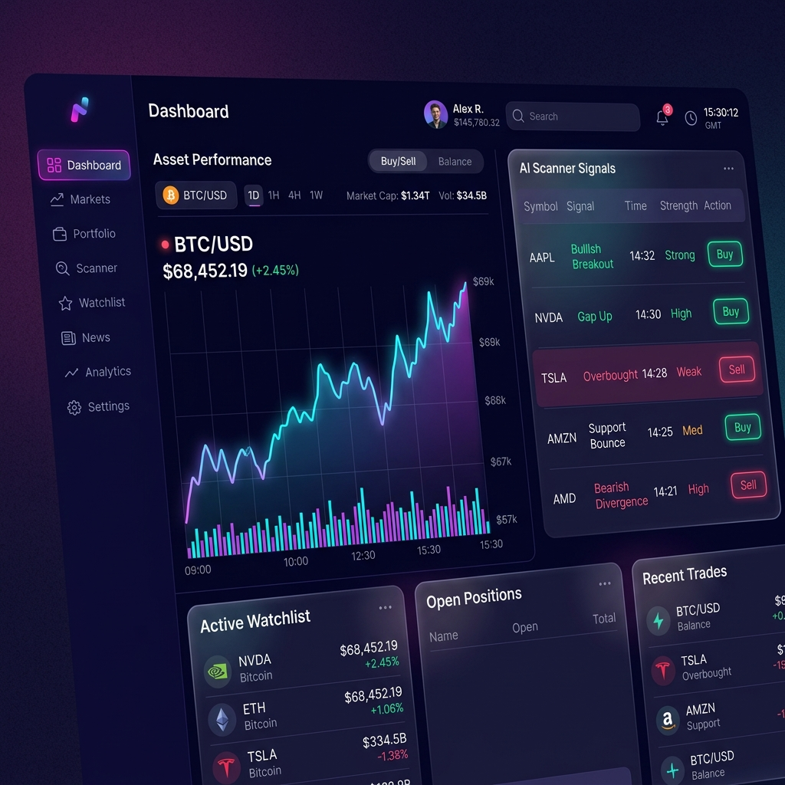

# 🚀 StockAuto: 고성능 마켓 스캐너 및 트레이딩 봇

**StockAuto**는 미국 주식 시장 전체를 실시간으로 전수 조사하여 고수 투자자들의 필터링 전략(Gap, RVOL, Catalyst)을 기반으로 최적의 매수 기회를 포착하는 자동화 트레이딩 시스템입니다.



## ✨ 주요 기능

- **🌐 초고속 비동기 전 시장 실시간 스캔**: `data_provider.py`와 `asyncio.gather` 병렬화를 통해 1분 미만의 딜레이로 나스닥/뉴욕 거래소 전 종목을 고성능 분석.
- **🛡️ v2.0 퀀트 투자 대가 필터 & 레짐 스위칭**: QQQ 나스닥 지수 MA20/MA50 기반 3-Mode 동적 장세 판별 및 BULLISH(80점)/BEARISH(90점) 다이내믹 컷오프 채점.
- **📈 1:2:6 피라미딩 자금 관리**: 후지모토 시게루식 분할 매수 기법(정찰병 15% ➡️ 확인 35% ➡️ 승부 50%)을 통한 지능적 리스크 방어 및 가중평균 평단가 동적 계산.
- **🚨 실시간 스마트 익절 & 트레일링 스탑**: 최고가 대비 하락 추적식 자동 스탑 및 RSI 과매수 다이버전스 + MACD 데드크로스 조기 스마트 익절 (`detect_smart_exit_signal`).
- **🔐 JWT 멀티유저 인증 & 데이터 격리**: 회원가입/로그인 보안 시스템 및 유저별 독립 트레이딩 모드, 개인 증권사 API Key 연동 및 철저한 멀티테넌시 데이터 격리.
- **💼 3-Mode 플렉시블 트레이딩 엔진**: 서버 재부팅 없이 실시간 핫 리로딩되는 `SIMULATED` (가상투자) / `MOCK` (모의 OpenAPI) / `REAL` (실전 OpenAPI) 3단 브로커 팩토리 아키텍처.
- **🎨 프리미엄 UI/UX 대시보드**: Next.js 15 App Router와 React 19 기반 최적화, Vercel/Linear 스타일 세련된 세그먼트/사이드바 설정 및 그라데이션 SVG 자산 추이 차트.
- **🤖 텔레그램 트레이딩 브릿지**: 단일 백그라운드 롱 폴링 데몬으로 리소스를 절약하며 간편 딥링크(/start 연동), 실시간 계좌 및 포트폴리오 자산 조회(`/status`), 명령어 제어(`/run`, `/stop`) 제공.
- **💾 Alembic 자동 마이그레이션**: Spring Boot 스타일 프로그램 기반 자동 기동식 마이그레이션을 탑재하여 유실 없는 테이블 스키마 핫 패치 및 무결성 부트스트래핑 보장.
- **🔥 AI 뉴스 감성 및 호악재 판독**: 실시간 해외 뉴스를 비동기 병렬 대량 수집하고 AI 감성 분석 모델을 연동하여 상승 명분(Catalyst)을 선제 발굴.

## 🛠 기술 스택

### 백엔드 (Backend)

- **FastAPI**: 고성능 비동기 API 서버
- **Redis**: 분산 락(Distributed Lock) 및 동시 주문 제어
- **yfinance**: 글로벌 시장 데이터 추출
- **pandas/numpy**: 고성능 기술적 지표 계산
- **SQLite**: 거래 로그 및 관심 종목 관리

### 프론트엔드 (Frontend)

- **Next.js 15 (App Router)**: 최신 웹 아키텍처
- **Tailwind CSS**: 프리미엄 UI 디자인
- **Lucide React**: 벡터 아이콘 시스템

## 🚀 시작하기

### 사전 요구 사항

- Python 3.10+
- Node.js 18+

### 설치 및 실행

1. **저장소 클론**

   ```bash
   git clone https://github.com/your-id/stockAuto.git
   cd stockAuto
   ```

### ⚡ 원클릭 간편 실행 (Windows 전용)

로컬 개발 환경(프론트엔드, 백엔드)을 한 번에 실행하고 Redis 상태를 자동 점검하려면, 프로젝트 최상단 폴더에 있는 **`start_dev.bat` 파일을 더블 클릭**하세요. 새 터미널 창들이 열리며 개발 서버가 자동 구동됩니다.
*(수동 환경 설정 및 실행 방법은 아래의 과정을 참고하세요.)*

2. **백엔드 설정**

   > StockAuto의 공식 파이썬 백엔드 가상환경 디렉터리는 **`backend/venv`** 입니다.

   ```bash
   cd backend
   
   # Redis 인프라 백그라운드 실행 (주문 동시성 제어용 필수)
   docker compose up -d redis

   python -m venv venv
   # Windows PowerShell: venv\Scripts\Activate.ps1
   # Git Bash: source venv/Scripts/activate
   # macOS/Linux: source venv/bin/activate
   pip install -r requirements.txt

   # 설정 파일 생성 (원하는 환경의 템플릿 복사)
   cp .env.local.example .env.local   # 로컬 시뮬레이션 환경용
   cp .env.dev.example .env.dev       # 모의투자 환경용
   cp .env.prod.example .env.prod     # 실전매매 환경용

   # 서버 실행 (가상환경 수동 활성화 생략 가능! run.py가 자동 감지 및 자가 치환 실행)
   python run.py local  # (또는 인자 생략 시 기본값: python run.py)

   # 서버 실행 (개발 모드)
   python run.py dev

   # 서버 실행 (운영 모드)
   python run.py prod
   ```

   > [!TIP]
   > **💡 가상환경 활성화 생략 가이드:**
   > `run.py` 런처는 자체적으로 공식 로컬 가상환경(`backend/venv`, 백엔드 폴더 기준 `venv`)을 감지하여 가상환경 파이썬 프로세스로 자동 전환(자가 치환, Self Re-execution)합니다. 따라서 패키지 설치(`pip install`) 이후에는 따로 가상환경을 활성화하지 않고 바로 `python run.py` 명령어로 서버를 간편하게 실행할 수 있습니다.

3. **프론트엔드 설정**

   ```bash
   cd ../frontend
   npm install

   # 설정 파일 생성
   cp .env.example .env.local

   # 로컬 개발 환경 구동 (Next.js 로컬 서버)
   npm run local

   # 개발 서버 빌드 및 구동 (KIS 모의투자 연동 환경)
   npm run build-dev
   npm run start-dev

   # 실전 서버 빌드 및 구동 (실거래 연동 환경)
   npm run build-prod
   npm run start-prod
   ```

## 🤖 AI 협업 가이드 (AI Collaboration)

본 프로젝트는 AI 코딩 어시스턴트와의 유기적이고 안전한 협업을 위한 **AI 하네스 환경(AI Harness Environment)**이 완벽히 구축되어 있습니다.

- **`AGENTS.md`**: AI가 프로젝트 진입 시 최우선으로 읽어 스스로를 동기화하는 최상위 가이드 맵입니다.
- **`docs/RULES.md`**: AI와 개발자 간의 협업 규칙, 코드 품질 기준 및 절대 수칙이 정의되어 있습니다.
- **`docs/AGENTS.md`**: 7인의 분야별 전문 AI 역할 분담과 3회 자가 치유(Self-Correction) 수칙을 수립하여, **자율 협업 루프를 정교하게 제어하고 오류 없는 개발을 유도하는 프로젝트 핵심 '소프트웨어식 하네스 플레이북'**입니다.

- **`docs/implementation_plan.md`**: **[구현 전 설계서]** 코드 작성 전에 변경 사양, 데이터 플로우, 타겟 수정 파일 및 검증 계획을 정의하는 최신 구축 기획 설계서입니다.
- **`docs/walkthrough.md`**: **[구현 후 완료 보고서]** 개발이 완료된 실제 소스코드 편집 내역과 린트/컴파일 검증 테스트 결과를 투명하게 기록하는 최종 완료 보고서입니다.
- **`docs/task.md`**: **[작업 현황판]** 프로젝트의 개발 단계별 목표와 실시간 진행 상황을 한눈에 볼 수 있도록 투명하게 관리하는 표준 작업 현황판입니다.
- **`scripts/verify_harness.py`**: 빌드/린트 결함 발견 시 Git 커밋을 원천 봉쇄하여 환각 없는 100% 무결성 빌드를 보장하는 물리적 하드웨어식 하네스 가드입니다.

#### 💡 하드 하네스 수동 검증 가이드
커밋 전에 코드가 모든 컴파일/타입/린트 기준을 완벽하게 만족하는지 수동으로 무결성 검증을 수행하려면 프로젝트 루트 디렉터리에서 아래 명령어를 실행하십시오:
```bash
python scripts/verify_harness.py
```
> [!NOTE]
> 만약 린트 오류나 타입 에러가 발생하면 **Git Pre-commit Hook 가드레일**에 의해 `git commit`이 자동으로 취소(Abort) 처리됩니다. 에러 로그를 분석 및 해결한 후 다시 커밋해주십시오.

## 🔒 보안 및 개인정보 보호

본 저장소에는 시스템의 핵심 매매 전략(Filter & Signal Logic) 마크다운 문서는 포함되어 있지 않습니다. 해당 정보는 개발자의 로직 보호를 위해 비공개로 관리됩니다.

## ⚠️ 면책 조항

본 프로그램은 투자 판단을 돕기 위한 보조 도구이며, 모든 투자의 책임은 투자자 본인에게 있습니다.

---

Developed & Maintained with Antigravity AI Engine

