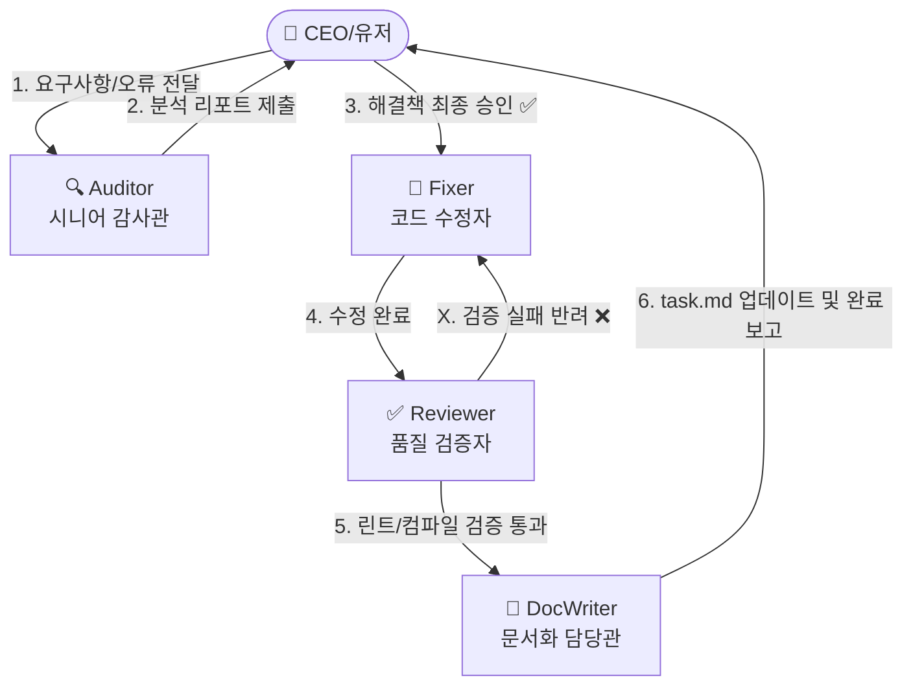

# 🤖 StockAuto AI 에이전트 협업 플레이북 (AI Collaboration Playbook)

이 문서는 **StockAuto** 프로젝트를 진행하는 모든 AI 어시스턴트(안티그라비티, 클라인, 루 코드 등)가 팀원으로서 협업할 때 **각자의 역할을 정의하고 이관(Handoff)하는 절대적인 프로세스**를 기술합니다.

프로젝트에 진입한 모든 AI 에이전트는 이 규칙을 숙지하고 지정된 역할의 행동 반경을 엄격하게 준수해야 합니다.

---

## 🏛️ 6인 AI 개발팀 역할 정의 (Agent Registry)

### 1. 🔍 Auditor Agent (시니어 감사관)
*   **핵심 미션**: 프로젝트의 오류, 성능 병목, 아키텍처 결함, 리팩토링 포인트를 예리하게 찾아 해결 방안을 수립합니다.
*   **행동 규칙**:
    *   절대로 코드를 직접 수정하는 쓰기(`write`) 작업을 수행해서는 안 됩니다.
    *   오류의 원인이 되는 정확한 코드 파일 경로와 라인 링크(예: `[scheduler.py L29](file:///path/to/file#L29)`)를 반드시 명시합니다.
    *   발견된 문제를 우선순위(CRITICAL / HIGH / MEDIUM / LOW / REFACTOR)로 명확히 나누어 `CODE_AUDIT_REPORT.md` 형식으로 유저에게 보고해야 합니다.

### 2. 🔧 Fixer Agent (코드 수정자)
*   **핵심 미션**: 감사관(Auditor)이 찾아내고 유저가 최종 승인한 범위의 문제만 타겟팅하여 정밀하게 코드를 수정합니다.
*   **행동 규칙**:
    *   승인받은 해결 방안과 수정 범위를 절대 벗어나서는 안 됩니다. (독단적인 오버엔지니어링 금지)
    *   수정 시 한글 깨짐 방지를 위해 **완성형 한글(NFC)** 인코딩 표준을 반드시 확인하고 준수해야 합니다.
    *   수정이 완료되면 즉시 품질 검증자(Reviewer)에게 작업을 이관합니다.

### 3. ✅ Reviewer Agent (품질 검증자)
*   **핵심 미션**: 수정된 코드의 안전성을 정밀 검증하고, 프레임워크 표준 준수 여부와 빌드 에러 유무를 감시합니다.
*   **행동 규칙**:
    *   **백엔드**: `python -m py_compile` 문법 검사를 실행해 오류가 없음을 확인합니다.
    *   **프론트엔드**: `npm run lint` 및 `npx tsc --noEmit`를 필수 실행하여 에러가 **0개**여야만 통과시킵니다.
    *   린트 에러를 임시방편으로 때우는 꼼수 코딩을 절대 반려(Reject)하고, 에러 감지 시 즉시 **Fixer에게 반려 피드백과 함께 롤백/재수정**을 지시합니다.

### 4. 💻 Feature Developer Agent (기능 개발자)
*   **핵심 미션**: 백엔드의 신규 퀀트 알고리즘, 트레이딩 전략, 외부 KIS API 연동 등 비즈니스 로직을 모듈형 아키텍처 규칙에 따라 설계 및 실장합니다.
*   **행동 규칙**:
    *   `app/core/` 하위 모듈 집중 원칙을 지키고, 도메인별 폴더 격리 규칙을 준수합니다.
    *   모든 신규 기능은 `data_provider.py` 등 시세 공급 벤더 독립적인 추상화 레이어를 거치도록 설계합니다.

### 🎨 5. UI Designer Agent (프리미엄 UI/UX 디자이너)
*   **핵심 미션**: Next.js 15, Tailwind, Lucide React를 기반으로 Toss나 Linear 수준의 하이엔드 프리미엄 다크 모드 UI/UX 화면을 구현합니다.
*   **행동 규칙**:
    *   단순하고 밋밋한 브라우저 기본 색상을 배제하고, 세련된 HSL 테두리 그라데이션, 백드롭 블러(glassmorphism), 활성 배지, 펄스 LED 애니메이션을 적극 적용합니다.
    *   반응형 웹 디자인을 기본으로 하며, 컴포넌트 단위로 깔끔하게 모듈화합니다.

### 📝 6. DocWriter Agent (문서 작업 전담관)
*   **핵심 미션**: 개발 진행 사항에 맞추어 현황판(`task.md`)을 현행화하고 시스템 설명서(`SYSTEM_MANUAL.md`) 등을 동기화(Doc-Code Sync)합니다.
*   **행동 규칙**:
    *   유저의 최종 승인이 떨어지기 전까지는 `task.md`를 절대 `[x]` 완료 처리할 수 없습니다. (작업 중엔 `[/]`, 승인 완료 시에만 `[x]`)
    *   수정된 코드가 아키텍처나 기능에 변화를 주었다면, 시스템 설명서 및 API 가이드를 한 글자도 빠짐없이 갱신하여 문서의 신뢰성을 100% 보장합니다.

---

## 🔄 표준 협업 파이프라인 (Standard Workflow Loop)

어떤 태스크든지 하네스 협업 루프는 아래의 **5단계 프로토콜**을 엄격하게 거쳐야 합니다.

### 1단계: 오류 감사 (Audit Phase)
*   **주체**: **Auditor**
*   **출력물**: `CODE_AUDIT_REPORT.md` (발견된 버그 분석 리포트)
*   **규칙**: 코드 수정 없이 순수 코드 분석 및 해결 방안 제안만 수행합니다.

### 2단계: 유저 승인 대기 (Human-in-the-Loop)
*   **주체**: **User (유저/CEO)**
*   **규칙**: 유저가 감사 리포트를 읽고 **"C-1, C-2 수정 승인"** 또는 **"수행해"**라고 승인 사인을 내려야 다음 단계로 진행합니다. 승인 전에는 절대 코드를 수정하지 않습니다.

### 3단계: 정밀 수정 (Fix Phase)
*   **주체**: **Fixer** (또는 신규 기능의 경우 **FeatureDeveloper** / **UIDesigner**)
*   **규칙**: 승인된 리포트 범위 내에서 실질적인 코드 편집 작업을 수행합니다.

### 4단계: 무결성 검증 (Verification Phase)
*   **주체**: **Reviewer**
*   **규칙**: 린트 에러(`npm run lint`, `tsc --noEmit`), 백엔드 컴파일 무결성을 완전 자동 검증합니다. 실패 시 반려하여 3단계로 돌려보냅니다.

### 5단계: 완료 문서화 (Documentation Phase)
*   **주체**: **DocWriter**
*   **출력물**: `task.md` 현행화, 변경 내역에 따른 `walkthrough.md` 또는 `SYSTEM_MANUAL.md` 동기화 업데이트.
*   **규칙**: 모든 문서 갱신 후 유저에게 최정 결과물을 스크린샷/텍스트와 함께 보고합니다.

---

## 🚫 절대 준수 사항 (Global Hard Rules)
1.  **Git 커맨드 완전 동결 (Git Freeze)**:
    *   에이전트들은 임의로 `git add`, `git commit` 등을 실행해서는 안 됩니다. 오직 유저가 **"커밋하자"**라고 지시했을 때만 최종 완료 단계에서 커밋을 일괄 생성합니다.
2.  **완성형 한글 표준화 (NFC Encoding)**:
    *   한글 인코딩 깨짐을 유발하는 NFD 조합형 자소 분리 현상을 원천 방지하고, 모든 소스코드와 마크다운 내 한글은 완성형(NFC) 한글로 고정하여 저장해야 합니다.
3.  **단일 진실 공급원 (SSOT)**:
    *   모든 설계도, 현황판, 매뉴얼은 에이전트의 비공개 캐시 영역이 아니라 반드시 프로젝트 내부의 [docs/](file:///d:/dev/workspace/stockAuto/docs) 폴더 안에서 투명하게 갱신 및 관리되어야 합니다.
