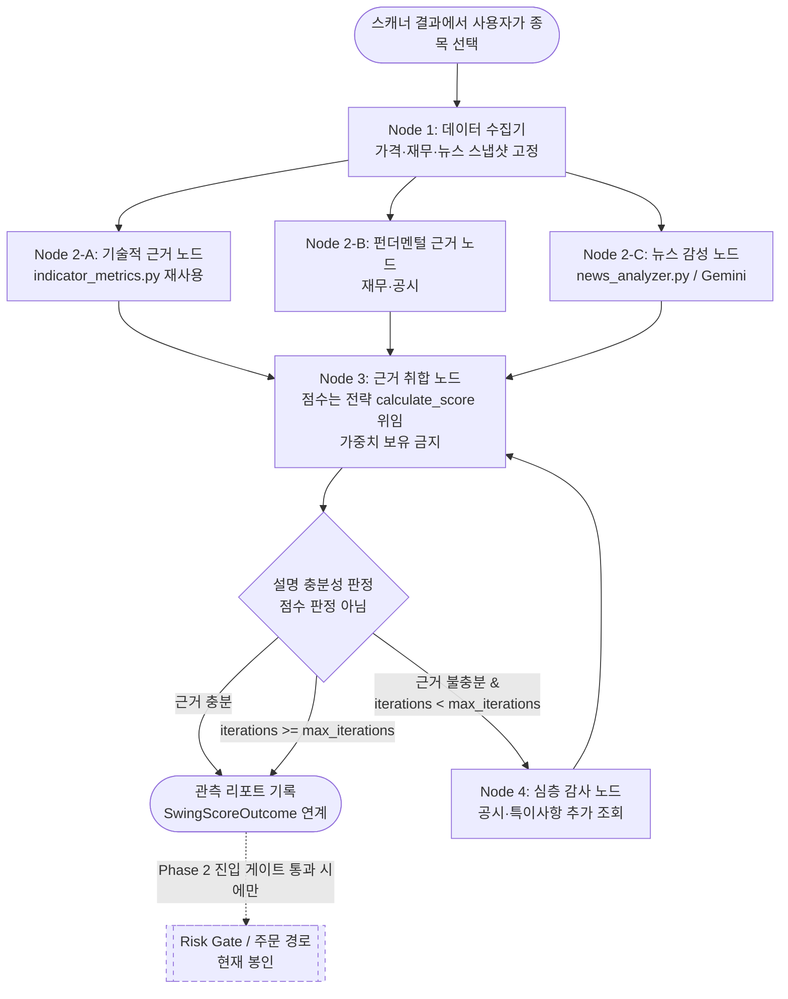

# AI Graph Engineering — 4세대 StateGraph 파이프라인 도입 정본

> **위상:** 도입 계획 및 아키텍처 정본. 원 제안은 GitHub Issue #97, 설계 검토는 같은 이슈의
> 코멘트 `comment-5309192387`이며, **본 문서는 그 검토 결과(선결 과제 7건)를 반영한 뒤의 정본**이다.
> 이슈 본문과 본 문서가 충돌하면 본 문서가 우선한다.
>
> **상위 제약:** [`strategy_alpha_verdict.md`](strategy_alpha_verdict.md) §7이 **"AI 그래프 Phase 2 상시 루프"를
> 금지 항목으로 명시**한다. 본 문서는 그 판정에 종속되며, 판정을 우회하는 어떤 조항도 두지 않는다.

---

## 0. 결론 (착수 범위)

| 단계 | 판단 | 근거 |
| :--- | :--- | :--- |
| **Phase 1** — 읽기 전용 StateGraph | **착수 가능**. 단 목적을 "관측·설명 레이어"로 재정의 | 온디맨드 월 $10~15로 캘리브레이션 데이터 확보 |
| **Phase 2** — 라이브 봇 시그널 연동 | **착수 금지**. 진입 게이트(§8) 통과 전까지 봉인 | 상시 루프 월 약 $227 대비 기대 초과수익 미검증 |
| **Phase 3** — SSE 시각화 | **Phase 1 이후 착수 가능** | 주문 경로 무관, 위험 0 |

Phase 1의 가치는 알파가 아니다. **"분자가 0인지"를 처음으로 측정 가능하게 만드는 것**이다.
측정 결과가 "역시 알파 없음"이어도 그것은 성공한 결과다 — 월 $15로 연 $2,724짜리 결정을 회피한 것이기 때문이다.

---

## 1. 배경 — AI 엔지니어링 4단계와 StockAuto 현주소

1. **1세대 (Prompt)** — 단순 질의응답
2. **2세대 (Context / RAG)** — 외부 데이터 결합 → **완료** (시세·뉴스·재무 파이프라인)
3. **3세대 (Loop / Tool Use)** — 도구 호출 자동 루프 → **완료** (`app/bot/scheduler.py` 스케줄러·봇)
4. **4세대 (Graph)** — 전문 노드 분업 + 조건부 분기 + 관측 가능성 → **본 문서의 대상**

현 상태는 2.5~3세대(규칙 기반 if-else 파이프라인)다. 다만 아래 §2가 말하듯,
**세대를 올리는 것 자체는 성과 개선의 근거가 아니다.**

---

## 2. 이 도입이 성과를 개선하지 못하는 이유 (설계 전제)

노드를 3개로 분리해도 **입력 데이터(가격·재무·뉴스)와 신호원은 동일**하다.
오케스트레이션 구조 변경만으로 새 정보가 생기지 않는다.
2,590종 전략 챔피언십에서 QQQ 대비 알파는 전 비교군 음수였다([`strategy_alpha_verdict.md`](strategy_alpha_verdict.md)).

따라서 **"점수 정확도 향상"을 기대 효과로 잡으면 실패가 예정되어 있다.**
본 도입의 기대 효과는 정확도가 아니라 **설명 가능성과 측정 가능성**이다.

추가로, 상위 레이어를 얹는 대상 자체가 미검증이다. [`score_calibration.py`](../backend/app/scanner/score_calibration.py)
모듈 주석이 명시한다 — *"85점 종목이 실제로 다음날 올랐는가는 지금까지 아무도 검증하지 않았다."*
검증되지 않은 신호를 검증되지 않은 방법으로 조합하는 구조를 만들지 않기 위해, §6의 SSOT 규약과
§8의 진입 게이트가 필수다.

---

## 3. 아키텍처 (Phase 1 정본)

이슈 본문의 원안은 Aggregator가 **자체 점수를 산출**하고 그 점수로 매매 분기까지 수행한다.
정본은 그 두 가지를 모두 제거했다 — 점수는 전략 객체가 내고(§6), 그래프는 **기록만** 한다.



**점선 경계가 이 설계의 핵심이다.** Phase 1 그래프는 주문 경로에 어떤 간선도 갖지 않는다.

### 3.1 노드 명세

| 노드 | 책임 | 재사용 대상 | LLM |
| :--- | :--- | :--- | :--- |
| `Ingest_Node` | 입력 스냅샷 고정(재현용 원본 보존) | 스캐너 결과, `indicator_metrics.py` | 없음 |
| `Technical_Evidence_Node` | 지표 근거 구조화 | `backend/app/scanner/indicator_metrics.py` | 없음 |
| `Fundamental_Evidence_Node` | 재무·공시 근거 구조화 | 기존 재무 조회 경로 | 없음 |
| `News_Sentiment_Node` | 헤드라인 감성·이슈 추출 | `backend/app/scanner/news_analyzer.py` | 있음 |
| `Evidence_Aggregator_Node` | 근거 병합 + **전략 위임 점수 호출** | 전략 `calculate_score` | 없음 |
| `Deep_Audit_Node` | 근거 불충분 시 추가 리서치 | 공시 본문 | 있음 |

`Risk_Gate_Node`는 Phase 2 전용이며 **본 단계에서 구현하지 않는다.** 자리만 예약한다.

### 3.2 AgentState 스키마 (초안)

```python
class AgentState(TypedDict):
    ticker: str
    snapshot_id: str              # Ingest가 고정한 입력 스냅샷 식별자 (재현 키)
    evidence: dict                # 노드별 구조화 근거 (technical / fundamental / news / audit)
    strategy_score: float | None  # 전략 calculate_score 결과. 그래프가 산출하지 않는다
    strategy_type: str            # 점수를 낸 전략 (SSOT 추적용)
    iterations: int               # DeepAudit 재회송 횟수
    max_iterations: int           # 상한. 기본 2
    llm_failures: list[str]       # 실패한 LLM 노드 이름
    terminated_by: str            # "sufficient" | "max_iterations" | "llm_failure"
```

`strategy_score`가 `None`으로 남는 경로를 허용한다 — LLM이 죽어도 그래프는 **근거 없음**을 기록하고 끝난다.

---

## 4. 순환 가드 (선결 과제 2-6)

원안의 `DeepAudit → Aggregator` 간선에는 반복 상한이 없어, 60~75점 구간에서 감사 후 점수가
변하지 않으면 영구 재회송된다.

**규약:**

- `AgentState.max_iterations` **기본값 2**, 하드 상한 3. 설정으로도 3을 넘길 수 없다.
- 상한 도달 시 예외가 아니라 **정상 종료**로 처리하고 `terminated_by="max_iterations"`를 기록한다.
- 회귀 테스트는 "감사 후에도 근거가 채워지지 않는" 고정 입력으로 **호출 횟수 상한**을 단언한다.

---

## 5. LLM 실패 정책 (선결 과제 2-7)

| 단계 | 정책 |
| :--- | :--- |
| Phase 1 (관측) | **fail-soft** — 해당 노드 근거를 비우고 `llm_failures`에 기록한 뒤 계속. 리포트는 "근거 결손"으로 남는다 |
| Phase 2 (주문 경로) | **fail-close** — LLM 실패·타임아웃 시 **진입하지 않는다**. 예외 없음 |

Phase 2에서 fail-open은 금지한다. 라이브 주문 경로는 `app/bot/scheduler.py` + `app/bot/order_reconciler.py` +
Redis 분산 락으로 구성되며, 장중 지연·타임아웃이 곧 미체결·부분체결로 직결되기 때문이다.

---

## 6. SSOT 규약 — Aggregator는 점수를 갖지 않는다 (선결 과제 2-3)

점수 산출의 SSOT는 이미 전략별 `calculate_score(row, regime, score_card)`이며,
전략들이 각자 regime별 동적 채점표를 보유한다.

원안의 **전역 고정 가중치(기술 40% + 감성 35% + 펀더 25%)** 는 두 번째 경쟁 채점 체계이자
`AGENTS.md` / `CLAUDE.md`의 "SSOT 우선" 수칙 위반이다. 전략마다 최적 가중치가 다른데
하나로 고정하는 것은 퇴보다.

**규약:**

1. `Evidence_Aggregator_Node`는 **가중치 상수를 보유하지 않는다.**
2. 종합 점수가 필요하면 반드시 해당 전략 객체의 `calculate_score`를 호출해 받는다.
3. 그래프가 만드는 것은 점수가 아니라 **그 점수에 대한 근거 레코드**다.
4. 회귀 가드: Aggregator 모듈에 가중치성 상수(`WEIGHT`, `_W`, 비율 리터럴 합=1.0 패턴)가
   등장하면 정적 검사에서 반려한다.

---

## 7. 검증 기준 (선결 과제 2-4)

원안의 Phase 1 검증 기준 *"동일 입력에 대해 결정론적 리포트 반환"* 은 **통과 불가능한 기준**이다.
News 노드는 Gemini LLM이며 temperature 0에서도 재현이 보장되지 않는다. **"결정론적" 문구는 폐기한다.**

대체 기준:

| # | 기준 | 측정 방법 |
| :--- | :--- | :--- |
| V1 | **경로 결정성** — 같은 입력에서 노드 방문 순서와 종료 사유가 동일 | `terminated_by`, 노드 호출 시퀀스 단언 |
| V2 | **구조 유효성** — 리포트가 스키마를 항상 만족 (LLM 실패 시에도) | 스키마 검증 + 실패 주입 테스트 |
| V3 | **점수 동일성** — 그래프를 거친 `strategy_score`가 그래프 없이 계산한 값과 **완전 일치** | 동일 입력 대조. 불일치는 §6 위반 |
| V4 | **비용 상한** — 종목당 LLM 호출이 상한을 넘지 않음 | 호출 카운터 단언 (§4 · §9) |
| V5 | **주문 경로 무간섭** — 그래프 실행이 주문·포지션 경로에 부작용 0 | 호출 그래프 정적 검사 |

LLM **출력 내용의 동일성**은 기준으로 삼지 않는다. 대신 V1~V3으로 "구조와 숫자는 결정적,
서술만 비결정적"임을 보장한다.

---

## 8. Phase 2 진입 게이트 (필수)

> `SwingScoreOutcome`([`backend/app/core/models.py`](../backend/app/core/models.py)) 캘리브레이션 데이터로
> **그래프 근거를 반영한 점수 vs 기존 점수의 히트레이트·정보계수(IC)를 비교**하여 유의미한 개선이
> 확인될 때만 Phase 2에 착수한다. 개선이 확인되지 않으면 Phase 1을 관측 레이어로 확정하고
> **Phase 2는 폐기한다.**

게이트 판정은 [`strategy_alpha_verdict.md`](strategy_alpha_verdict.md) §6 반증 조건 R1~R6을
그대로 적용한다. 총수익 비교만으로는 통과시키지 않는다.

---

## 9. AI 쿼터·타임아웃 재설계 (선결 과제 2-5)

### 9.1 현재 배급 상태 (실측)

[`backend/app/scanner/scanner.py`](../backend/app/scanner/scanner.py)가 Free Tier 15 RPM에 맞춰 빠듯하게 배급 중이다.

```python
AI_NEWS_GUARANTEED_SLOTS = 3     # 필터 통과 상위 N개는 무조건 AI 분석
AI_NEWS_MAX_SLOTS = 10           # 스캔 1회당 총 AI 호출 상한
```

노드 분업 시 종목당 LLM 호출이 뉴스 1회 → **뉴스 + 심층감사 최소 2회**로 증가한다.
**그래프 도입 전에 쿼터 정책 재설계가 선행되어야 한다.**

### 9.2 규약

- Phase 1은 **온디맨드 전용**이다. 스캐너 상시 루프의 슬롯 예산을 잠식하지 않도록 **별도 쿼터**로 분리한다.
- 상시 루프에 그래프를 태우려면 배치 호출(종목 N개 1콜) 또는 유료 전환이 **선행 조건**이다.

### 9.3 타임아웃

[`backend/app/ai/gemini_client.py`](../backend/app/ai/gemini_client.py)의 현재 값은 심층감사 노드에 부적합하다.

```python
DEFAULT_GEMINI_TIMEOUT_SECONDS = 8.0
```

- 뉴스 감성 노드: 8초 유지 (짧은 프롬프트)
- **심층 감사 노드: 최소 30초** — 공시 본문을 입력으로 받으므로 8초로는 상시 타임아웃된다
- 타임아웃은 노드별 파라미터로 주입한다. 전역 상수 상향은 금지 — 스캐너 상시 경로가 함께 느려진다

---

## 10. 비용 산정 및 손익분기

### 10.1 호출량 (코드 기준)

- `app/bot/scheduler.py` — 스캐너 잡 10분 주기
- `refresh_scanner_cache()` — 장 마감 시 스킵
- [`app/bot/market_session.py`](../backend/app/bot/market_session.py) — 활성 구간 04:00~20:00 ET (16시간)

→ **하루 96회 스캔 × 최대 10콜 = 일 960콜 / 월 20,160콜**

현재 `news_analyzer.py` 프롬프트는 지시문 + 헤드라인 5개 ≈ 입력 200토큰 / 출력 80토큰으로 매우 작다.

### 10.2 Phase 2(상시 루프) 월 비용

News 노드 + Deep Audit 노드(스캔당 3건, 공시 본문 포함 입력 3,000 / 출력 500) 기준,
월 입력 22.2M · 출력 4.6M 토큰:

| 구성 | 월 비용 |
| :--- | ---: |
| 전부 Opus 5 ($5/$25 per MTok) | **약 $227** |
| 전부 Sonnet 5 ($3/$15) | 약 $136 |
| Haiku(뉴스) + Opus(심층감사) | 약 $178 |
| 전부 Haiku 4.5 ($1/$5) | 약 $45 |

비용의 대부분(약 $166)이 **Deep Audit 노드**에서 발생한다. News 노드 티어를 낮춰도 전체는
$227 → $178 수준으로만 감소하므로 **티어링의 실익이 적다.**

### 10.3 Phase 1(온디맨드) 월 비용

사용자가 스캐너에서 종목을 클릭할 때만 실행된다. 일 20~50회 기준 월 1,000콜 남짓 —
상시 루프의 5% 수준. → **월 $10~15 (Opus 5 기준)**

### 10.4 손익분기

Phase 2 비용 $227/월 = **연 $2,724**. 이를 상회하려면 필요한 초과수익률:

| 운용 자본 | 필요 연간 알파 |
| :--- | ---: |
| $50,000 | **5.45%** |
| $100,000 | **2.72%** |
| $300,000 | 0.91% |
| $1,000,000 | 0.27% |

그러나 **§2에서 확인했듯 본 저장소의 측정 알파는 0 또는 음수다.**
분자가 0이면 자본 규모와 무관하게 손익분기점이 존재하지 않는다.
즉 비용 최적화 논의는 부차적이며, 물어야 할 것은 **"분자가 0이 아니라는 근거가 있는가"** 다. 현재는 없다.

### 10.5 적용 불가한 절감책 2건

1. **프롬프트 캐싱 미적용** — 캐시 가능 최소 프리픽스는 모델별 512~4,096토큰(Haiku 4.5는 4,096).
   현재 프롬프트 200토큰은 이에 미달하여 **에러 없이 조용히 캐시되지 않는다.**
2. **Batch API 50% 할인은 장중 사용 불가** — 배치는 완료까지 최대 24시간이라 10분 주기 루프에 부적합.
   단, **08:00 스윙 예측 잡과 `score_calibration` 잡은 배치 적용 시 정확히 반값**이다(즉시 적용 가능).

---

## 11. 로드맵

- [ ] **Phase 1 — 관측·설명 레이어 StateGraph (온디맨드)**
  - `AgentState` 스키마 및 그래프 파이프라인 구축
  - 기술/재무/뉴스 근거 노드 병렬 실행 → 근거 리포트 기록
  - 검증 기준 V1~V5(§7) 통과
- [ ] **Phase 2 — 라이브 봇 연동 (봉인. §8 게이트 통과 전 착수 금지)**
  - Risk Gate 노드 및 금융 불변식 연동, fail-close 정책
- [ ] **Phase 3 — 프론트 실시간 흐름 시각화 (Phase 1 이후)**
  - 노드별 상태 SSE 스트리밍, Human-in-the-loop UI

---

## 12. 착수 전 선결 과제 체크리스트 (7건)

| # | 과제 | 반영 위치 | 상태 |
| :--- | :--- | :--- | :--- |
| 1 | `DeepAudit → Aggregator` 루프에 `max_iterations` 가드 | §4 | 설계 반영 완료 (구현 미착수) |
| 2 | Aggregator 고정 가중치 제거, 전략 `calculate_score` 위임 | §6 | 설계 반영 완료 (구현 미착수) |
| 3 | Phase 1 검증 기준에서 "결정론적" 문구 삭제 | §7 | 설계 반영 완료 |
| 4 | AI 쿼터 정책 재설계 (배치 호출 또는 유료 전환) | §9.2 | **미해결** — 코드 변경 필요, Phase 1 착수 선행 조건 |
| 5 | LLM 노드 타임아웃 재산정 (심층감사 최소 30초) | §9.3 | **미해결** — 코드 변경 필요 |
| 6 | 스윙 예측·캘리브레이션 잡 Batch API 전환 | §10.5 | **미해결** — 즉시 적용 가능, 그래프와 독립 |
| 7 | Phase 2 LLM 실패 fail-open/fail-close 정책 명문화 | §5 | 설계 반영 완료 |

**설계 반영 완료 4건은 본 문서로 종결된다.** 미해결 3건(4·5·6)은 코드 변경이 필요하며,
그중 4·5는 **Phase 1 착수의 선행 조건**이다. 6은 독립 과제로 언제든 착수 가능하다.

---

## 13. 관련 문서

| 문서 | 관계 |
| :--- | :--- |
| [`strategy_alpha_verdict.md`](strategy_alpha_verdict.md) | **상위 제약.** §7이 Phase 2 상시 루프를 금지. §6 반증 조건 R1~R6이 §8 게이트 판정 기준 |
| [`docs/tasks/2026-08-17.md`](tasks/2026-08-17.md) | §10 비용·손익분기 산정의 원 기록 |
| GitHub Issue #97 | 원 제안 및 설계 검토 코멘트 `comment-5309192387` |

---

## 14. 이력

| 날짜 | 변경 |
| :--- | :--- |
| 2026-08-30 | 정본 신설. Issue #97 원안에 설계 검토 선결 과제 7건을 반영하여 작성. Phase 1을 관측·설명 레이어로 재정의, Aggregator 가중치 제거, `max_iterations` 가드·fail-close 정책·검증 기준 V1~V5·쿼터/타임아웃 규약 명문화 |
