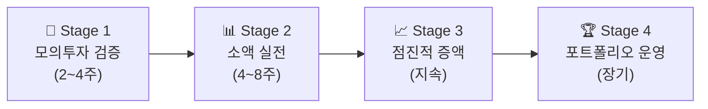

# 🚀 StockAuto 운영 배포 종합 마스터 플랜 (Production Deployment Master Plan)

본 문서는 StockAuto 자동매매 시스템을 성공적으로 운영(Production) 환경에 배포하고, 시스템 안정성 확보 및 4단계 수익성 검증 체계를 구축하기 위한 프로젝트 표준 기술 계획서입니다.

---

## 📊 1. 현재 상태 종합 현황판 (Ready vs Not Ready)

### ✅ 준비 완료된 항목 (Ready)
1. **백엔드 코어 및 도메인 구조**: FastAPI 기반 10개 도메인 분리 완료 (`core`, `auth`, `bot`, `scanner`, `strategies`, `trades`, `watchlist` 등)
2. **매매 전략 엔진**: 79개 매매 전략 동적 로딩 및 시장 상황 대응 마스터 전략 (`regime_switching`) 탑재
3. **KIS 금융 연동**: 실전/모의 서버 자동 분기, OAuth 토큰 관리, 해시키 검증, 멀티 브로커 추상화
4. **보안 체계**: JWT (Access 30분 / Refresh 14일) + Fernet 대칭키 기반 KIS API 키 DB 암호화 저장
5. **동시성 및 가동 제어**: Redis 분산락 기반 주문 중복 방지, APScheduler 8개 상시 잡 오케스트레이션
6. **테스트 및 검증 체계**: 51개 pytest, 8개 E2E Playwright 테스트 통과, 7단계 CI 검증 하네스 구축
7. **프론트엔드 아키텍처**: Next.js 16 (App Router), SWR 패칭, Next.js Proxy Rewrites (`/api/v1`) 적용 완료
8. **환경 변수 기본 뼈대**: `.env.prod` 파일 존재 (JWT 키, Fernet 키, Telegram/Gemini API 키 등 기본 세팅 완료)

### ❌ 보완 및 구축이 필요한 항목 (Not Ready)
1. **배포 인프라 미정**: 서버(VPS/클라우드) 및 도메인 미확정 (인프라 프로비저닝 대기 중)
2. **운영 DB/Redis 실제 프로비저닝**: PostgreSQL 서버 미구축 (현재 `.env.prod`에 `DATABASE_URL` 미기재는 DB 서버가 없어서 당연한 상태)
3. **Prod 모드 DB 전환 선택**: `database.py` 내 Prod 모드 SQLite 명시적 차단 로직 (필요시 선택적 완화 가능)
4. **시크릿 키 환경 분리**: Local/Dev/Prod 간 Fernet 마스터키 분리 및 Prod 전용 키 재생성 필요
5. **HTTPS 및 웹 서버 셋팅**: Nginx 리버스 프록시 및 Let's Encrypt SSL 적용 필요

---

## 🎯 2. 사용자 승인 및 선택 필요 사항 (User Review Required)

> [!IMPORTANT]
> 아래 **3가지 핵심 결정사항**에 따라 구체적인 작업 범위와 비용, 실행 스케줄이 확정됩니다.

### 결정 1: 배포 인프라 선택
- **옵션 A (추천)**: **국내 VPS (Vultr 서울 / Lightsail)** (월 1~3만원) ➔ 한국 리전 빠른 KIS 지연시간, 24시간 안정 가동
- **옵션 B**: **Google Cloud Run + Cloud SQL** (월 3~10만원) ➔ 매니지드 환경 (단, 스케줄러 상시 가동을 위해 `min-instances=1` 필요)
- **옵션 C**: **AWS EC2 서울 + RDS** (월 5~15만원) ➔ 엔터프라이즈급 신뢰성 및 무중단 운영
- **옵션 D**: **윈도우 로컬 PC** (0원) ➔ PC 꺼짐 위험, 미장 시간(23:30~06:00) 수면 중 가동 불안정

### 결정 2: 운영 DB 전략
- **방안 1 (정석)**: 처음부터 PostgreSQL 프로비저닝 후 연결 (동시 쓰기 락 완전 해결, 가장 안전)
- **방안 2 (초기 비용 절감)**: `database.py` 차단 로직을 풀고, 개인용/소액 검증 단계에서는 **SQLite(WAL 모드 + Micro-Session)**로 가동 후 향후 PostgreSQL 전환

### 결정 3: 수익 검증 단계 진입 시점
- **방안 1**: 인프라 배포(Phase 0~1) 즉시 모의투자(`dev` 모드) 4주 검증 시작
- **방안 2**: CI/CD 파이프라인(Phase 2)까지 완전 구축 후 모의투자 시작

---

## 🛠 3. 구체적 단계별 실행 계획 (Proposed Changes)

### Phase 0: 배포 인프라 셋팅 및 환경 설정 (1~2일)
#### [MODIFY] [database.py](file:///d:/dev/workspace/stockAuto/backend/app/core/database.py)
- 결정된 DB 전략(PostgreSQL 또는 SQLite 허용)에 맞춰 연결 및 연결 풀 프로비저닝 처리
#### [MODIFY] [.env.prod](file:///d:/dev/workspace/stockAuto/backend/.env.prod)
- 인프라 구축 완료 후 `DATABASE_URL` 및 `ALLOWED_ORIGINS` 2개 빈칸 채우기
- Prod 전용 독립 Fernet 마스터키 적용

### Phase 1: 운영 오케스트레이션 및 데이터 백업 (2~3일)
#### [NEW] `docker-compose.prod.yml`
- Backend + Frontend + Redis (+ PostgreSQL) 통합 실행 매니페스트 구축
#### [NEW] `scripts/backup_db.sh`
- DB 일일 자동 백업 스크립트 작성 및 크론탭 연동

### Phase 2: 무중단 운용 및 모니터링 구축 (2일)
#### [MODIFY] [health/router.py](file:///d:/dev/workspace/stockAuto/backend/app/health/router.py)
- 로드밸런서/감시 프로세스용 DB, Redis, KIS API, APScheduler 상태 통합 헬스체크 제공

---

## 💰 4. 수익성 검증 4단계 로드맵 (Verification Plan)

### 단계별 실행 세부사항
1. **Stage 1 (모의투자)**: KIS VTS Mock 서버 연동 (`python run.py dev`). 4주간 승률, MDD(<5%), 일일 수익률 검증. 텔레그램 일일 리포트 자동 점검.
2. **Stage 2 (소액 실전)**: 실제 KIS 실전 계좌 연동 (`python run.py prod`). 잃어도 되는 최소 금액($500~$1000)으로 슬리피지 및 수수료 체결 실체 점검.
3. **Stage 3 & 4 (증액 및 운영)**: 백테스트 아레나 및 성과 스코어카드 연동을 통한 비수익 전략 자동 비활성화 체계 운영.
