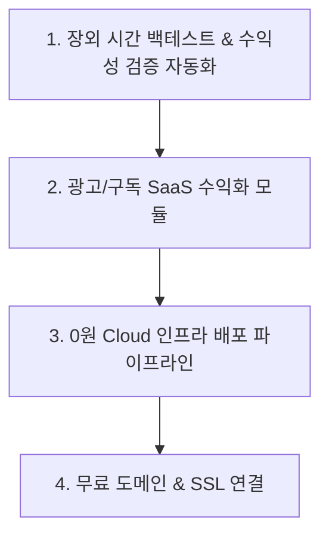

# 🚀 StockAuto 시뮬레이션 수익성 검증 중심 SaaS & 0원 인프라 전략서 (개정 3판)

본 문서는 **실전 계좌 연동 전 시뮬레이션 수익성 검증 우선**이라는 개발자 지침을 반영하여, **토스증권 REAL/MOCK 연동을 검증 완료 시까지 보류(Hold)**하고, **시뮬레이션 수익성 검증 자동화 및 SaaS 인프라 구축에 집중**하도록 개정된 실행 전략서입니다.

---

## 📌 1. 검증 대기 및 미루는 과제 (On Hold)
- ⏸️ **토스증권 REAL / MOCK 실전 매매 연동**: 시뮬레이션 및 백테스트 토너먼트 수익률/승률 검증이 최종 완료된 이후로 연기.

---

## 🎯 2. 순수 신규 실행 전략 4대 과제 (Core Action Items)

### 1️⃣ [★최우선] 장외 시간 백테스트 토너먼트 & 수익성 검증 자동화 모듈
- **목적**: 시뮬레이션 환경에서 72개 매매 전략의 승률, Profit Factor(PF), 누적 수익률을 자동 측정하고 가장 수익성이 높은 파라미터를 판결.
- **실행 과제**:
  - **09:00 ~ 14:00 (낮 시간대)**: **백테스트 토너먼트 아레나 자동 실행 엔진** 구축. 매일 최신 주가 데이터를 바탕으로 전략별 수익성을 자동 판결.
  - **06:00 ~ 09:00 (장마감 직후)**: 당일 시뮬레이션 매매 결산 및 유저별 일일 리포트 알림 발송.
  - **14:00 ~ 18:00 (오후 시간대)**: AI 종목 분석 & 센티먼트 리포트 자동 작성 (광고 유입용 컨텐츠).

### 2️⃣ 광고 & 구독 SaaS 기능 구현
- **실행 과제**:
  - **광고 슬롯**: 프론트엔드 대시보드 및 마켓 스캐너 하단에 Google AdSense / Kakao AdFit 반응형 배너 컴포넌트 추가.
  - **구독 티어링 (Basic vs Pro)**: Basic(기본 시뮬레이션) 및 Pro(고급 백테스트 토너먼트 리포트 및 실시간 알림 잠금 해제) 플랜 분리.

### 3️⃣ 0원 Cloud 인프라 프로덕션 배포 파이프라인 구축
- **실행 과제**:
  - **프론트엔드 (Cloudflare Pages / Vercel)**: Next.js 16 무상 배포 구성.
  - **백엔드 (Oracle Cloud Free Tier / Render)**: 24시간 시뮬레이터 및 자동화 스케줄러 가동용 Docker 컨테이너 작성.
  - **데이터베이스 (Supabase / Neon)**: PostgreSQL 무료 DB 연결.

### 4️⃣ 무료 도메인 및 SSL 자동 바인딩
- **실행 과제**: Cloudflare Pages / Vercel 무료 서브도메인 (예: `mystockauto.pages.dev`) CNAME 연동 및 CORS 설정.

---

## 🗓 3. 우선순위 재조정 로드맵 (Adjusted Roadmap)

| 단계 | 구분 | 과제 내용 | 비고 |
| :---: | :--- | :--- | :--- |
| **Phase 1** | **수익성 검증** | 장외시간 백테스트 토너먼트 자동 구동 및 전략별 수익성 판결 엔진 구축 | **최우선 과제** |
| **Phase 2** | **SaaS 수익화** | 프론트엔드 광고 배너 컴포넌트 + Pro 플랜 회원 권한 락(Lock) 로직 개발 | 프론트/백엔드 |
| **Phase 3** | **0원 배포** | Oracle Cloud VM / Vercel 자동 배포 스크립트 작성 및 무료 도메인 연결 | 인프라 배포 |
| **Phase 4** | **실전 연동** | 시뮬레이션 수익성 검증 완료 후 토스증권 REAL/MOCK 팩토리 최종 바인딩 | **검증 완료 후 진행** |
