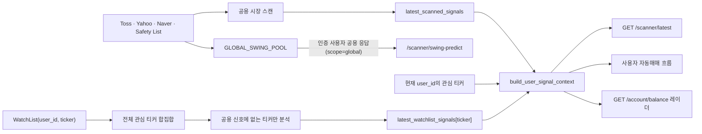

# StockAuto 스캐너 데이터 경계 계약

이 문서는 공용 시장 스캔과 사용자별 관심종목 데이터의 분리·재결합 규칙을 정의합니다. 스캐너, 자동매매, 계좌 레이더, 스윙 예측 경로를 변경할 때 반드시 함께 검토합니다.

## 1. 핵심 원칙

- 관심종목 소유권은 `WatchList.user_id`에 있으며 다른 사용자에게 노출하거나 공용 시드의 출처로 표시하지 않습니다.
- 가격·기술 지표 분석 결과는 티커 단위의 공용 시장 사실로 캐시할 수 있지만, `WATCHLIST` 태그와 사용자별 포함 여부는 응답 또는 실행 컨텍스트를 만들 때 계산합니다.
- 공용 데이터에서 관심종목을 제거하는 변경과 사용자 경로에 다시 결합하는 변경은 하나의 원자적 작업입니다.
- 사용자별 경로는 최소 두 사용자의 서로 다른 관심종목으로 격리와 재결합을 동시에 검증합니다.

## 2. 데이터 종류와 소유권

| 데이터 | 소유권 | 생산자 | 저장·캐시 | 허용 소비자 |
| :--- | :--- | :--- | :--- | :--- |
| 공용 시장 시드 | 공용 | Toss, Yahoo Finance, Naver, 안전 기본 목록 | 실행 중 source map | 공용 시장 스캐너, 글로벌 스윙 후보 |
| 공용 시장 신호 | 공용 | `scan_overseas_market()` | `latest_scanned_signals` | 사용자 컨텍스트 빌더, 공용 레이더, 시뮬레이터 가격 조회 |
| 관심종목 소유권 | 사용자별 | 관심종목 CRUD API | `watchlist.user_id` | 해당 사용자 API·자동매매 컨텍스트 |
| 관심종목 분석 결과 | 티커 단위 공용 사실 | `analyze_single_ticker()` | `latest_watchlist_signals[ticker]` | 사용자 소유권 확인 후에만 결합 |
| 사용자 신호 컨텍스트 | 요청·사이클별 사용자 데이터 | `build_user_signal_context()` | 영구 전역 저장 금지 | `/scanner/latest`, 사용자 자동매매, 사용자 레이더 |
| 스윙 예측 후보 | 현재 구현상 공용 | `scan_next_day_candidates()` | `GLOBAL_SWING_POOL` 및 DB snapshot | 인증된 사용자 조회, 관리자 백테스트 |

`latest_watchlist_signals`에 사용자 ID가 없는 이유는 분석 결과가 동일 티커의 시장 사실이기 때문입니다. 사용자 포함 여부는 반드시 `WatchList.user_id` 조회 결과로 제한합니다.

## 3. 현재 데이터 흐름

## 4. 경로별 계약

| 경로 | 인증 | 공용 신호 | 현재 사용자 관심종목 | 상태 |
| :--- | :---: | :---: | :---: | :--- |
| `GET /scanner/latest` | 필수 | 상위 10개 | 모두 결합 | 2사용자 API 격리 검증 완료 |
| `POST /scanner/overseas` | 필수 | 전체 캐시 갱신 | 전체 티커 분석 캐시 갱신 | 수동·예약 단일 실행 가드 사용 |
| 자동매매 사이클 | 내부 | 전체 | 활성 사용자별 결합 | `build_user_signal_context()` 사용 |
| `GET /account/balance` 레이더 | 필수 | 사용 | 모두 결합 | `build_user_signal_context()` 재사용, 2사용자 API 격리 검증 완료 |
| `GET/POST /scanner/swing-predict` | 필수 | 글로벌 풀 | 결합하지 않음 | 인증된 모든 사용자에게 동일한 `scope=global` 공용 시장 후보 제공 |

## 5. 금지되는 구현

- `WatchList` 전체 조회 결과를 공용 시장 시드의 사용자 출처로 직접 합치기
- 전역 신호 객체에 특정 사용자의 `WATCHLIST` 태그를 저장하기
- 라우터에서 `latest_scanned_signals`만 반환하면서 사용자 맞춤 응답이라고 표시하기
- 인증 의존성을 선언하고 실제 사용자 ID를 사용하지 않은 채 개인화된 UI 문구를 제공하기
- 헬퍼 단위 격리 테스트만 통과하고 API 또는 스케줄러 소비 경로 테스트를 생략하기

## 6. 변경 체크리스트

- [ ] 공용 생산자와 사용자별 생산자를 구분했는가?
- [ ] 모든 `latest_scanned_signals` 직접 소비자를 검색했는가?
- [ ] 관심종목 추가·삭제 후 다음 갱신 시점과 캐시 무효화 계약이 명확한가?
- [ ] 현재 사용자만 `WATCHLIST` 태그를 받는가?
- [ ] 두 사용자 A/B의 관심종목이 서로 섞이지 않는가?
- [ ] API, 자동매매, 레이더, 스윙, 프론트엔드 소비자가 같은 계약을 사용하는가?
- [ ] `FILTER.md`, `SYSTEM_MANUAL.md`, `API_STANDARD.md`가 실제 흐름과 일치하는가?

## 7. 필수 회귀 시나리오

1. 신규 사용자 A가 공용 상위 목록에 없는 `AAPL`을 관심종목으로 등록합니다.
2. 사용자 B는 다른 티커 `MSFT`를 등록합니다.
3. 공용 스캔과 관심종목 분석 캐시를 갱신합니다.
4. A의 `/scanner/latest`에는 `AAPL`만 `WATCHLIST`로 포함되고 `MSFT`는 없어야 합니다.
5. B의 응답에는 `MSFT`만 `WATCHLIST`로 포함되고 `AAPL`은 B의 관심종목으로 표시되면 안 됩니다.
6. 자동매매와 계좌 레이더도 같은 사용자 컨텍스트를 사용해야 합니다.
7. 관심종목 삭제 후 다음 계약된 갱신 시점부터 사용자 응답과 레이더에서 제거되어야 합니다.

## 8. 추적 상태

- GitHub [#8 멀티테넌시 분리 후 사용자 관심종목 재결합 누락](https://github.com/CarpediemBDev/stockAuto/issues/8)
- `/scanner/latest`와 `/account/balance`는 동일한 사용자 신호 컨텍스트를 사용하고 2사용자 격리·삭제 후 제거 시나리오를 통과했습니다.
- 스윙 예측은 관심종목을 결합하지 않는 인증된 공용 시장 기능으로 확정했으며 응답의 `scope` 값은 `global`입니다.
- 회귀 테스트 원장은 `backend/tests/test_scanner_multitenancy.py`이며 GitHub #8 완료 근거로 사용합니다.
