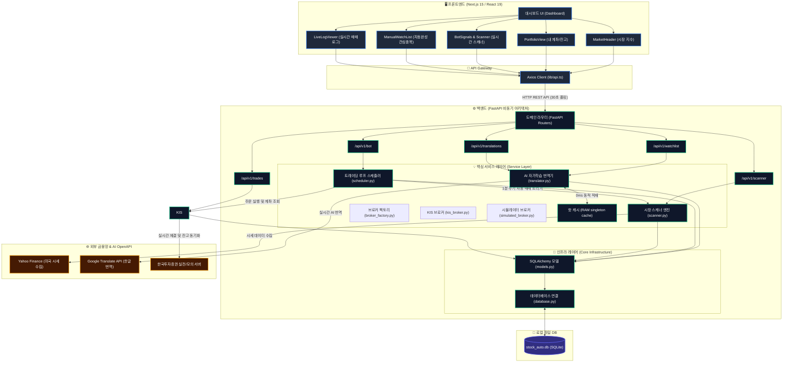
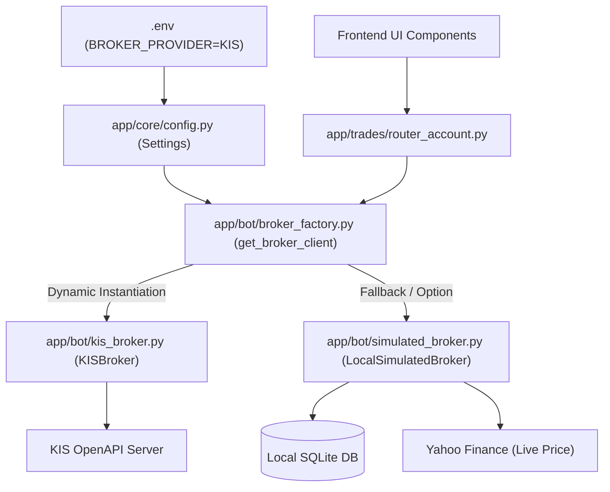

# StockAuto 시스템 매뉴얼 (System Manual)

본 문서는 StockAuto 자동매매 시스템의 전체 구조와 소스 코드 구성을 설명하는 최종 기술 매뉴얼입니다.

## 📐 시스템 전체 아키텍처 블록 다이어그램 (Architecture Diagram)

프론트엔드(Next.js)와 백엔드(FastAPI), 로컬 SQLite DB, 그리고 외부 금융망(한국투자증권, Yahoo Finance) 및 AI OpenAPI(Google Translate)가 서로 어떻게 긴밀하게 연동되어 구동되는지 한눈에 보여주는 시스템 종합 구조도입니다.



## 📂 프로젝트 파일 맵

### 1. 백엔드 코어 모듈 (`/backend/app/core`)

- **`config.py`**: `.env` 환경 변수를 부모 경로 추적을 통해 안정적으로 로드하여 실전/모의 거래 환경을 설정합니다.
- **`database.py`**: SQLAlchemy 기반 DB 연결 설정 및 SQLite 경로를 프로젝트 루트 절대 경로로 자동 오차 보정합니다.
- **`models.py`**: 모든 SQLAlchemy DB 테이블 모델 중앙 관리 (`TradeLog`, `Holding`, `ActionLog`, `BotStatus`, `WatchList`, `StockTranslation`).
- **`exceptions.py`**: 표준 규격 전역 예외 처리 핸들러 (`StockAutoException`).
- **`response.py`**: 프론트엔드 통신용 성공 API JSON 응답 포맷 통일 헬퍼.

### 2. 백엔드 도메인 패키지 (`/backend/app`)

- **`main.py`**: 서비스 기동 및 Lifespan 시작점. 핫 번역 메모리 캐시 및 백그라운드 봇 스케줄러 자동 가동.
- **`translations/`**: 번역 도메인. 어드민 CRUD API(`router.py`) 및 RAM 싱글톤 핫 캐시 기반 번역기(`translator.py`).
- **`watchlist/`**: 관심종목 도메인. 종목 추가/삭제 및 신규 주식 등록 시 한글 번역 자동 연동 자가학습 API(`router.py`).
- **`scanner/`**: 스캐너 도메인. 최신 봇 시그널 제공 API(`router.py`) 및 QQQ 나스닥 지수 기반의 2-Stage expert 필터 핵심 스캔 모듈(`scanner.py`).
- **`bot/`**: 자동매매 제어 도메인. 봇 구동 제어 API(`router.py`), 하이브리드 트레이딩 메인 루프 스케줄러(`scheduler.py`), 한국투자증권 API 클라이언트(`kis_api.py`), 공통 추상 브로커 인터페이스(`base_broker.py`), 한투 래퍼 브로커(`kis_broker.py`), 가상 예수금 및 실시간 가격 연동 시뮬레이터 브로커(`simulated_broker.py`), 이들을 설정에 따라 동적으로 생산 및 반환하는 팩토리(`broker_factory.py`).
- **`trades/`**: 거래 및 계좌 도메인. 실시간 매매 및 시스템 활동 로그 API(`router_trades.py`), 브로커 팩토리를 통해 잔고/보유량을 통합 처리하는 초경량 라우터(`router_account.py`), 지수 및 시장 종합 센티먼트 API(`router_market.py`).

### 4. 프론트엔드 대시보드 (`/frontend`)

- **`components/MarketHeader.tsx`**: 실시간 시장 지수 및 심리 상태 표시.
- **`components/PortfolioView.tsx`**: 보유 종목 현황 및 트레일링 스탑 시각화.
- **`components/BotSignals.tsx`**: 봇이 실시간 탐지한 상위 시그널 표시 (Bot's View).
- **`components/ManualWatchList.tsx`**: 사용자 등록 관심종목 및 개별 점수 표시 (User's View).
- **`components/LiveLogViewer.tsx`**: 봇 활동 내역 실시간 터미널 뷰.

## ⚙️ 시스템 핵심 동작 원리

1. **인증**: 모든 통신은 `kis_api.py`에서 OAuth 2.0 및 Hashkey 보안 과정을 거쳐 처리됩니다.
2. **분석**: `scanner.py`가 전체 시장 상황을 먼저 판단(Sentiment Check)한 후 개별 종목을 정밀 분석합니다.
3. **매매**: `TRADING_STRATEGY.md`에 정의된 하이브리드 전략에 따라 `scheduler.py`가 자율적으로 판단하여 주문을 전송합니다.
4. **모니터링**: 봇의 모든 판단 과정은 `ActionLog`에 기록되어 대시보드에 실시간으로 출력됩니다.

## 🌐 실시간 AI 자가학습 번역 시스템 (Self-Learning i18n System)

StockAuto는 8,000개가 넘는 나스닥 상장 주식의 한글명을 자동으로 번역하고 최적화하여 보관하는 독자적인 자가학습 캐싱 시스템을 제공합니다.

### 🔄 데이터 조회 및 자동 학습 파이프라인
신규 종목(예: `CTNT`)이 추가되거나 조회될 때 시스템은 아래의 4단계 파이프라인을 거치며 **0ms 속도로 초고속 서빙 및 자가학습**을 수행합니다:

1. **1단계: 메모리 캐시 조회 (0ms)**
   - 백엔드 RAM 내부에 상주하고 있는 핫 캐시(`Translator._cache`)에서 즉시 조회하여 반환합니다.
2. **2단계: 로컬 DB 조회 및 메모리 캐시 동적 싱크**
   - 메모리에 없을 경우 로컬 SQLite DB (`StockTranslation` 테이블)를 쿼리하여 번역을 획득하고, 이를 메모리 캐시에 적재하여 다음 요청부터는 0ms로 서빙되도록 만듭니다.
3. **3단계: 미국 금융 데이터 실시간 추적 (yfinance Fallback)**
   - DB에도 없을 경우 실시간으로 yfinance를 통해 미국의 주식 상장 데이터베이스에 접속하여 실상장 여부를 검증하고, 영문 법인명(ShortName/LongName)을 가져옵니다.
4. **4단계: AI 실시간 번역 및 자가학습 캐싱 가동**
   - 불필요한 법인 꼬리표(예: `Inc.`, `Corp.`, `Ltd.`, `plc.`)를 정규식으로 안전하게 도려낸 뒤, **Google Translation OpenAPI**를 연동하여 깔끔한 한글 주식명(예: `치타넷 공급망 서비스`)으로 번역합니다.
   - 번역된 결과를 로컬 DB에 영구 기록(자가학습)하고, 메모리 캐시에도 즉각 동기화하여 평생 보관합니다.

### 🎁 시스템 전역 낙수 효과 (Cascade Effect)
이 자가학습 번역기(`Translator.translate`)는 전역 미들웨어 형태로 캡슐화되어 있습니다. 따라서 **관심종목(Watchlist)**, **마켓 스캐너(Market Scanner)**, **트레이딩 봇 매매 일지** 등 어떤 모듈에서든 신규 주식을 건드리는 즉시 단 한 번의 번역만으로 시스템 전체가 한글 이름 혜택을 동시에 누립니다.


## 🎨 실시간 자동완성 검색 드롭다운 (Real-Time Autocomplete Dropdown)

사용자 편의성과 HTS급의 극적이고 안전한 UX를 보장하기 위해 관심종목 수동 추가창에 **실시간 자동완성 드롭다운 엔진**을 탑재하고 있습니다.

### 🔄 동작 메커니즘 및 프리미엄 UX 스펙
1. **사전 다운로드 (Pre-fetching)**: 
   - 사용자가 관심종목 추가 양식 `[+]` 버튼을 클릭하는 즉시 백엔드로부터 한글 번역 DB 사전 목록을 프론트엔드 메모리로 가져옵니다 (`translationAPI.getAll`).
2. **0ms 고속 필터링 (Client-side Search)**:
   - 사용자가 타이핑을 시작하면 백엔드 호출 없이 브라우저단에서 즉각 영어 티커와 한국어 이름을 대소문자 구분 없이 실시간 매칭하여 상위 5개의 추천 종목을 도출합니다.
3. **검색어 정밀 하이라이팅 (Matced Highlight)**:
   - 사용자가 입력한 검색어 단어 부위만 주황색/금색(`text-amber-500 font-bold`)으로 강조 분리 렌더링하고 나머지는 흰색/회색으로 표시하여 전문 거래소 플랫폼다운 고도의 심미성을 선사합니다.
4. **클릭 즉시 골인 (Instant Registration)**:
   - 복잡하게 영문 티커를 다 적고 [Add]를 누를 필요 없이, 목록에 뜬 한글 추천 후보를 마우스로 클릭하면 정확히 매핑된 영문 티커와 정식 한글명으로 백엔드에 즉각 등록 요청을 날립니다.
5. **예외 방어 (Ambiguity Prevention)**:
   - 백엔드의 임의적인 추측(예: '테슬' 입력 시 테슬라와 테슬라 레버리지 중 엉뚱한 종목을 마음대로 등록해 주는 부작용)을 완벽히 방지하여, 오작동 없는 안전한 관심종목 형상관리를 보장합니다.


## 🔌 멀티 증권사 연동 아키텍처 및 모의투자 시뮬레이터 (Multi-Broker & Paper Trading)

기존 한국투자증권(KIS)에 강하게 밀결합되어 있던 계좌 및 자산 조회 구조를 느슨한 결합(Loose Coupling)으로 전면 개선했습니다.

### 🔄 동적 브로커 조립 데이터 흐름 (Mermaid Flow)


### 1. 추상 아키텍처 설계 규격
* **`BaseBroker` (추상 인터페이스)**: 미래에셋, 토스, 키움 등 어떤 증권사 API든 꽂아 쓸 수 있게 약속된 잔고/보유종목 조회 함수 규격을 구축했습니다.
* **`KISBroker` (한투 연동용)**: 한투 API 실전 및 모의투자 API를 규격에 맞춰 래핑하여 연동 상태에 따라 `"KIS Live"` 혹은 `"KIS Mock"`을 반환하도록 설계했습니다.
* **`LocalSimulatedBroker` (로컬 모의투자)**: 로컬 SQLite 가상 주식 데이터와 실시간 환율 및 실시간 주가를 추적 연산하는 독립 모의투자 시뮬레이터 객체를 깔끔하게 구현했습니다.

### 2. UI 시각화 및 구분 가이드 (UI Visualization)
실시간 데이터의 연동 출처를 사용자가 직관적으로 식별할 수 있도록 다이내믹 인디케이터 장치를 설계했습니다.
* **실전 계좌 연동 시 (Live)**: 🟢 초록색 테두리로 활기차게 빛나며 **`KIS LIVE`** 배지 표시.
* **모의 계좌 연동 시 (Mock)**: 🟡 경고/가상 성격의 주황색 테두리와 함께 **`KIS MOCK`** 배지 표시.
* **로컬 가상 투자 시 (Simulated)**: 🟡 주황색 테두리와 함께 **`SIMULATED`** 배지 표시.

### 3. 향후 타 증권사 추가 가이드 (Future Extension)
설정파일(`.env`)에서 `BROKER_PROVIDER=TOSS` 혹은 `BROKER_PROVIDER=MIRAE` 등으로 변경 시 즉시 교체될 수 있도록 설계되었습니다.
1. `app/bot/` 디렉터리에 `toss_broker.py`를 생성하고 `BaseBroker` 인터페이스의 추상 메서드를 구현합니다.
2. `broker_factory.py`에서 `BROKER_PROVIDER == "TOSS"` 조건 분기를 추가하여 `TossBroker` 인스턴스를 반환하도록 등록합니다.
3. `.env` 파일의 증권사 이름만 변경해 주면 소스코드 수정 없이 전체 UI 및 계좌 연동이 즉시 토스증권으로 자동 스위칭됩니다!


## 🚀 시스템 실행 방법 (System Execution)

### 1. 백엔드 실행 (Backend Startup)

백엔드는 OS 환경변수 주입 실수를 원천 방지하기 위해 **Spring Boot Style 통합 프로필 런처 (`run.py`)** 를 지원합니다. `/backend` 폴더에서 아래 명령어 중 하나를 실행하십시오.

```bash
# 1. 로컬 개발 환경 (소스코드 자동 릴로드 ON, .env.local 로드)
python run.py local  # (또는 인자 생략 시 기본값: python run.py)

# 2. 개발 서버 환경 (소스코드 자동 릴로드 ON, .env.dev 로드)
python run.py dev

# 3. 실전 운영 환경 (자동 릴로드 OFF로 안정성 극대화, .env.prod 로드)
python run.py prod
```

> [!IMPORTANT]
> 더 이상 터미널에서 복잡하게 `uvicorn app.main:app --reload` 명령어를 직접 타이핑하거나 OS별 환경변수를 억지로 세팅할 필요가 없습니다. `run.py` 런처가 프로필 파라미터를 읽어 완벽히 안전하게 구동해 줍니다.

### 2. 프론트엔드 실행 (Frontend Startup)

`/frontend` 폴더에서 실행합니다.

```bash
npm run dev
```

---

> 상세한 트레이딩 전략 규칙은 [TRADING_STRATEGY.md](file:///d:/dev/workspace/stockAuto/docs/TRADING_STRATEGY.md)를 참고하세요.
> Vue 개발자를 위한 React Hooks 직관 가이드는 [REACT_GUIDE.md](file:///d:/dev/workspace/stockAuto/docs/REACT_GUIDE.md)를 참고하세요.
