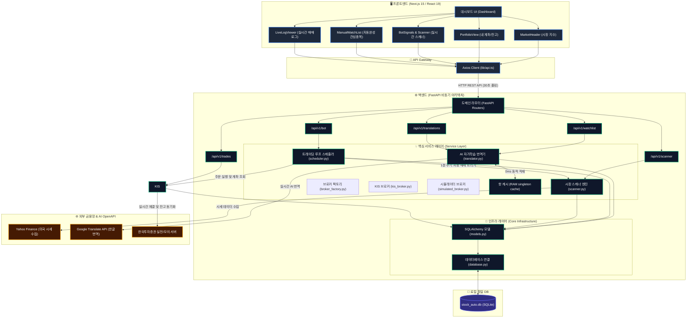
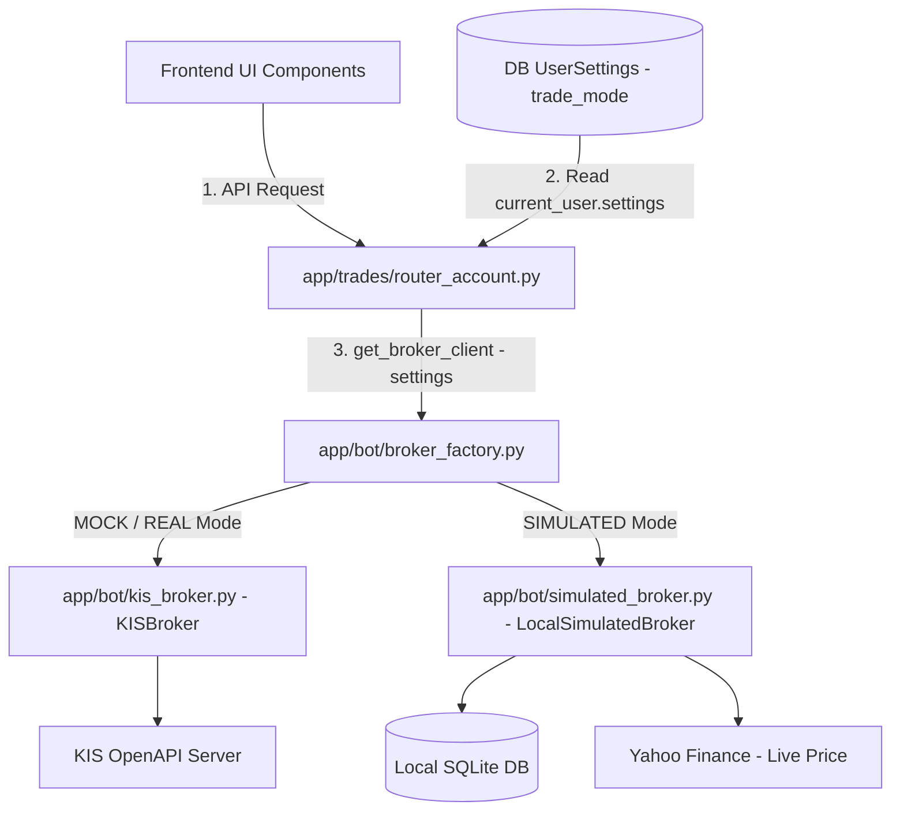
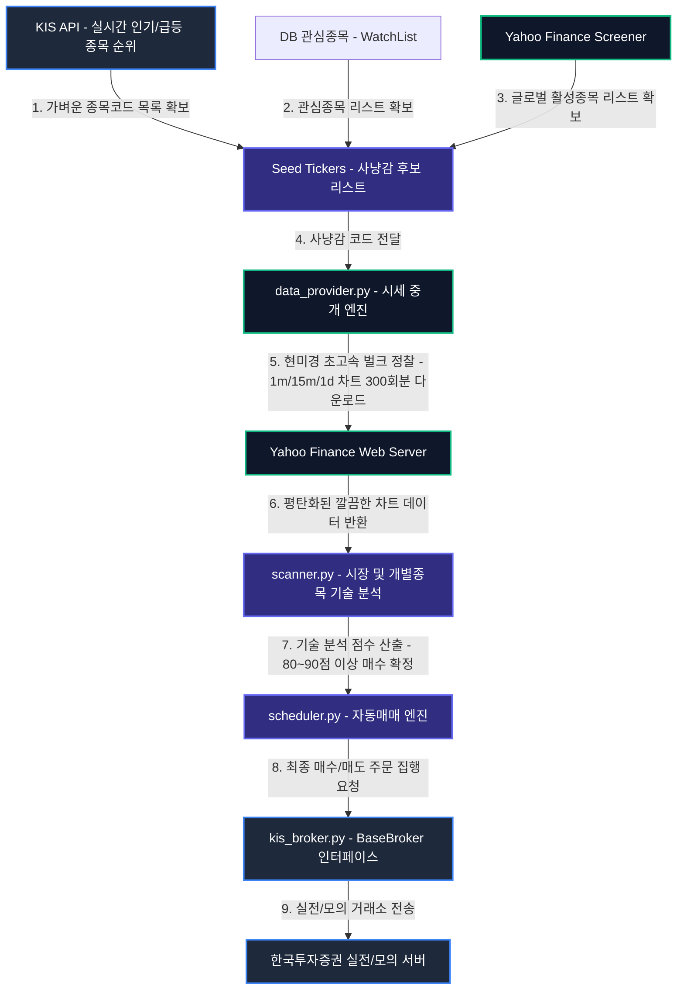
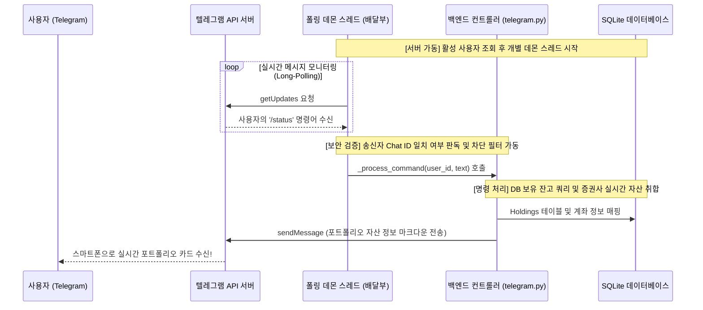
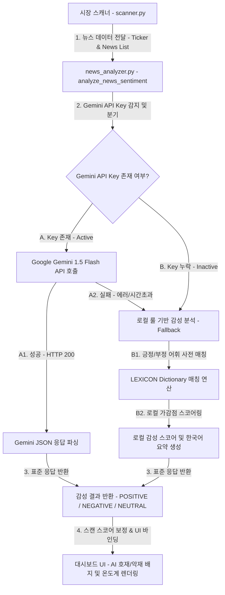

# StockAuto 시스템 매뉴얼 (System Manual)


본 문서는 StockAuto 자동매매 시스템의 전체 구조와 소스 코드 구성을 설명하는 최종 기술 매뉴얼입니다.


## 📐 시스템 전체 아키텍처 블록 다이어그램 (Architecture Diagram)


프론트엔드(Next.js)와 백엔드(FastAPI), 로컬 SQLite DB, 그리고 외부 금융망(한국투자증권, Yahoo Finance) 및 AI OpenAPI(Google Translate)가 서로 어떻게 긴밀하게 연동되어 구동되는지 한눈에 보여주는 시스템 종합 구조도입니다.





## 📂 프로젝트 파일 맵


### 1. 백엔드 코어 모듈 (`/backend/app/core`)


- **`config.py`**: `.env` 환경 변수를 부모 경로 추적을 통해 안정적으로 로드하여 실전/모의 거래 환경을 설정합니다.

- **`database.py`**: SQLAlchemy 기반 DB 연결 설정 및 SQLite 경로를 프로젝트 루트 절대 경로로 자동 오차 보정합니다.

- **`models.py`**: 모든 SQLAlchemy DB 테이블 모델 중앙 관리 (`TradeLog`, `Holding`, `ActionLog`, `BotStatus`, `WatchList`, `StockTranslation`).

- **`exceptions.py`**: 표준 규격 전역 예외 처리 핸들러 (`StockAutoException`).

- **`response.py`**: 프론트엔드 통신용 성공 API JSON 응답 포맷 통일 헬퍼.


### 2. 백엔드 도메인 패키지 (`/backend/app`)


- **`main.py`**: 서비스 기동 및 Lifespan 시작점. 핫 번역 메모리 캐시 및 백그라운드 봇 스케줄러 자동 가동.

- **`translations/`**: 번역 도메인. 어드민 CRUD API(`router.py`) 및 RAM 싱글톤 핫 캐시 기반 번역기(`translator.py`).

- **`watchlist/`**: 관심종목 도메인. 종목 추가/삭제 및 신규 주식 등록 시 한글 번역 자동 연동 자가학습 API(`router.py`).

- **`scanner/`**: 스캐너 도메인. 최신 봇 시그널 제공 API(`router.py`), QQQ 나스닥 지수 기반의 단타 돌파 전용 2-Stage expert 필터 모듈(`scanner.py`), 그리고 120일 일봉 기반으로 내일의 급등주를 예측하는 마크 미너비니 VCP 패턴 기반의 스윙 예측 모듈(`swing_predictor.py`)을 포함하는 **투트랙(Two-track) 스캐닝 엔진**입니다.

- **`bot/`**: 자동매매 제어 도메인. 봇 구동 제어 API(`router.py`), 하이브리드 트레이딩 메인 루프 스케줄러(`scheduler.py`), 한국투자증권 API 클라이언트(`kis_api.py`), 공통 추상 브로커 인터페이스(`base_broker.py`), 한투 래퍼 브로커(`kis_broker.py`), 가상 예수금 및 실시간 가격 연동 시뮬레이터 브로커(`simulated_broker.py`), 이들을 설정에 따라 동적으로 생산 및 반환하는 팩토리(`broker_factory.py`).

- **`trades/`**: 거래 및 계좌 도메인. 실시간 매매 및 시스템 활동 로그 API(`router_trades.py`), 브로커 팩토리를 통해 잔고/보유량을 통합 처리하는 초경량 라우터(`router_account.py`), 지수 및 시장 종합 센티먼트 API(`router_market.py`).


### 4. 프론트엔드 대시보드 (`/frontend`)


- **`components/MarketHeader.tsx`**: 실시간 시장 지수 및 심리 상태 표시.

- **`components/PortfolioView.tsx`**: 보유 종목 현황 및 트레일링 스탑 시각화.

- **`components/BotSignals.tsx`**: 봇이 실시간 탐지한 상위 시그널 표시 (Bot's View).

- **`components/ManualWatchList.tsx`**: 사용자 등록 관심종목 및 개별 점수 표시 (User's View).

- **`components/LiveLogViewer.tsx`**: 봇 활동 내역 실시간 터미널 뷰.


## ⚙️ 시스템 핵심 동작 원리


1. **인증**: 모든 통신은 `kis_api.py`에서 OAuth 2.0 및 Hashkey 보안 과정을 거쳐 처리됩니다.

2. **분석**: `scanner.py`가 전체 시장 상황을 먼저 판단(Sentiment Check)한 후 개별 종목을 정밀 분석합니다.

3. **매매**: `strategy_specification.md`에 정의된 하이브리드 전략에 따라 `scheduler.py`가 자율적으로 판단하여 주문을 전송합니다.

4. **모니터링**: 봇의 모든 판단 과정은 `ActionLog`에 기록되어 대시보드에 실시간으로 출력됩니다.


## 🌐 실시간 AI 자가학습 번역 시스템 (Self-Learning i18n System)


StockAuto는 8,000개가 넘는 나스닥 상장 주식의 한글명을 자동으로 번역하고 최적화하여 보관하는 독자적인 자가학습 캐싱 시스템을 제공합니다.


### 🔄 데이터 조회 및 자동 학습 파이프라인

신규 종목(예: `CTNT`)이 추가되거나 조회될 때 시스템은 아래의 4단계 파이프라인을 거치며 **0ms 속도로 초고속 서빙 및 자가학습**을 수행합니다:


1. **1단계: 메모리 캐시 조회 (0ms)**

   - 백엔드 RAM 내부에 상주하고 있는 핫 캐시(`Translator._cache`)에서 즉시 조회하여 반환합니다.

2. **2단계: 로컬 DB 조회 및 메모리 캐시 동적 싱크**

   - 메모리에 없을 경우 로컬 SQLite DB (`StockTranslation` 테이블)를 쿼리하여 번역을 획득하고, 이를 메모리 캐시에 적재하여 다음 요청부터는 0ms로 서빙되도록 만듭니다.

3. **3단계: 미국 금융 데이터 실시간 추적 (yfinance Fallback)**

   - DB에도 없을 경우 실시간으로 yfinance를 통해 미국의 주식 상장 데이터베이스에 접속하여 실상장 여부를 검증하고, 영문 법인명(ShortName/LongName)을 가져옵니다.

4. **4단계: AI 실시간 번역 및 자가학습 캐싱 가동**

   - 불필요한 법인 꼬리표(예: `Inc.`, `Corp.`, `Ltd.`, `plc.`)를 정규식으로 안전하게 도려낸 뒤, **Google Translation OpenAPI**를 연동하여 깔끔한 한글 주식명(예: `치타넷 공급망 서비스`)으로 번역합니다.

   - 번역된 결과를 로컬 DB에 영구 기록(자가학습)하고, 메모리 캐시에도 즉각 동기화하여 평생 보관합니다.


### 🎁 시스템 전역 낙수 효과 (Cascade Effect)

이 자가학습 번역기(`Translator.translate`)는 전역 미들웨어 형태로 캡슐화되어 있습니다. 따라서 **관심종목(Watchlist)**, **마켓 스캐너(Market Scanner)**, **트레이딩 봇 매매 일지** 등 어떤 모듈에서든 신규 주식을 건드리는 즉시 단 한 번의 번역만으로 시스템 전체가 한글 이름 혜택을 동시에 누립니다.


## 🎨 실시간 자동완성 검색 드롭다운 (Real-Time Autocomplete Dropdown)


사용자 편의성과 HTS급의 극적이고 안전한 UX를 보장하기 위해 관심종목 수동 추가창에 **실시간 자동완성 드롭다운 엔진**을 탑재하고 있습니다.


### 🔄 동작 메커니즘 및 프리미엄 UX 스펙

1. **사전 다운로드 (Pre-fetching)**: 

   - 사용자가 관심종목 추가 양식 `[+]` 버튼을 클릭하는 즉시 백엔드로부터 한글 번역 DB 사전 목록을 프론트엔드 메모리로 가져옵니다 (`translationAPI.getAll`).

2. **0ms 고속 필터링 (Client-side Search)**:

   - 사용자가 타이핑을 시작하면 백엔드 호출 없이 브라우저단에서 즉각 영어 티커와 한국어 이름을 대소문자 구분 없이 실시간 매칭하여 상위 5개의 추천 종목을 도출합니다.

3. **검색어 정밀 하이라이팅 (Matced Highlight)**:

   - 사용자가 입력한 검색어 단어 부위만 주황색/금색(`text-amber-500 font-bold`)으로 강조 분리 렌더링하고 나머지는 흰색/회색으로 표시하여 전문 거래소 플랫폼다운 고도의 심미성을 선사합니다.

4. **클릭 즉시 골인 (Instant Registration)**:

   - 복잡하게 영문 티커를 다 적고 [Add]를 누를 필요 없이, 목록에 뜬 한글 추천 후보를 마우스로 클릭하면 정확히 매핑된 영문 티커와 정식 한글명으로 백엔드에 즉각 등록 요청을 날립니다.

5. **예외 방어 (Ambiguity Prevention)**:

   - 백엔드의 임의적인 추측(예: '테슬' 입력 시 테슬라와 테슬라 레버리지 중 엉뚱한 종목을 마음대로 등록해 주는 부작용)을 완벽히 방지하여, 오작동 없는 안전한 관심종목 형상관리를 보장합니다.


## 🔌 멀티 증권사 연동 아키텍처 및 모의투자 시뮬레이터 (Multi-Broker & Paper Trading)

기존 한국투자증권(KIS)에 강하게 밀결합되어 있던 계좌 및 자산 조회 구조를 느슨한 결합(Loose Coupling)으로 전면 개선했습니다.

### 🔄 매매 모드 전환 시 데이터 흐름 (실전/모의/가상 전환)



### 1. 추상 아키텍처 설계 규격

* **`BaseBroker` (추상 인터페이스)**: 미래에셋, 토스, 키움 등 어떤 증권사 API든 꽂아 쓸 수 있게 약속된 잔고/보유종목 조회 함수 규격을 구축했습니다.
* **`KISBroker` (한투 연동용)**: 한투 API 실전 및 모의투자 API 연동을 담당합니다.
* **`SimulatedBroker` (가상 시뮬레이터용)**: yfinance 실시간 시세 기반의 가상 매매 및 잔고 관리 역할을 수행합니다.

### 2. UI/UX 동적 렌더링 구분 (Broker Badge Styling)

설정된 트레이딩 모드에 따라 대시보드 및 보유종목 상단에 아래와 같이 배지와 테두리가 다이내믹하게 렌더링됩니다:
* **실전 투자 시 (Real)**: 🟢 초록색 테두리와 함께 **`KIS LIVE`** 배지 표시.
* **모의 투자 시 (Mock)**: 🟠 모의 OpenAPI 가상 성격의 주황색 테두리와 함께 **`KIS MOCK`** 배지 표시.
* **로컬 가상 투자 시 (Simulated)**: 🟡 주황색 테두리와 함께 **`SIMULATED`** 배지 표시.

### 3. 향후 타 증권사 추가 가이드 (Future Extension)

레지스트리 패턴(Registry Pattern)을 적용하여, 신규 증권사가 추가되더라도 복잡한 조건 분기문을 매번 수정하지 않고 단순 딕셔너리 매핑 추가만으로 안정적으로 등록 및 교체가 가능합니다.

1. `app/bot/` 디렉터리에 `toss_broker.py`를 생성하고 `BaseBroker` 인터페이스의 추상 메서드를 구현합니다.
2. `broker_factory.py` 파일 상단의 `BROKER_REGISTRY` 딕셔너리에 신규 브로커 클래스를 키-값 쌍으로 매핑해 줍니다.
   ```python
   # 예시
   BROKER_REGISTRY = {
       "SIMULATED": LocalSimulatedBroker,
       "MOCK": KISBroker,
       "REAL": KISBroker,
       "TOSS_MOCK": TossBroker,  # 신규 등록!
       "TOSS_REAL": TossBroker,
   }
   ```
3. 데이터베이스 `user_settings` 테이블의 `trade_mode`를 `"TOSS_MOCK"` 등으로 세팅해 주면 소스코드 수정 없이 전체 UI 및 계좌 연동이 즉시 토스증권으로 자동 스위칭됩니다!


## 📊 종목 발굴부터 주문까지의 전체 데이터 흐름 (시세-주문 협동)


StockAuto는 수백 개의 주식 종목을 매 시간 정찰(Scanning)하면서도, 증권사 API의 엄격한 제한 규정 내에서 안전하게 가동되도록 **"시세 분석(yfinance)"과 "주문 집행(한국투자증권 KIS)" 채널을 철저히 분리한 이원화 협동 아키텍처**를 제공합니다.


### 📐 데이터 흐름 및 순환 과정 (Mermaid Flow)





### 🛠️ 이원화 아키텍처의 핵심 기술 스펙 및 설계 이점


1. **🚨 증권사 초당 호출 제한(Rate Limit) 원천 해결 및 IP 차단 방지**

   - **문제 상황:** 한국투자증권(KIS) API는 모의투자 기준 초당 2~3회, 실전 기준 초당 20회 내외의 엄격한 호출 제약이 있습니다. 100개 종목에 대해 1분봉/15분봉/일봉 차트를 스캔하려면 **최소 300번의 통신**이 필요하여 즉시 호출 한도 초과 에러(HTTP 429) 및 IP 차단이 발생합니다.

   - **해결 방안:** `data_provider.py`는 `yfinance`가 지원하는 강력한 **대량 벌크 다운로드(Bulk Fetch)** 기능(`yf.download([리스트])`)을 활용합니다. 300번 통신해야 할 분량을 단 **3번의 비동기 병렬 요청**으로 줄여 단 0.5초 만에 차트 수집을 끝마칩니다.


2. **🔌 의존성 역전 원칙(DIP)을 통한 완벽한 시세 벤더 캡슐화**

   - 시스템 메인 컨트롤러(스케줄러, 라우터, 모의투자 브로커 등)는 야후 파이낸스를 직접 알지 못합니다. 오직 중립적인 명칭을 지닌 `data_provider.py`의 `fetch_ohlcv` 인터페이스만 호출해 사용합니다.

   - 향후 야후 파이낸스 측 서비스가 마비되거나 다른 유료 시세 API(예: AlphaVantage, Bloomberg 등) 또는 한투 시세 API로 교체해야 하는 상황이 오더라도, **메인 프로그램 소스코드는 단 한 줄도 수정할 필요 없이 오직 `data_provider.py` 내부 구현만 교체**하면 모든 연동이 그대로 영속됩니다.


3. **🤝 KIS(브로커)와 data_provider(시세 엔진)의 유기적인 데이터 매핑**

   - **사냥감 목록 발굴:** 한투 KIS API를 통해 "오늘 거래대금이 가장 많이 몰린 핫한 해외주식 100개 목록"을 안전하게 받아옵니다. (1차 그물망)

   - **정밀 저격 정찰:** KIS가 포착해 준 100개 종목 코드를 `data_provider(yfinance)`에 대입하여 대용량 차트 정보를 긁어와 기술 지표(EMA, VWAP, OBV, RSI)를 현미경 정찰하듯 분석하여 최종 타점 점수를 도출합니다.

   - **주문 체결:** 최종 선정된 우량주 사냥감에 대해서만 한투(`KISBroker`) API를 쏘아 체결 및 포트폴리오를 동기화합니다. 이보다 더 효율적이고 이상적일 수 없는 하이브리드 트레이딩 루프입니다.


## 🤖 텔레그램 트레이딩 브릿지 아키텍처 & 연동 가이드 (Telegram Trading Bridge)


StockAuto는 텔레그램 봇 API를 통해 사용자의 스마트폰과 백엔드 서버를 1대1 무중단 양방향으로 연결하는 대화형 트레이딩 브릿지 시스템을 탑재하고 있습니다. 이를 통해 외부에서도 실시간으로 시스템 모니터링 및 트레이딩 루프의 가동/중지가 가능합니다.


### 📐 텔레그램 연동 아키텍처 시퀀스 다이어그램 (Mermaid Sequence)


사용자(Telegram App)의 명령 입력부터 백엔드 엔진의 처리, 외부 증권사 API 연동 및 비동기 답장 전송까지의 전체 데이터 흐름도입니다.





### ⚙️ 핵심 모듈 설계 및 동작 원리


이 브릿지는 [`backend/app/core/telegram.py`](file:///d:/dev/workspace/stockAuto/backend/app/core/telegram.py)에 구현되어 있으며, 아래의 4단계 라이프사이클을 통해 안전하고 빠르게 구동됩니다.


#### 1. 서버 라이프사이클 통합 기동 (`start_telegram_bot` & `start_telegram_bot_for_user`)

- **싱글스레드 기반 멀티테넌시 지원**: 서버가 시작될 때(`main.py`의 startup lifespan), 시스템 설정의 `settings.TELEGRAM_BOT_TOKEN`을 기반으로 단 **1개의 글로벌 백그라운드 폴링 데몬 스레드**만 가동합니다.

- **획기적인 서버 리소스 절약**: 유저 수에 비례하여 개별 스레드를 생성하던 방식에서 단 1개의 데몬 스레드로 모든 사용자 메시지를 일괄 처리하도록 리팩토링하여 서버 부하를 0에 수렴시켰습니다.


#### 2. 실시간 롱 폴링(Long-Polling) 루프 및 간편 딥링크 연동 (`_poll_global_updates_loop` & `_process_global_message`)

- **무한 루프 감시**: 전역 단일 봇 토큰으로 `getUpdates` API를 지속 호출하며 대기열에 쌓이는 사용자의 입력 메시지를 수집합니다.

- **⚡ 1-Click 자동 딥링크 연동**: 사용자가 웹 대시보드에서 `[🔗 텔레그램 연동 시작]` 버튼을 누르면 `t.me/봇아이디?start=username`으로 연결됩니다. 사용자가 대화창에서 `[시작 (Start)]`을 누르면 백엔드가 `/start username` 메시지를 감지하여 해당 사용자의 텔레그램 `chat_id`를 데이터베이스에 자동으로 안전하게 바인딩합니다. (사용자는 본인의 CHAT ID를 수동으로 알아낼 필요가 전혀 없습니다.)

- **🔐 철통 보안 필터링**: 메시지를 보낸 송신자의 텔레그램 `chat_id`가 DB에 등록되지 않은 비인가 사용자인 경우, 연동 안내 가이드 메시지만 발송하고 원격 제어 명령을 차단하여 비인가 접근을 원천 봉쇄합니다.


#### 3. 명령어 파싱 및 로직 핸들러 (`_process_command`)

수신한 텍스트의 첫 어절을 추출하여 소문자로 정제한 뒤, `if-elif-else` 제어 흐름에 따라 동작을 처리합니다.

- **`/start`**: 시스템 연동 완료 인사말 및 간결한 활용 매뉴얼 전송.

- **`/run`**: DB 내 사용자의 `is_running` 상태 값을 `True`로 전환하여 백엔드 스케줄러 자동매매 루프를 즉각 작동시킵니다.

- **`/stop`**: `is_running` 값을 `False`로 전환하여 자율 트레이딩 자동매매 루프를 안전하게 일시중지합니다.

- **`/status`**: QQQ 나스닥 지수 기반의 실시간 원/달러 환율 캐시(`FXRateCache`), 데이터베이스의 보유 종목(`Holding` 테이블), 그리고 동적 브로커 팩토리(`get_broker_client`)를 통해 취합한 실시간 총자산 및 예수금 현황을 가공하여 시인성 높은 마크다운 텍스트로 조립하여 답장을 발송합니다.


#### 4. 비동기식 실시간 답장 전송 (`send_message_async`)

- 조립된 답장 메시지를 전송할 때, 네트워크망 레이턴시로 인해 메인 트레이딩 엔진의 매매 타이밍이 딜레이되는 현상을 예방하기 위해 **비동기 전송**을 수행합니다.

- **`ThreadPoolExecutor`** (최대 10개 스레드 풀)를 생성해 두고 전송 작업을 백그라운드 태스크로 던짐으로써, 메인 스레드는 전송 완료 여부를 기다리지 않고 0.1ms 만에 즉시 다음 주식 스캔 및 연산 루프로 복귀합니다.


## 🧠 하이브리드 AI 뉴스 감성 분석 아키텍처 (Hybrid AI News Sentiment Architecture)

StockAuto는 수집된 실시간 뉴스를 활용하여 시장의 촉매제(Catalyst) 및 호악재를 판독하는 **"하이브리드 AI 뉴스 감성 분석 엔진 (`news_analyzer.py`)"**을 구축하고 있습니다.
이 시스템은 고성능 외부 생성형 AI 모델과 인터넷망 단절 또는 크레딧 초과 상황에 대비한 로컬 룰 엔진을 유기적으로 교차 구동하는 **자동 폴백(Fallback) 안전망**을 제공합니다.

### 📐 뉴스 감성 분석 및 폴백 흐름도 (Mermaid Flow)



### 🛠️ 하이브리드 감성 분석의 핵심 아키텍처 및 장점

1. **🤖 Google Gemini 1.5 Flash API 연동 (기본 경로)**
   - 스캔된 종목의 최근 뉴스 5개 헤드라인을 수집하여 프롬프트를 구성합니다.
   - 금융 특화 감성 판독 결과(`POSITIVE`, `NEGATIVE`, `NEUTRAL`)와 영향도 점수(0~100), 그리고 **자연스러운 1문장 한글 요약(Summary)**을 JSON 규격으로 반환받아 실시간 가공합니다.
   
2. **🔌 3단계 로컬 자연어 어휘 사전 폴백 (Local Fallback Lexicon)**
   - API Key 미등록 상태이거나, 한도 초과(Rate Limit), 네트워크 장애 등으로 외부 API가 무응답 상태에 빠질 경우 시스템 마비를 방지하기 위해 **즉시 로컬 감성 사전을 활성화**합니다.
   - 긍정 어휘 사전(`LEXICON_POSITIVE`: surge, breakout, upgrade 등) 및 부정 어휘 사전(`LEXICON_NEGATIVE`: crash, lawsuit, miss 등)과의 매칭 계산을 통해 안정적인 감성 분류 및 로컬 요약을 0ms 내에 생성해 냅니다.
   
3. **📊 전략 시그널 스코어 보정 및 대시보드 렌더링**
   - 최종 판독된 감성 결과는 스캐너 채점판에 반영되어 점수를 보정(긍정 뉴스 최대 +20점, 부정 뉴스 최대 -30점)하며, Next.js 화면의 AI 배지와 온도계로 시각화됩니다.


## 🚀 시스템 실행 방법 (System Execution)

### 1. 백엔드 실행 (Backend Startup)

백엔드는 OS 환경변수 주입 실수와 가상환경 수동 활성화 번거로움을 원천 방지하기 위해 **Spring Boot Style 통합 프로필 런처 및 가상환경 자가 치환 시스템 (`run.py`)** 을 지원합니다. `/backend` 폴더에서 아래 명령어 중 하나를 실행하십시오.

> **백엔드 가상환경 표준:** 공식 디렉터리는 `backend/venv`입니다.

```bash
# 1. 로컬 개발 환경 (소스코드 자동 릴로드 ON, .env.local 로드)
python run.py local  # (또는 인자 생략 시 기본값: python run.py)

# 2. 개발 서버 환경 (소스코드 자동 릴로드 ON, .env.dev 로드)
python run.py dev

# 3. 실전 운영 환경 (자동 릴로드 OFF로 안정성 극대화, .env.prod 로드)
python run.py prod
```

> [!TIP]
> **💡 가상환경(venv) 자동 감지 및 자가 치환 (DX 업그레이드)**
> `run.py` 런처는 실행 시 자동으로 공식 백엔드 로컬 가상환경(`backend/venv`, 백엔드 폴더 기준 `venv`) 존재 여부를 확인합니다.
> 만약 가상환경이 존재하고 현재 실행 중인 파이썬 인터프리터가 가상환경 내부의 것이 아니라면, **`backend/venv/Scripts/python.exe` (또는 `backend/venv/bin/python`) 프로세스로 자신을 투명하게 대체(os.execv)**하여 다시 구동시킵니다.
> 이 덕분에 번거롭게 `venv\Scripts\activate`를 먼저 입력해 가상환경을 활성화하지 않고도 **바로 `python run.py`만 터미널에 입력하여 안전하게 가상환경 상태로 구동할 수 있습니다.**

> [!IMPORTANT]
> 더 이상 터미널에서 복잡하게 `uvicorn app.main:app --reload` 명령어를 직접 타이핑하거나 OS별 환경변수를 억지로 세팅할 필요가 없습니다. `run.py` 런처가 프로필 파라미터를 읽고 가상환경을 자동으로 활성화하여 완벽히 안전하게 구동해 줍니다.

### 2. 프론트엔드 실행 (Frontend Startup)

`/frontend` 폴더에서 실행합니다.

```bash
npm run local
```

### 3. Google Cloud Run 올-클라우드 통합 배포 (Unified Cloud Run Deployment)

프로덕션 환경으로 전체 시스템을 배포할 때, 프론트엔드와 백엔드를 모두 **Google Cloud Run** 서버리스 컨테이너 환경으로 통일하여 올립니다.

#### A. 컨테이너 빌드 파일 (Dockerfiles)
*   **백엔드 Dockerfile (`/backend/Dockerfile`)**: Python 3.10-slim 이미지 기반으로 requirements.txt 설치 후, Cloud Run 주입 포트 `$PORT`를 받아 Uvicorn 기동.
*   **프론트엔드 Dockerfile (`/frontend/Dockerfile`)**: Node 18-alpine 이미지 기반의 멀티스테이지 빌드로 Next.js 프로덕션 빌드 서빙.

#### B. 깃허브 자동 CI/CD 및 환경변수 연동
1.  **백엔드 서비스 배포**:
    *   Google Cloud Run에서 `backend/Dockerfile`을 소스로 지정하여 서비스를 생성합니다.
    *   완료 시 생성되는 백엔드 HTTPS 주소(`https://stockauto-be-xxxx-a.run.app`)를 획득합니다.
    *   환경변수 `ALLOWED_ORIGINS`에 프론트엔드의 정확한 Origin을 등록합니다. 여러 주소는 쉼표로 구분하며 와일드카드는 사용하지 않습니다.
    *   동일 출처 프록시 사용 시 Refresh Cookie는 `REFRESH_COOKIE_SAMESITE=lax`, `REFRESH_COOKIE_SECURE=true`를 유지합니다.
2.  **프론트엔드 서비스 배포**:
    *   Google Cloud Run에서 `frontend/Dockerfile`을 소스로 지정하여 서비스를 생성합니다.
    *   브라우저가 백엔드를 직접 cross-site 호출하지 않도록 `NEXT_PUBLIC_API_BASE=/api/v1`을 사용합니다.
    *   서버 측 Next.js rewrite 대상은 `BACKEND_API_ORIGIN=https://stockauto-be-xxxx-a.run.app`으로 주입합니다.
    *   이 구조에서는 `/api/v1/*` 요청과 HttpOnly Refresh Cookie가 프론트엔드와 동일한 Origin에서 처리되어 서드파티 쿠키 차단 영향을 받지 않습니다.

#### C. 데이터베이스 영속성 (SQLite) 및 프로덕션 아키텍처 권장사항
Google Cloud Run은 **무상태(Stateless)** 서버리스 환경이므로 컨테이너 인스턴스 재생성 시 내부 로컬 파일(`/app/stockauto.db`)이 초기화됩니다. 데이터 보존을 위해 아래 두 방식 중 하나를 설정하는 것을 강력히 권장합니다.

1. **Google Cloud Storage (GCS) FUSE 볼륨 마운트 (비용 효율적)**:
   * Google Cloud Console ➔ Cloud Run 서비스 세부 정보에서 **[수정 및 새 버전 출시]**를 클릭합니다.
   * **[볼륨(Volumes)] ➔ [볼륨 추가(Add Volume)]**를 선택하고 유형으로 **Google Cloud Storage**를 지정한 뒤, 전용 버킷을 생성하여 바인딩합니다.
   * **[컨테이너(Containers)] ➔ [볼륨 마운트(Volume Mounts)]**에서 마운트 경로를 `/app/db`와 같이 지정합니다. (이후 SQLite 파일 저장 경로를 해당 탑재 폴더 하위로 설정하면 컨테이너가 내려가더라도 상태와 로그가 온전히 보존됩니다.)
2. **Google Cloud SQL 연동 (프로덕션 환경)**:
   * 고가용성 및 스케일 아웃 환경을 위해 Google Cloud SQL (PostgreSQL 또는 MySQL) 서비스를 개설합니다.
   * `backend/app/core/database.py`에서 환경변수로 주입받는 `DATABASE_URL`을 사용해 외부 DB에 연결하도록 구성을 간단히 오버라이드하여 엔터프라이즈 급 안정성을 구현할 수 있습니다.

---

## 💾 데이터베이스 자동 마이그레이션 시스템 (Alembic Integration)

StockAuto는 수동으로 SQL `ALTER TABLE` 명령어를 짜거나 데이터베이스 파일을 완전 유실해가며 땜질하던 기존의 원시적인 구조를 완벽하게 탈피하고, 파이썬/SQLAlchemy 생태계의 표준 마이그레이션 도구인 **Alembic**을 완벽하게 내장하고 있습니다.

특히, 스프링부트의 **Flyway** 아키텍처에서 착안한 **"프로그램 기반 자동 기동식 마이그레이션 (Programmatic Auto-Migration)"**을 구현하여, 개발자나 배포 환경(Docker, Render, Cloud Run 등)에서 추가적인 마이그레이션 명령어 구동 없이 **서버 시동 시 최신 스키마가 즉각 자율 병합**되도록 자동화되어 있습니다.

### 🔄 스마트 부트스트래핑 (Smart Bootstrapping) 작동 메커니즘
이 시스템은 `backend/app/core/migrator.py`에 구현되어 있으며, 앱 구동(`main.py` 진입점) 시 데이터베이스 상태를 분석해 다음과 같이 똑똑하게 분기 구동됩니다:

1. **기존 데이터 감지 & 무결성 보존 (Smart Stamping)**:
   * 만약 DB 파일에 `users` 테이블 등이 이미 생성되어 있으나 Alembic 버전 테이블(`alembic_version`)이 없는 경우: 테이블을 생성하는 SQL은 에러를 유발하므로 즉시 건너뛰고, 버전 히스토리만 최신 표준 버전으로 강제 업데이트하는 **`alembic stamp head`** 명령을 백그라운드에서 자동 구동합니다.
   * 기존 회원 계정 정보, 모의투자 거래 기록, 관심 종목은 **단 1Byte의 누수도 없이 100% 온전히 보전**됩니다.
2. **신규 데이터베이스 자동 생성 (Automatic Upgrade)**:
   * 로컬이나 컨테이너 내부 환경에 아예 DB 파일이 없는 깨끗한 상태인 경우: 초기 베이스라인 마이그레이션 스크립트를 포함한 모든 마이그레이션 이력을 차례로 자동 적용(`alembic upgrade head`)하여, **완벽한 테이블 7개 및 제약 조건을 0ms 만에 자동으로 무에서 유로 완강하게 구축**해 냅니다.
3. **신규 변경분 핫 패치 (Schema Hot-Patching)**:
   * 이미 Alembic으로 이력이 관리되고 있는 DB인 경우, 새로운 마이그레이션이 발견되는 즉시 이를 감지하여 변경된 컬럼만 안전하게 추가/수정 반영합니다.

### 🛠️ 데이터 모델 변경 가이드 (Future Migration)
데이터베이스 모델(`models.py`)에 컬럼을 추가/삭제/변경해야 하는 경우, 아래 순서대로 아주 간편하게 수행할 수 있습니다.

1. **SQLAlchemy 모델 정의 변경**:
   * `backend/app/core/models.py`에서 원하는 컬럼을 추가하거나 수정합니다.
2. **마이그레이션 파일 자동 생성**:
   * 백엔드 폴더(`backend/`) 경로의 터미널에서 다음 명령어를 실행합니다:
     ```bash
     venv\Scripts\python.exe -m alembic revision --autogenerate -m "설명_영어"
     ```
   * 이 명령어 하나로 `backend/alembic/versions/` 아래에 SQLAlchemy 모델 변경점을 감지한 마이그레이션 파이썬 파일이 자동 생성됩니다.
3. **서버 시작 및 반영**:
   * 생성된 마이그레이션 파일을 깃에 커밋하기만 하면 끝납니다. **서버가 다시 켜지는 즉시** 모든 동료 개발자 및 프로덕션 환경의 실전 데이터베이스에 해당 변경사항이 자동으로 핫 패치(심어짐) 됩니다.

---

> 상세한 트레이딩 전략 규칙은 [strategy_specification.md](file:///d:/dev/workspace/stockAuto/docs/strategy_specification.md)를 참고하세요.
> Vue 개발자를 위한 React Hooks 직관 가이드는 [REACT_GUIDE.md](file:///d:/dev/workspace/stockAuto/docs/REACT_GUIDE.md)를 참고하세요.
