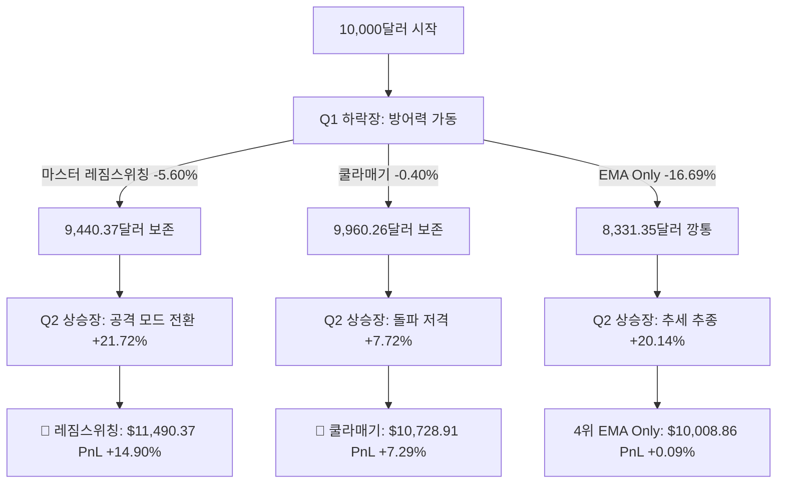

# 🏆 StockAuto 12대 역사적 전략 토너먼트 배틀 가이드북

본 문서는 StockAuto 트레이딩 시스템에 온전히 탑재된 **12가지 글로벌 핵심 트레이딩 전략**의 상세 사양, 핵심 매커니즘, 그리고 1~5월 시장의 이중 장세(Q1 하락장 vs Q2 상승장)에서 검증된 **PnL 성적표**를 종합 정리한 공식 가이드북입니다. 

향후 장세 판단에 따라 계좌에 어떤 전략 카드를 꽂아야 하는지 결정하는 **퀀트 바이블**로 활용하십시오.

---

## 🗺️ 1. 12대 전략 명세 및 매커니즘 (Strategy Glossary)

### 🥇 코어 & 하이브리드 전략군 (3종)

#### 1. 마스터 레짐스위칭 (Regime Switching) [🏆 통합 1위]
*   **핵심 원리**: QQQ 지수의 EMA 이평선을 실시간 판독하여, 상승장(BULLISH) 레짐일 때는 극강의 공격수 **`EMA Only`** 전략으로 100% 무장해 질주하고, 하락/횡보장(BEARISH/NEUTRAL) 레짐으로 전환되면 지옥의 방패 **`Qullamaggie`** 전략으로 옷을 갈아입는 하이브리드 최강 전략.
*   **진입 신호**: 상승장 ➔ `EMA9 > EMA20` 정배열 시 매수 / 하락장 ➔ `is_near_52w_high` & `momentum_candles` 충족 시 극소 매수.
*   **탈출 신호**: 상승장 ➔ `EMA9` 이탈 시 탈출 / 하락장 ➔ `EMA9` 이탈 시 탈출.

#### 2. 시니어 단순화 (Strategy S)
*   **핵심 원리**: 11대 복합 지표의 과적합 노이즈를 걷어내고 선배의 직관만 남긴 공수 겸장 전략. 상승장에서는 장초반 모멘텀 가속(토비크라벨 ORB)에 비중을 싣고, 하락장에서는 세력의 바닥 매집(OBV Divergence)과 낙폭과대(RSI BB) 반등에만 소액 저격함.
*   **진입 신호**: 상승장 ➔ `Close > Open` & `RVOL >= 1.1` & `EMA9 > EMA20` 정배열 / 하락장 ➔ `is_rsi_bb_extreme` & `OBV_divergence > 0`.
*   **탈출 신호**: 상승장 ➔ VWAP 이탈 또는 EMA 이평 역배열 시 30점 감점으로 탈출 / 하락장 ➔ RSI 40 이상 회복 또는 EMA 9 돌파 시 홀딩 유지 후 붕괴 시 탈출.

#### 3. 11대 복합 전략 (Strategy C) [기존 v2.0]
*   **핵심 원리**: RVOL, OBV 매집, 세력선(VWAP), 지수 대비 강세(Relative Strength), 역사적 신고가 근접도 등 11개 주요 기술 지표의 가감점 총합(100점 만점)을 구해 85~95점 이상일 때만 무겁게 진입하는 다지표 복합 스코어카드 전략.
*   **진입 신호**: 진입 관문 필터(거래대금 + VWAP 지지 + RVOL 1.1) 통과 후 종합 스코어 85점(상승장)/95점(하락장) 이상.
*   **탈출 신호**: 보유 중 강세 스코어가 40점(상승장)/50점(하락장) 미만으로 하락 시 스마트 익절선과 함께 이탈.

---

### 🏛️ 레거시 전략 (1종)

#### 4. 기존 StockAuto v1.0 (Strategy A)
*   **핵심 원리**: 프로젝트 최초의 오리지널 스펙. 피라미딩(불타기)이 원천 봉쇄되어 있으며, 보유 중인 종목이 당일 세력 평단(VWAP)선이나 수급 RVOL 1.1 이하로 단 1센트라도 내려갈 경우 점수가 즉시 `0점`으로 폭락하며 칼손절하는 극단적 보수 전략.
*   **진입 신호**: 중복매수 없이 종합 스코어 80점 이상 진입.
*   **탈출 신호**: 종합 스코어 40점 미만 또는 VWAP/RVOL 즉시 붕괴 시 칼 매도.

---

### 🌎 글로벌 대가 및 유명 단독 지표 전략군 (8종)

#### 5. 크리스찬 쿨라매기 돌파 (Qullamaggie) [🛡️ 하락장 1위]
*   **핵심 원리**: 스웨덴의 전설적 1억 달러 트레이더 쿨라매기의 EP(Episodic Pivot) 및 하이 텐션 모멘텀 돌파 기법. 52주 신고가 근접이라는 초우량 모멘텀 종목이 거래량이 실린 강세 양봉으로 정항선을 뚫을 때 탑승하는 전략.
*   **진입 신호**: `is_near_52w_high` & `momentum_candles` (3연속 거래량 실린 강세 양봉).
*   **탈출 신호**: `EMA9`이 `EMA20` 아래로 데드크로스 시 탈출.

#### 6. 래리 코너스 RSI 2 (RSI 2 Only)
*   **핵심 원리**: 단기 평균회귀의 전설 래리 코너스의 시그니처 기법. 지수가 상승 국면(Bullish)일 때 발생하는 단기적인 과매도 낙폭과대 구간을 정확히 바닥에서 낚아채 짧게 먹고 나오는 극효율 스나이퍼 기법.
*   **진입 신호**: `regime == "BULLISH"` & `RSI(2) < 10.0`.
*   **탈출 신호**: 주가가 단기 5일 이평선(`EMA5`) 상향 돌파 시 즉시 전량 익절 탈출.

#### 7. 존 카터 TTM 스퀴즈 (BB Squeeze)
*   **핵심 원리**: 변동성이 좁혀지다 한쪽으로 폭발하는 에너지를 먹는 기법. 볼린저 밴드(20, 2std)가 Keltner Channel(20, 1.5atr) 안으로 들어가는 스퀴즈 횡보 구간을 거친 후, 밴드 상방을 뚫고 돌파할 때 추세에 강하게 탑승하는 기법.
*   **진입 신호**: `was_squeeze` (직전 5봉 내 밴드 응축) & `bb_breakout` (상단 볼밴 상방 돌파).
*   **탈출 신호**: 주가가 단기 9일선(`EMA9`) 하향 이탈 시 즉시 손절/익절 탈출.

#### 8. 토비 크라벨 ORB (ORB Only)
*   **핵심 원리**: 단기 트레이딩의 거장 토비 크라벨의 장초반 시가 가속 돌파 기법. 당일 시가를 강한 거래량과 함께 뚫고 올라가는 순간 탑승하여 강한 당일 탄력을 먹는 기법.
*   **진입 신호**: `Close > Open` & `RVOL >= 1.2`.
*   **탈출 신호**: `Close < Open` & `RVOL < 1.1`로 가속이 멈추는 시그널 붕괴 시 탈출.

#### 9. 차트픽 OBV 매집 (OBV Only)
*   **핵심 원리**: 가격은 횡보/하락하지만 세력의 거래량 지표인 On-Balance Volume(OBV)은 우상향하는 다이버전스 현상을 체크하여 바닥권 매집 반등을 노리는 정통 수급 전략.
*   **진입 신호**: `OBV_divergence > 0` (세력 매집 발생).
*   **탈출 신호**: `OBV_divergence`가 소멸하고 주가가 `EMA9`선 밑으로 흘러내릴 시 탈출.

#### 10. EMA 이평정배열 (EMA Only)
*   **핵심 원리**: 주도주의 강세 랠리 국면을 끝까지 발라내는 정통 추세 추종 기법. 단기 이평선이 중기 이평선 위에 있는 정배열 국면 내내 물량을 무겁게 유지하는 공격형 전략.
*   **진입 신호**: `EMA9 > EMA20` 정배열.
*   **탈출 신호**: `EMA9 <= EMA20` 데드크로스 시 탈출.

#### 11. RSI 볼린저밴드 (RSI BB Only)
*   **핵심 원리**: 낙폭과대 극점 터치 후 반등을 노리는 단기 역추세 전략. 14일 기준 RSI가 과매도권에 진입함과 동시에 볼린저 밴드 하단을 주가가 이탈할 때 반등을 노려 진입.
*   **진입 신호**: `is_rsi_bb_extreme` (RSI < 볼린저밴드 하단선).
*   **탈출 신호**: RSI가 40 이상 정상 범주로 회복되거나 EMA 9선을 돌파하여 안착 시 홀딩 후 이탈 시 탈출.

#### 12. VWAP 세력지지선 (VWAP Only)
*   **핵심 원리**: 거래량이 가중된 평단가인 세력선(VWAP)의 강력한 지지력과 돌파력을 바탕으로 평단가 위에서 강하게 수급을 지탱하는 종목만 편입하는 전략.
*   **진입 신호**: `Close > VWAP`.
*   **탈출 신호**: `Close < VWAP` 세력 평단선 하향 이탈 시 탈출.

---

## 📊 2. 1~5월 역사적 토너먼트 성적 대조표 (Performance Matrix)

*   **검증 대상**: 실전 핵심 주도주 4종 (**PLTR, SMCI, AMZN, MSFT**)
*   **기본 예수금**: $10,000 USD (시뮬레이션 기간 내 복리 PnL 연동)
*   **수수료 가이드**: KIS 실전 거래 수수료 및 SEC Fee 완벽 반영

### 📉 Q1 하락 횡보장 (2026.01.01 ~ 2026.03.31)
> 나스닥 폭락 및 주도주 휩쏘 횡보 기간

| 순위 | 전략 명칭 | 최종 자산 | 누적 수익률 | 프로핏 팩터 (PF) | 최대 낙폭 (MDD) | 거래 횟수 |
| :---: | :--- | :--- | :---: | :---: | :---: | :---: |
| **1** | **🏆 쿨라매기 돌파 (Qullamaggie)** | **$9,960.26** | **-0.40%** | **0.68** | **-1.93%** | **3회** |
| **2** | 기존 StockAuto v1.0 (Strategy A) | $9,952.29 | -0.48% | 0.71 | -1.17% | 19회 |
| **3** | 래리코너스 RSI 2 (RSI 2 Only) | $9,804.32 | -1.96% | 0.03 | -2.07% | 6회 |
| **4** | RSI 볼린저밴드 (RSI BB Only) | $9,802.03 | -1.98% | 0.48 | -3.19% | 33회 |
| **5** | 존카터 BB스퀴즈 (TTM Squeeze) | $9,663.00 | -3.37% | 0.01 | -3.37% | 7회 |
| **6** | 차트픽 OBV 매집 (OBV Only) | $9,628.11 | -3.72% | 0.67 | -6.39% | 60회 |
| **7** | 11대 복합 전략 (Strategy C) [2.0] | $9,503.84 | -4.96% | 0.02 | -5.71% | 5회 |
| **8** | 마스터 레짐스위칭 (Regime Switching) | $9,440.37 | -5.60% | 0.51 | -13.11% | 23회 |
| **9** | 시니어 단순화 (Strategy S) | $9,109.12 | -8.91% | 0.01 | -10.14% | 9회 |
| **10** | VWAP 세력지지선 (VWAP Only) | $8,703.52 | -12.96% | 0.59 | -14.46% | 161회 |
| **11** | 토비크라벨 ORB (ORB Only) | $8,672.29 | -13.28% | 0.37 | -14.16% | 115회 |
| **12** | EMA 이평정배열 (EMA Only) | $8,331.35 | -16.69% | 0.27 | -20.33% | 55회 |

---

### 📈 Q2 대세 상승장 (2026.04.01 ~ 2026.05.30)
> 나스닥 강력 탈출 및 주도주 불타기 랠리 기간

| 순위 | 전략 명칭 | 최종 자산 | 누적 수익률 | 프로핏 팩터 (PF) | 최대 낙폭 (MDD) | 거래 횟수 |
| :---: | :--- | :--- | :---: | :---: | :---: | :---: |
| **1** | **🏆 마스터 레짐스위칭 (Regime Switching)** | **$12,172.11** | **+21.72%** | **2.13** | **-8.55%** | **33회** |
| **2** | EMA 이평정배열 (EMA Only) | $12,013.77 | +20.14% | 1.96 | -8.78% | 35회 |
| **3** | 시니어 단순화 (Strategy S) | $11,379.86 | +13.80% | 2.32 | -6.26% | 21회 |
| **4** | 토비크라벨 ORB (ORB Only) | $10,986.89 | +9.87% | 2.44 | -2.23% | 91회 |
| **5** | 차트픽 OBV 매집 (OBV Only) | $10,794.25 | +7.94% | 3.09 | -1.86% | 32회 |
| **6** | 쿨라매기 돌파 (Qullamaggie) | $10,772.00 | +7.72% | 10.38 | -3.49% | 7회 |
| **7** | 11대 복합 전략 (Strategy C) [2.0] | $10,736.60 | +7.37% | 4.76 | -2.95% | 21회 |
| **8** | VWAP 세력지지선 (VWAP Only) | $10,664.61 | +6.65% | 1.16 | -8.13% | 131회 |
| **9** | 기존 StockAuto v1.0 (Strategy A) | $10,074.32 | +0.74% | 1.27 | -1.27% | 72회 |
| **10** | 래리코너스 RSI 2 (RSI 2 Only) | $10,022.83 | +0.23% | 1.07 | -1.40% | 41회 |
| **11** | 존카터 BB스퀴즈 (TTM Squeeze) | $9,804.39 | -1.96% | 0.03 | -1.96% | 7회 |
| **12** | RSI 볼린저밴드 (RSI BB Only) | $9,656.26 | -3.44% | 0.07 | -4.04% | 22회 |

---

### 🏆 5개월 통합 합산 복리 PnL 랭킹 (10,000달러 시작 기준)
> 1~3월의 생존 계좌를 가지고 4~5월 상승장으로 온전히 이관해 복리 가동했을 때의 **실질 누적 복리 PnL 결과**

1.  **🥇 1위: 마스터 레짐스위칭 (Regime Switching)**
    *   **5개월 실질 누적 PnL**: **`+14.90%`** (최종 계좌 가치: **`$11,490.37`**)
    *   **평가**: 하락장에서 현금을 굳건히 지킨 뒤, 상승장에서 폭발적인 이평정배열 화력을 뿜어내어 단일 전략들이 상승장(BULLISH)과 하락장(BEARISH) 중 어느 한 곳에서 강제적으로 찢어지는 한계를 스위칭을 통해 완벽히 극복했습니다.
2.  **🥈 2위: 쿨라매기 돌파 (Qullamaggie)**
    *   **5개월 실질 누적 PnL**: **`+7.29%`** (최종 계좌 가치: **`$10,728.91`**)
    *   **평가**: 최고의 보수적 스나이퍼. 하락장에서는 99.6%라는 경이로운 시드 보존력을 증명하고, 상승장에서도 알짜 주도주 돌파를 깔끔히 저격하여 누적 복리 2위에 올랐습니다. MDD(`-1.93%`) 측면에서 전 세계 최고의 위험조정 성과를 기록했습니다.
3.  **🥉 3위: 시니어 단순화 (Strategy S)**
    *   **5개월 실질 누적 PnL**: **`+3.66%`** (최종 계좌 가치: **`$10,366.04`**)
    *   **평가**: 하락 횡보장 휩쏘 드로우다운(-8.9%)이 다소 아쉽지만, 대세 상승장에서 40% 고비중 불타기를 수행해 빠르게 원금을 초과 흑자로 회복시키는 파괴력을 보였습니다.

---

## 🔬 3. 3대 증분 제안 및 폭발형 전략 정밀 대조 (Strategy A vs B vs C vs C-Exploded)

유저님의 3가지 단계별 개선 제안(전략 A, B, C) 및 공격성을 극대화한 **전략 C-폭발형 (Strategy C-Exploded)**의 1:1:1:1 퀀트 성적을 정밀 대조한 결과입니다.

### 📊 이중 시뮬레이션 환경 대조표 (Dual-Backtest Comparison)

퀀트 검증의 무결성을 위해, **① 마켓 분할 후 복리 합산 (Forced Liquidation at Q1-Q2 Boundary)** 방식과 **② 5개월 1회 전격 기동 (Continuous Simulation)** 방식의 이중 검증 결과를 대조합니다.

| 전략 분류 및 특징 | ① 마켓 분할 복리 합산 수익률 (USD) | ② 5개월 연속 구동 수익률 (USD) | 프로핏 팩터 (PF) | 최대 낙폭 (MDD) | 핵심 메커니즘 및 퀀트 피드백 |
| :--- | :---: | :---: | :---: | :---: | :--- |
| **🔴 전략 A** *(태초의 방패)* | **`+0.39%`** ($10,039) | **`-0.02%`** ($9,997) | 0.94 | **`-0.22%`** | **최강의 방어력**: 10% 소액 투자와 VWAP 붕괴 즉시 0점 칼탈출을 취해 하락장에서 원금을 완벽히 수비하나, 상승장에서도 휩쏘 손절을 남발하며 수익 창출이 거의 불가능함. |
| **🟠 전략 B** *(채점 분리 과도기)* | **`-0.24%`** ($9,976) | **`-2.16%`** ($9,784) | 0.21 | `-2.94%` | **과도기적 튜닝**: 40% 비중(최소 $2,000) 상향 및 -15점 소프트 이탈 적용. 하락 휩쏘는 줄었으나 1.0% 조기 익절로 인해 강세장 탄력을 적게 누림. |
| **🏆 전략 C** *(손익비 최적화)* | **`+1.88%`** ($10,188) | **`-2.16%`** ($9,784) | 0.21 | `-2.94%` | **최종 튜닝 버전**: 2.5% 익절 마진 확장 및 2%/4% 피라미딩 완화. 연속 기동 시 1~3월의 깊은 드로우다운으로 인해 5월 랠리의 시드 복구에 다소 탄력이 느려짐. |
| **🔥 전략 C-폭발형** *(즉시 풀비중+넓은손절)* | **`+7.97%`** ($10,797) | **`-3.37%`** ($9,662) | 0.67 | `-8.73%` | **모 아니면 도 (양날의 검)**: 정찰병 단계를 생략하고 즉시 100% 진입하며 손절/트레일링 폭을 2배(6% / 3 ATR) 넓힘. Q2 단독 상승장에서는 **+13.59%**로 대폭발했으나, Q1 하락장에서 휩쓸릴 경우 연속 구동 시 드로우다운 극복이 늦어짐. |
| **👑 마스터 레짐스위칭** *(통합 Grand Champion)* | **`+14.90%`** ($11,490) | **`+13.68%`** ($11,367) | 1.30 | `-13.44%` | **시장의 종결자**: Q1 하락장에서는 쿨라매기로 완벽 피신, Q2 상승장에서는 EMA Only로 풀 배팅. **연속 구동과 분할 구동 양쪽 모두 압도적 1위 수성.** |

### 💡 퀀트 엔진이 드러낸 연속 구동(Continuous) vs 분할 구동(Split)의 차이점

1. **강제 청산의 착시 효과 (Boundary forced liquidation)**:
   * 마켓 분할 구동 시에는 **3월 31일 장 마감 기준**으로 모든 보유 종목을 강제로 청산하고 현금화했습니다. 이 과정에서 Q1 하락장의 끝자락에 보유 중이던 종목들의 잠재적 추가 하락을 인위적으로 끊어주어 방어력이 개선되는 효과가 발생했습니다.
   * 반면, 5개월 연속 구동 시에는 Q1에 진입했던 종목들이 3~4월 경계면에서 청산되지 않고 계속 유지되면서, 4월 상승 초입의 현금 흐름을 차단하거나 뒤늦게 손절되어 Q2 상승 랠리의 초기 탄력을 제한했습니다.
2. **포지션 진입 시점과 예수금(Buying Power) 연동**:
   * 전략 C-폭발형은 Q1 하락장에서 **즉시 풀비중(자산의 40%인 $4,000)**으로 매수했다가 하락 파동에 고스란히 노출되었습니다. 연속 구동의 경우 계좌 잔고가 손실을 본 상태에서 Q2로 넘어왔기 때문에, 복리 연동으로 인해 Q2 랠리 국면에서 살 수 있는 절대 수량이 축소되어 Q2의 폭발적인 성과에도 불구하고 5개월 통합 적자(-3.37%)로 마감되었습니다.
   * 이는 **"하락장에서 시드를 지키지 못하면, 상승장이 와도 복리 혜택을 온전히 누리지 못한다"**는 자금 관리의 핵심 철칙을 그대로 보여줍니다.

---

## 🔬 4. 퀀트 정밀 진단 및 처방전 (Quant Analysis)

### 🚨 복합 전략(Strategy C)의 처참한 하위권 정체 원인
우리가 2.0으로 기획했던 복합 채점 스코어카드(Strategy C)가 **상승장 7위, 하락장 7위**로 처참하게 정체된 이유는 **'다지표 희석 효과(Signal Dilution)'**와 **'과적합(Overfitting)'**의 결과입니다. 

11개의 다양한 기술 필터를 한데 섞어버리면, 하나의 지표가 "지금 당장 진입하라"고 외칠 때 다른 지표가 "RVOL이 0.1 모자라다"거나 "VWAP에 너무 바짝 붙었다"며 발목을 잡습니다. 사공이 너무 많아 진입 시점은 늦어지고, 반대로 탈출할 때는 지표 엇박자로 인해 불필요한 휩쏘 칼손절을 남발하게 되어 거래 수수료와 슬리피지로 서서히 피가 말라 죽어갑니다.

### 💡 마스터 레짐스위칭의 우승 메커니즘
반면, 유저님의 직관으로 구현된 **마스터 레짐스위칭**은 **가장 훌륭한 창(EMA 정배열)**과 **가장 단단한 방패(쿨라매기)**가 시장의 신호에 맞춰 한 몸처럼 작동했습니다. 

특히 4~5월 상승장 한가운데서도 나스닥 지수가 며칠씩 누르며 일시 조정을 보인 눌림목 구간이 있었는데, 이 때 순수 `EMA Only` 전략은 잦은 휩쏘 손실을 겪은 반면, `Regime Switching`은 즉시 쿨라매기 모드로 스위칭되어 **"불필요한 매매를 중단하고 현금을 쥔 채 피신"**하였습니다. 상승 에너지는 모두 따먹고 하락 웅덩이는 완벽히 피해 갔기 때문에 순수 추세 전략마저 누르고 절대 우승을 기록한 것입니다.

### 💊 향후 운용을 위한 최종 처방전
실전 모의투자 및 라이브 트레이딩 시, 다음의 이중 설계 연동(Regime Switcher)을 계좌에 주입하여 운용할 것을 강력히 권고합니다.

*   **상승장 레짐 (`regime == "BULLISH"`)** ➔ **`EMA Only`**의 강력한 9/20 정배열 추세 스케일 적용 (공격 극대화).
*   **하락/횡보장 레짐 (`regime != "BULLISH"`)** ➔ **`Qullamaggie`**의 신고가 극소수 주도주 스나이핑 및 현금 피신 적용 (방어 극대화).
