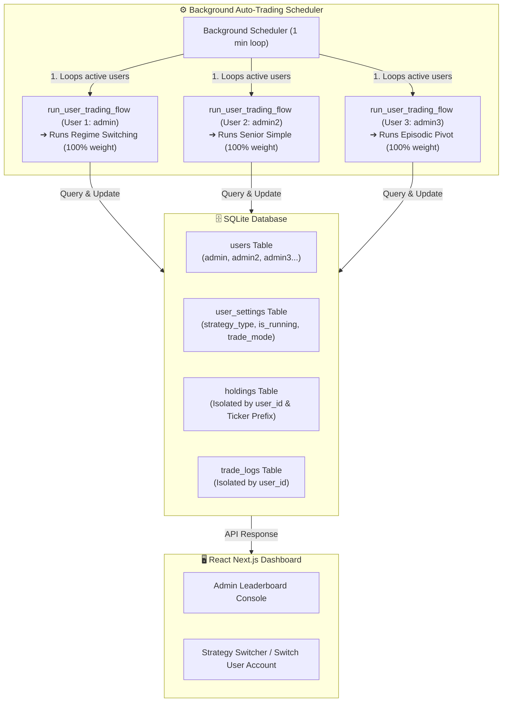

# 🏆 [구현 계획서] 사용자별 백테스트 아레나 전략 대결 시스템 (Strategy Battle Arena)

본 계획서는 단일 계좌 내에서 슬롯을 나누어 돌리던 기존 방식을 확장하여, **여러 명의 경쟁 사용자(admin, admin2, admin3 등)가 각각 자신만의 고유한 전략을 배정받아 가상 모의투자 환경에서 실시간 수익률 대결을 펼칠 수 있는 멀티테넌시 전략 경쟁(Battle) 아키텍처**로 고도화하기 위한 설계 도안입니다.

---

## 🚨 사용자 검토 요구사항 (User Review Required)

> [!IMPORTANT]
> **1. 모의투자 가동 및 시드머니 공정성**
> * 대결에 참가하는 모든 사용자(`admin`, `admin2`, `admin3`, `admin4`, `admin5`)는 최초 생성 시 **가상 예수금 1,000만 원 (10,000,000 KRW)**과 **시뮬레이션 가동 플래그(`is_running = True`, `trade_mode = 'SIMULATED'`)**가 활성화된 채 부트스트래핑됩니다.
> * 각 유저별로 배정된 고유 전략은 미국 정규 주식 시장이 시작되면 완전히 병렬적이고 격리된 환경에서 동시에 매매를 시작하게 됩니다.
> 
> **2. 슬롯 분할 vs 단일 100% 매매 모드 통합**
> * 사용자가 단일 전략(예: 쿨라매기 돌파)을 선택한 경우, 계좌 예수금의 100%를 해당 단일 전략에 풀-배팅하여 대결이 진행됩니다.
> * 기존 `MultiStrategyManager`를 업그레이드하여, 단일 전략을 돌릴 때는 **1-슬롯 (지분 100% 가용)**으로 자동 구성되게 하여 기존 매매 핵심 스케줄러 루프를 단 한 줄도 손대지 않고 깔끔하게 소화하도록 설계합니다.

---

## 💬 오픈 질문 (Open Questions)

> [!NOTE]
> * **대결 참가용 경쟁 유저 라인업**:
>   * `admin` (ID: 1): 🥇 **마스터 레짐스위칭 V2** (Regime Switching V2)
>   * `admin2` (ID: 2): 🥈 **시니어 단순화** (Senior Simple)
>   * `admin3` (ID: 3): 🥉 **에피소딕 피벗** (Episodic Pivot)
>   * `admin4` (ID: 4): 📡 **쿨라매기 돌파** (Qullamaggie)
>   * `admin5` (ID: 5): 🛡️ **차트픽 OBV 매집** (OBV Only)
>   * 이 외에 다른 전략 조합이나 추가 경쟁자를 투입하고 싶으시다면, DB 시드 목록만 확장하여 즉시 추가 가능합니다.

---

## 📐 멀티테넌시 전략 대결 아키텍처

---

## 📋 핵심 설계 및 구현 명세

### 1. 사용자 설정 테이블 확장 (Schema Upgrade)
* `user_settings` 테이블에 `strategy_type` 컬럼을 신설하여, 각 사용자별로 구동할 핵심 전략 식별자 상수를 부여합니다.
* Alembic 자동 버전 스크립트를 신설하여 서버 재시작 시 컬럼 추가가 자동으로 처리되도록 지원합니다.

### 2. 가용 5대 경쟁 유저 자동 시딩 (Auto Seeding)
* `migrator.py` 또는 `main.py` 부트스트랩 단계에서 `admin`, `admin2`, `admin3`, `admin4`, `admin5` 계정의 존재 여부를 자동 검사하고, 미존재 시 비밀번호 해싱을 적용하여 전용 User 및 UserSettings 레코드를 자동 시딩합니다.
* 각 유저는 기본 **가용 예수금 1,000만 원 (Simulated)** 상태로 공정하게 출발합니다.

### 3. `MultiStrategyManager`를 1-Slot & N-Slot 공용 엔진으로 업그레이드
* 단일 전략 식별자가 전달되면, 지분 **1.0 (100%)**의 단일 슬롯과 해당 전략 고유 접두사(예: `SS_`, `EP_`, `QM_`, `OB_`)를 할당하는 가상 단일 슬롯 배분 구조로 자동 적응하게 업그레이드합니다.
* 이 설계 덕분에 스케줄러의 자금 관리, 매수 판단, 피라미딩 검사, 자가 치유(Self-Healing) 코드가 완전히 동일한 규격 하에 100% 호환 동작합니다.

### 4. 프론트엔드 대시보드 일반화 및 고속 갱신
* `/balance` API가 슬롯 배분 정보를 줄 때 하드코딩된 두 개 키가 아닌, 동적으로 설정된 지분 맵을 그대로 배열 직렬화해서 반환하게 변경합니다.
* 프론트엔드 `AccountBalance.tsx`는 객체 순회를 통해 설정된 전략의 개수만큼 슬롯 카드와 원장을 자동 매핑하여 실시간 시각화합니다.

---

## 🛠️ 제안된 변경 사항 (Proposed Changes)

### [Component 1] 데이터베이스 모델 및 스키마 업데이트
#### [MODIFY] [models.py](file:///d:/dev/workspace/stockAuto/backend/app/core/models.py)
* `UserSettings` 클래스에 `strategy_type = Column(String, default="regime_switching", nullable=False)` 필드를 추가합니다.

#### [NEW] [add_strategy_type_migration.py](file:///d:/dev/workspace/stockAuto/backend/alembic/versions/add_strategy_type_to_user_settings.py)
* `user_settings` 테이블에 `strategy_type` 컬럼을 추가하고 기본값 `"regime_switching"`을 매핑하는 Alembic 리비전 스크립트를 생성합니다.

---

### [Component 2] 아레나 참가용 5대 어드민 유저 부트스트랩 시딩
#### [MODIFY] [migrator.py](file:///d:/dev/workspace/stockAuto/backend/app/core/migrator.py)
* `run_migrations_programmatically()` 완료 후, `users` 테이블에 경쟁자 `admin`, `admin2`, `admin3`, `admin4`, `admin5`와 그에 맞는 `user_settings` 전략 레코드가 있는지 확인하고 강제 Seeding 및 시뮬레이터 구동 상태로 활성화해 두는 Seeder 메서드를 탑재합니다.

---

### [Component 3] 다이내믹 멀티 전략 격리 엔진 개편
#### [MODIFY] [multi_strategy_manager.py](file:///d:/dev/workspace/stockAuto/backend/app/bot/multi_strategy_manager.py)
* `MultiStrategyManager`가 생성 시 `strategy_type`을 인자로 받도록 수정합니다.
* `"multi_slot"` 일 때는 기존 2슬롯 분할, 그 외 특정 전략 상수일 때는 지분 100%의 단일 슬롯(`weight = 1.0`) 및 맞춤형 접두사(`SS_`, `EP_` 등)를 생성하게 런타임 빌더를 추가합니다.

---

### [Component 4] 스케줄러 및 라우터 일반화
#### [MODIFY] [scheduler.py](file:///d:/dev/workspace/stockAuto/backend/app/bot/scheduler.py)
* `run_user_trading_flow`에서 사용자의 `user_settings.strategy_type`을 로드하여 `MultiStrategyManager(strategy_type=user_settings.strategy_type)`로 전달하고, 접두사 마이그레이션 가드 및 자가치유 시 첫 번째 슬롯 키를 활용하도록 일반화합니다.

#### [MODIFY] [router_account.py](file:///d:/dev/workspace/stockAuto/backend/app/trades/router_account.py)
* `get_balance` API가 슬롯 배분을 고정된 형태가 아닌, 설정된 임의의 슬롯 구조를 동적 루프 형태로 직렬화해서 프론트엔드로 전달하도록 개편합니다.

#### [MODIFY] [AccountBalance.tsx](file:///d:/dev/workspace/stockAuto/frontend/components/AccountBalance.tsx)
* 프론트엔드 계좌 뷰에서 `wallet_allocation` 필드를 2슬롯으로 하드코딩해서 읽던 로직을 제거하고, 전달받은 전략 맵 수에 맞게 게이지와 카드를 자동 매핑 루프로 그려내도록 리팩토링합니다.

---

## 🧪 검증 계획 (Verification Plan)

### 1. 데이터베이스 시딩 및 스키마 검증
* 서버를 재부팅(`python run.py local`)하여 alembic 마이그레이션이 무결하게 통과되고, SQLite DB 내 `users` 테이블에 `admin` ~ `admin5`까지 계정이 완벽히 정렬되는지 SQLite 뷰어로 검증합니다.

### 2. 가상 5대 어드민 자동 매매 병렬 검증
* 5명의 가입자가 모두 `is_running = True` 상태로 세팅된 상태에서, scheduler 1분 루프 기동 시 5개 유저의 백그라운드 트레이딩 플로우(`run_user_trading_flow`)가 5대 개별 전략 조건 하에 에러 없이 안전하게 다중 구동되는지 로그를 통해 확인합니다.

### 3. API 및 대시보드 동적 렌더링 확인
* 각 경쟁 계정으로 로그인(`admin`, `admin2` 등)하여 대시보드 접속 시, 자신이 맡은 단일 전략(예: 에피소딕 피벗 지분 100%) 혹은 마스터 전략의 자산 비중과 지분 게이지가 찌그러짐 없이 화면에 아름답게 표현되는지 검증합니다.
