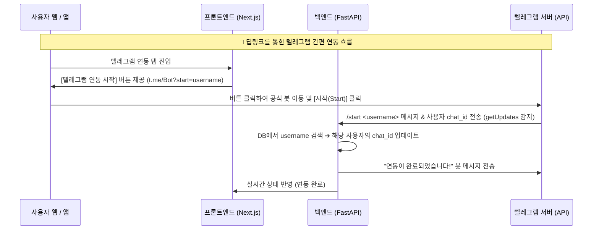

# 🛠️ 텔레그램 1인 봇 통합 아키텍처 및 딥링크 연동 계획서 (Phase 19)

본 계획서는 기존의 사용자별로 독립된 봇 토큰을 등록하고 스레드를 개별 가동하던 **"다중 봇 개별 폴링(Multi-Thread Polling)"** 방식에서, **"단 하나의 공식 봇 토큰(Single Bot Token)과 백그라운드 단일 스레드"** 기반의 **"멀티유저 통합 텔레그램 브릿지"** 아키텍처로 대전환하기 위한 정밀 설계도입니다.

---

## 1. 🚨 기존 아키텍처 결함 및 전환 필요성

1. **서버 리소스 고갈 위험 (100인 기준):**
   * 기존 방식은 사용자마다 독립된 백그라운드 스레드를 생성해 롱폴링을 수행합니다. 사용자가 100명이면 100개의 스레드가 텔레그램 API 서버와 계속 통신을 시도하게 되어 가벼운 서버의 경우 CPU/메모리가 쉽게 고갈됩니다.
2. **복잡한 사용자 UX:**
   * 가입하는 사용자마다 본인의 텔레그램 봇을 생성(`BotFather` 사용)하고 봇 토큰을 구해 웹 설정창에 복사/붙여넣기해야 하므로 서비스 진입 장벽이 매우 높습니다.
3. **해결책:**
   * 개발자가 만든 **단 1개의 공식 봇(Bot Token)**만 백그라운드 스레드 1개에서 전체 수신을 처리하고, 각 사용자는 본인의 `chat_id`만 입력하거나 봇 대화방에서 `/start`를 눌러 즉시 연동되는 **프로덕션 급 멀티유저 아키텍처**로 대전환합니다.

---

## 2. 🛠️ 아키텍처 설계 및 변경 제안 (Proposed Changes)

---

### [Component 1] 백엔드 설정 및 데이터 모델

#### ⚙️ [MODIFY] [config.py](file:///d:/dev/workspace/stockAuto/backend/app/core/config.py)
* `.env`에 정의된 글로벌 `TELEGRAM_BOT_TOKEN`을 시스템 전역 설정 변수로 활성화합니다. (이미 `self.TELEGRAM_BOT_TOKEN`이 정상적으로 설정되어 있어 호환됩니다.)

#### ⚙️ [MODIFY] [models.py](file:///d:/dev/workspace/stockAuto/backend/app/core/models.py)
* `UserSettings`의 `telegram_bot_token` 컬럼은 하위 호환성을 위해 스키마에 유지하되, 비즈니스 로직에서는 더 이상 의존하지 않도록 관리합니다 (Deprecated 선언).

---

### [Component 2] 백엔드 텔레그램 코어 리팩토링

#### ⚙️ [MODIFY] [telegram.py](file:///d:/dev/workspace/stockAuto/backend/app/core/telegram.py)
* **[구조 대수선]** 사용자별 개별 스레드 롱폴링 방식(`_poll_updates_loop_for_user`, `start_telegram_bot_for_user`)을 **완전 제거**하거나 빈 동작(Pass)으로 처리합니다.
* **[신규] 단일 글로벌 폴링 스레드 구축 (`start_telegram_bot`, `stop_telegram_bot`)**:
  * 단 하나의 글로벌 폴링 스레드(`TelegramGlobalPollThread`)를 띄워, 공통 `settings.TELEGRAM_BOT_TOKEN`으로 업데이트를 조회합니다.
* **[신규] 간편 딥링크 / 명령어 매핑 로직 (`_process_global_message`)**:
  * `/start` 명령어와 뒤이어 들어오는 사용자 식별자(예: `/start username`)를 추출하여 해당 사용자의 `telegram_chat_id`를 자동으로 DB에 연결합니다.
  * 이미 연동된 사용자의 `/status`, `/run`, `/stop` 원격 명령어는 기존 기능과 100% 동일하게 동작하도록 매핑합니다.
* **[수정] `send_message_sync`**:
  * DB의 사용자별 봇 토큰 대신 전역 설정의 `settings.TELEGRAM_BOT_TOKEN`을 일괄 사용하여 `telegram_chat_id`로 메시지를 전송합니다.

---

### [Component 3] 백엔드 관리자 라우터 연동 정화

#### ⚙️ [MODIFY] [router.py](file:///d:/dev/workspace/stockAuto/backend/app/admin/router.py)
* 사용자의 설정을 업데이트할 때 더 이상 개별 유저별 스레드를 중단/재부팅(`stop_telegram_bot_for_user`, `start_telegram_bot_for_user`)하지 않습니다.
* 전역 폴링 데몬이 이미 켜져 있으므로, DB의 `telegram_chat_id` 및 `telegram_enabled` 업데이트만 수행하면 즉시 발송/수신에 적용됩니다.

---

### [Component 4] 프론트엔드 설정 페이지 레이아웃 개선

#### ⚙️ [MODIFY] [page.tsx](file:///d:/dev/workspace/stockAuto/frontend/app/admin/settings/page.tsx)
* 텔레그램 설정 폼(`subTab === "telegram"`)에서 더 이상 개별 `BOT TOKEN` 입력을 요구하지 않습니다.
* 대신 **두 가지 편리한 연동 방식**을 직관적이고 고급스러운 UI로 노출합니다.
  1. **[간편 연동]** 사용자의 username을 기반으로 한 텔레그램 딥링크 버튼 제공: 
     `https://t.me/<YourBotUsername>?start=<CurrentUsername>`
     (사용자는 버튼 클릭 후 [시작]만 누르면 복잡한 CHAT ID 입력 없이 1초 만에 즉시 연동 완료)
  2. **[수동 연동]** 기존 CHAT ID 입력란 유지 및 사용법 가이드 고지:
     "본인의 CHAT ID를 알고 있다면 직접 입력하여 연동할 수도 있습니다."

---

## 3. 🧪 검증 계획 (Verification Plan)

### A. 정밀 구문 컴파일 및 타입 검증
* 백엔드: `python -m py_compile backend/app/core/telegram.py backend/app/admin/router.py` 실행하여 무결성 확인.
* 프론트엔드: `npm run lint` 및 `npx tsc --noEmit`을 통한 타입 안정성 사전 통과 확인.

### B. 시나리오 기반 실전 테스트
1. **단일 봇 기동성 테스트:**
   * 서버 시작 시 백엔드 단 하나의 `TelegramGlobalPollThread`만 안전하게 가동되는지 확인.
2. **간편 딥링크(Deep Link) 연동 테스트:**
   * 웹 화면에서 [텔레그램 연동하기] 버튼을 누르고 텔레그램에서 `/start` 전송 시, 데이터베이스 `UserSettings.telegram_chat_id`에 내 고유 챗 ID가 완벽히 저장되는지 확인.
3. **양방향 명령어 실시간 전달:**
   * 텔레그램 방에서 `/status` 명령어 전송 시, 봇이 내 계좌의 자산과 보유 포트폴리오를 정확히 읽어와 리턴하는지 확인.
4. **개별 사용자 알림 격리:**
   * 서로 다른 2개 이상의 계정에 대해 각각 알림을 보냈을 때, 상대방 방에는 스필오버(Spillover) 없이 오직 자신에게 할당된 알림만 완벽히 개별 수신되는지 확인.
