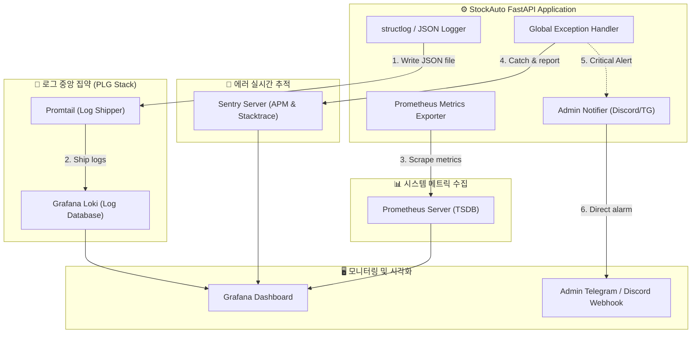

# 🏆 [구현 계획서] StockAuto 고가용성 운영을 위한 모니터링 및 로그 관리 시스템 구축 계획

본 계획서는 StockAuto를 로컬 시뮬레이션 환경에서 24/7 실전 운영 환경(Production)으로 안전하게 이관하기 위해, **예기치 못한 장애(네트워크 단절, KIS API 제한, DB 교착, 메모리 누수 등)를 선제적으로 감지하고 신속하게 트러블슈팅할 수 있는 고가용성 모니터링 및 구조화된 로그 관리 체계**를 구축하는 엔지니어링 설계 도안입니다.

---

## 🚨 사용자 검토 요구사항 (User Review Required)

> [!IMPORTANT]
> **1. 모니터링 및 알림 채널의 이원화 (Admin vs User)**
> * 현재 StockAuto는 `telegram.py`를 통해 매매 체결 내용과 자산 변동 사항을 사용자에게 전송하고 있습니다.
> * 시스템 장애(SQLite DB Lock, 디스크 용량 초과, 429 API 한도 제한, 백그라운드 스레드 사망 등)는 일반 투자 알림과 섞이지 않도록 **Admin 전용 Telegram 채널 또는 Discord Webhook**으로 이원화하여 전송하도록 설계합니다.
> 
> **2. 클라우드 서버리스(GCP Cloud Run) vs 단일 가상 서버(VPS) 호스팅 환경 결정**
> * 배포 환경에 따라 로그 수집 방식과 모니터링 스택이 달라집니다:
>   * **GCP Cloud Run (서버리스)**: Google Cloud Logging 및 Cloud Monitoring을 기본 연동하여 로그 수집 및 메트릭 경고를 서버리스 형태로 비용 효율적으로 처리합니다.
>   * **단일 VPS (Ubuntu 등)**: **PLG Stack (Prometheus + Loki + Grafana)** 을 도커 컴포즈로 가볍게 띄워 중앙 집중형 실시간 대시보드와 로그 탐색 환경을 자체 구축합니다.

---

## 💬 오픈 질문 (Open Questions)

> [!WARNING]
> 1. **Sentry(센트리) 연동 여부**: 실시간 실전 매매에서 발생하는 예외(Exception)와 에러 콜스택을 가장 강력하고 신속하게 추적할 수 있는 Sentry 연동을 추가할까요? (무료 플랜으로도 충분히 운영 가능합니다.)
> 2. **알림 전송 타겟**: 시스템 장애 발생 시 알림을 받을 채널로 **Admin 전용 신규 텔레그램 봇**을 개설하는 방식과, 기존 **개인 텔레그램 메신저 브릿지**로 통합해서 받는 방식 중 어느 것을 선호하시나요?

---

## 📐 시스템 모니터링 및 로그 관리 아키텍처

---

## 📋 핵심 설계 및 구현 명세

### 1. 모니터링 시스템 구축 (Monitoring System)

* **Prometheus 메트릭 노출 (`/metrics`)**:
  * `prometheus-fastapi-instrumentator` 라이브러리를 적용하여 API 요청 수, HTTP 응답 속도 분포(Latency), 5xx 에러율 등을 자동 계측합니다.
  * **APScheduler 모니터링**: 1분 주기 자동매매 루프와 10분 주기 스캐너 캐시 루프의 **마지막 실행 시각 및 성공/실패 여부**를 커스텀 메트릭으로 노출하여 스케줄러가 죽는 현상을 실시간 모니터링합니다.
  * **KIS API 헬스 체킹**: KIS API 호출 시의 평균 지연시간(Latency)과 초당 호출 수, 그리고 `HTTP 429 Too Many Requests` 발생 빈도를 추적합니다.
* **Admin 전용 알림 시스템 (`admin_notifier.py`) 신설**:
  * 시스템 치명적 장애(예: 디스크 용량 90% 돌파, SQLite DB 잠김 에러 5회 연속 발생, 실전 주문 통신 장애 등)가 발생하면 `lifespan` 혹은 `scheduler` 레벨에서 관리자 단독 채널(Telegram Admin Bot 혹은 Discord Webhook)로 마크다운 형식의 알림을 발송합니다.
* **Grafana 대시보드 설계**:
  * **시스템 대시보드**: CPU, Memory, Disk I/O, SQLite 파일 크기.
  * **트레이딩 대시보드**: 실시간 KIS 잔고 상태, 실전 주문 체결 속도(Latency), 오늘 하루 주문 성공/실패 비율, API 429 차단 지표.

### 2. 구조화된 로그 관리 (Log Management)

* **구조화된 JSON 로깅 도입 (Structured Logging)**:
  * 기존의 일반 텍스트 포맷 로그는 대형 로그 수집기에서 필터링하거나 검색하기 어렵습니다.
  * `python-json-logger`를 도입하여 모든 로그 파일(`logs/stockauto.log`)과 콘솔 출력을 **정제된 단일 행 JSON 포맷**으로 통일합니다.
  * 로그에 콘텍스트 필드(`user_id`, `ticker`, `event_type`, `elapsed_ms`, `order_no`, `regime_mode`)를 구조적으로 내장하여 Grafana Loki에서 특정 사용자의 특정 종목 매매 이력만 `0.1초` 내로 쿼리할 수 있게 만듭니다.
* **PLG Stack (Prometheus + Loki + Grafana) 연동**:
  * 로컬 또는 VPS 구동 환경 시 매우 경량화된 **Loki**와 **Promtail**을 도커 기반으로 구동합니다.
  * Promtail이 `backend/logs/stockauto.log` 파일의 JSON 라인을 실시간 파싱하여 Loki 서버로 스트리밍합니다.
* **로그 로테이션 및 압축 보존 정책 (Log Retention)**:
  * 로컬 디스크 보호를 위해 기존 `RotatingFileHandler` 구성을 확장하여 최대 10MB 크기 단위로 회전하며, 최대 10개의 백업 파일을 유지합니다.
  * 중앙 Loki/GCP Cloud Logging 서버의 보존 기한(Retention Policy)은 개발용 7일, 운영용 30일로 지정하여 비용을 최적화합니다.

---

## 🛠️ 제안된 변경 사항 (Proposed Changes)

### [Component 1] 백엔드 설정 및 로깅 모듈 전면 개편
#### [MODIFY] [config.py](file:///d:/dev/workspace/stockAuto/backend/app/core/config.py)
* Admin 알림을 위한 `ADMIN_TELEGRAM_BOT_TOKEN`, `ADMIN_TELEGRAM_CHAT_ID`, `DISCORD_WEBHOOK_URL` 옵션을 `.env.prod`에 추가하고 Pydantic 설정 클래스에 바인딩합니다.
* Sentry 연동을 위한 `Sentry_DSN` 설정 파라미터를 탑재합니다.

#### [MODIFY] [logging.py](file:///d:/dev/workspace/stockAuto/backend/app/core/logging.py)
* `python-json-logger` 라이브러리를 적용하여 프로덕션 프로필(`prod`)일 때 로그 포맷을 JSON 형식으로 자동 변환하는 `JsonFormatter` 필터를 장착합니다.
* 로그 레벨에 따른 콘텍스트 전파 로직을 추가합니다.

---

### [Component 2] 모니터링 메트릭 수집 및 관리자 알림 모듈 추가
#### [NEW] [admin_notifier.py](file:///d:/dev/workspace/stockAuto/backend/app/core/admin_notifier.py)
* 시스템 관리자에게 직접 닿는 실시간 경고 전송 클래스를 신설합니다.
* 백그라운드 스레드 예외 발생 시 비동기로 Admin Telegram/Discord 웹훅으로 긴급 마크다운 메시지를 발송하는 헬퍼 기능을 탑재합니다.

#### [MODIFY] [main.py](file:///d:/dev/workspace/stockAuto/backend/app/main.py)
* `FastAPI` 시작 시 `prometheus-fastapi-instrumentator`를 미들웨어로 등록하고 `/metrics` 엔드포인트를 노출시킵니다.
* Sentry 라이브러리(`sentry-sdk`)를 프로덕션 모드일 때 초기화하여 전역 예외가 자동으로 센트리 대시보드로 수집되도록 바인딩합니다.

---

### [Component 3] 시스템 복구 및 스케줄러 안정성 보강
#### [MODIFY] [scheduler.py](file:///d:/dev/workspace/stockAuto/backend/app/bot/scheduler.py)
* 자동매매 1분 루프의 핵심 에러 캐치문(`except Exception`) 내부에 `admin_notifier` 알림을 결합하여, 루프 도중 치명적 장애로 봇이 정지될 위험 처리를 실시간으로 감지하고 관리자에게 신속 통보합니다.
* 스케줄러의 수행 주기 및 잡 성공 여부를 기록하는 Prometheus 게이지 메트릭을 동적으로 업데이트합니다.

---

## 🧪 검증 계획 (Verification Plan)

### 1. JSON 로그 정밀도 및 출력 검사 (JSON Log Verification)
* 백엔드를 프로덕션 프로필(`python run.py prod`)로 구동하여 `backend/logs/stockauto.log`에 쌓이는 로그가 유효한 JSON 포맷인지 검증하고, 필수 메타데이터(`level`, `asctime`, `message`, `name`)가 올바르게 내장되는지 검사합니다.

### 2. 가상 시스템 장애 상황 유도 및 관리자 알림 테스트 (Alert Trigger Test)
* 로컬 DB 연결을 일시적으로 강제 차단하거나, KIS API 모의 통신에 타임아웃을 강제로 유도하여 `admin_notifier`가 지정된 텔레그램 관리자 채널 혹은 디스코드 웹훅으로 경보 마크다운을 신속하게 쏘는지 모니터링합니다.

### 3. Prometheus `/metrics` 엔드포인트 수집 검사 (Metrics Scrape Test)
* `curl http://localhost:8000/metrics` 명령을 실행하여 FastAPI 표준 라우팅 메트릭 및 커스텀 스케줄러 메트릭들이 정상적으로 노출되는지 확인합니다.
