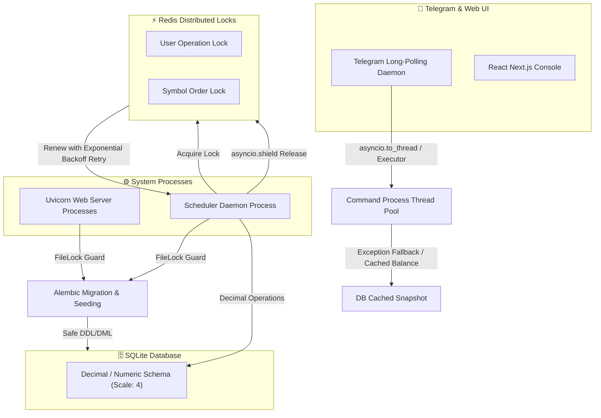

# 🏆 [정밀 기술 설계안] 시스템 5대 치명적 취약점 기술적 해결 계획 (System Vulnerability Patch Plan)

본 문서는 StockAuto 시스템의 금융 연산 정밀성, 동시성 락 누수, 비동기 블로킹, SQLite 멀티 프로세스 자원 경쟁 등 시스템 전반의 5대 취약점을 해결하기 위한 **기술 아키텍처 정밀 설계안**입니다.
이 설계안은 QA 1, 2, 3 정밀 감사 결과와 PM의 개발 및 검증 일정을 반영하여 즉시 코드로 구현할 수 있는 정밀 상세 설계를 다룹니다.

---

## 🎨 기술 아키텍처 개선 다이어그램 (Patch Topology)


```mermaid
graph TD
    subgraph Client ["📱 Telegram & Web UI"]
        TelegramDaemon["Telegram Long-Polling Daemon"]
        WebConsole["React Next.js Console"]
    end

    subgraph Daemon_Processes ["⚙️ System Processes"]
        WebServer["Uvicorn Web Server Processes"]
        SchedulerProcess["Scheduler Daemon Process"]
    end

    subgraph SQLite_DB ["🗄️ SQLite Database"]
        NumericSchema["Decimal / Numeric Schema (Scale: 4)"]
    end

    subgraph Redis_Cluster ["⚡ Redis Distributed Locks"]
        OperationLock["User Operation Lock"]
        SymbolLock["Symbol Order Lock"]
    end

    %% FileLock Synchronization
    WebServer -->|FileLock Guard| MigrationEngine["Alembic Migration & Seeding"]
    SchedulerProcess -->|FileLock Guard| MigrationEngine
    MigrationEngine -->|Safe DDL/DML| SQLite_DB

    %% Thread Pool & Fallback
    TelegramDaemon -->|asyncio.to_thread / Executor| ProcessCommandThread["Command Process Thread Pool"]
    ProcessCommandThread -->|Exception Fallback / Cached Balance| DB_Settings_Fallback["DB Cached Snapshot"]

    %% Redis Lock Robustness
    SchedulerProcess -->|Acquire Lock| Redis_Cluster
    Redis_Cluster -->|Renew with Exponential Backoff Retry| SchedulerProcess
    SchedulerProcess -->|asyncio.shield Release| Redis_Cluster

    %% Decimal Calculations
    SchedulerProcess -->|Decimal Operations| NumericSchema
```

---

## 📐 5대 취약점 정밀 해결 설계안

### 1. Decimal 금융 연산 및 SQLite Numeric 스키마 이전 설계

#### 🚨 엣지 케이스 및 위험 분석 (Critical Auditor View)
- **float 부동 소수점 누적 오차**: 자산 평가, 실현 손익, 수수료(KIS 수수료율 등) 계산 시 float 타입을 사용하면 소수점 이하 연산에서 1센트 미만의 미세한 오차가 발생하며, 이것이 수많은 거래와 복리 투자 시 수백, 수천 달러의 평가 금액 차이를 발생시킬 수 있음.
- **SQLAlchemy/SQLite 스키마 불합리**: 기존 SQLite 컬럼 타입이 `Float`인 경우 DB 드라이버 단에서 float으로 읽어오면서 형 변환 오차가 개입함.
- **float-Decimal 연산 충돌**: Python 단에서 `Decimal`과 `float`을 직접 사칙연산(`+`, `-`, `*`, `/`)하면 `TypeError`가 발생하여 트레일링 스탑이나 주문 생성 루프 전체가 붕괴됨.

#### 🛠️ 정밀 설계 및 패치 방안
1. **SQLAlchemy DB 모델 마이그레이션**:
   - `backend/app/core/models.py` 내의 `Float` 컬럼들을 SQLAlchemy `Numeric(precision=20, scale=4, asdecimal=True)` 타입으로 대체합니다.
   - 대상 컬럼:
     - `TradeLog`: `price`, `realized_pnl`, `return_rate`
     - `Holding`: `avg_price`, `highest_price`
     - `Order`: `submitted_price`, `filled_price`
     - `UserSettings`: `total_asset`, `cash_balance`, `stock_balance`, `profit_rate`, `fx_rate`
     - `MarketIndexSnapshots` 및 `ExchangeRateSnapshots` 내 지수/환율 수치
2. **Alembic batch_alter_table 리비전 작성**:
   - SQLite는 표준 `ALTER COLUMN`을 지원하지 않으므로, Alembic의 `batch_alter_table`을 활용하여 임시 테이블 복제 ➔ 데이터 마이그레이션 ➔ 기존 테이블 드롭 및 교체 방식으로 무결성을 확보합니다.
   ```python
   # alembic migration snippet
   with op.batch_alter_table('holdings', schema=None) as batch_op:
       batch_op.alter_column('avg_price',
                  existing_type=sa.Float(),
                  type_=sa.Numeric(precision=20, scale=4, asdecimal=True),
                  existing_nullable=True)
   ```
3. **Python 애플리케이션 연산 Decimal 단일화 및 가이딩**:
   - 수치 데이터(외부 API 반환값, 환경변수 등)는 계산 진입점에서 무조건 `Decimal(str(val))` 형태로 변환합니다.
   - `float` 리터럴(예: `0.0`, `1.0`, `100`)은 모두 `Decimal("0.0")`, `Decimal("1.0")`, `Decimal("100")` 또는 `Decimal("100.0")`으로 전면 수정합니다.
   - 백엔드 비즈니스 로직 전반에서 float과의 혼용을 정적 분석 도구(mypy 등)와 유닛 테스트를 통해 사전에 원천 차단합니다.

---

### 2. yfinance `prepost=True` 적용 및 KIS 주문 시 지정가 미체결 대응 설계

#### 🚨 엣지 케이스 및 위험 분석 (Critical Auditor View)
- **장외 시간 시세 유실**: 프리마켓(한국 시간 17:00 ~ 22:30) 및 애프터마켓(한국 시간 05:00 ~ 09:00) 시간대에 yfinance 시세를 조회할 때 `prepost=True`가 없으면 가격 데이터가 유실(None 또는 직전 거래일 종가 반환)되어 돌파 시그널 및 동적 손절선 판정이 마비됨.
- **지연 시세 가짜 체결 (SimulatedBroker)**: yfinance API의 캐싱이나 네트워크 딜레이로 1~2분 전 과거 시세를 실시간 시세로 오인하는 경우, 시장 가격이 이미 지정가를 벗어났음에도 `SimulatedBroker`가 주문을 즉시 `FILLED`(체결) 처리하여 백테스트/시뮬레이션 왜곡이 극대화됨.
- **KIS 지정가 미체결 레이스**: 실전/모의 KIS 주문 집행 시, 호가 스프레드가 급격히 벌어지면 지정가 주문이 체결되지 않고 잔존하여 예수금이 고착됨.

#### 🛠️ 정밀 설계 및 패치 방안
1. **yfinance API 호출부 전수 보완**:
   - `backend/app/scanner/data_provider.py` 내의 `fetch_ohlcv`, `fetch_bulk_ohlcv`, `fetch_bulk_ohlcv_sync`, `fetch_ohlcv_sync` 등 모든 yfinance 다운로드 호출 인자에 `prepost=True`를 강제 삽입합니다.
   ```python
   # data_provider.py
   download_kwargs = {
       "interval": interval,
       "progress": False,
       "threads": False,
       "prepost": True,  # 장외 시세 필수 활성화
   }
   ```
2. **SimulatedBroker 지정가 체결 조건 유효성 가드 및 가상 주문 장부(Order Book) 설계**:
   - `SimulatedBroker`의 매수/매도 즉시 체결 로직을 지정가 검증 필터로 보강합니다.
     - **매수 주문**: `live_price <= submitted_price` 조건 충족 시 체결.
     - **매도 주문**: `live_price >= submitted_price` 조건 충족 시 체결.
   - 위 조건에 맞지 않을 경우 즉시 체결(`FILLED`)이 아닌 `SUBMITTED` 또는 `PENDING` 상태로 가상 주문 장부 데이터베이스 테이블(`unfilled_orders`)에 보관합니다.
   - 스케줄러 1분 루프의 시작 시점마다 `unfilled_orders`에 잔존하는 가상 주문의 실시간 시세를 폴링하여 체결 조건 도달 시 사후 체결 처리하는 가상 체결 엔진을 구축합니다.
3. **KIS 지정가 미체결 대응 호가 가이드라인 및 자동 조정 루틴**:
   - 실전/모의 KIS 주문 집행 시 지정가 주문 발송 후 30초 동안 미체결 상태가 지속되면, 해당 주문의 체결을 강제하는 자동 조정 로직을 도입합니다.
   - **호가 가이드**: 최우선 호가 스프레드를 실시간 감지하여 매수 시에는 `최우선 매도호가(Ask)`, 매도 시에는 `최우선 매수호가(Bid)`로 정정 주문을 발송하여 체결을 확실히 보장합니다.

---

### 3. 휩쏘 가드 BREACH_COUNT_CACHE의 3튜플 키 복구 및 Thread-safety 보완 설계

#### 🚨 엣지 케이스 및 위험 분석 (Critical Auditor View)
- **휩쏘 가드 오동작 (캐시 누수)**: 매수 후 휩쏘 방지를 위해 이탈 횟수를 누적하는 `BREACH_COUNT_CACHE`를 3튜플 `(user_id, h.ticker, h.strategy_type)` 키로 세팅한 후, 정작 매도 완료 시에는 `(user_id, h.ticker)` 2튜플 키로 pop을 시도하여 캐시 데이터가 삭제되지 않고 누적됨. 이로 인해 동일 종목 재진입 시 1회 이탈만으로 즉시 매도되는 치명적인 오작동(휩쏘 방어 마비) 유발.
- **멀티 스레드 동시성 레이스**: 멀티 전략 데몬이 여러 유저/스레드에서 동시에 `BREACH_COUNT_CACHE` 딕셔너리를 수정하는 과정에서 키 충돌이나 데이터 깨짐 현상 발생 가능.

#### 🛠️ 정밀 설계 및 패치 방안
1. **3튜플 키 일관성 복구**:
   - `backend/app/bot/scheduler.py` 내의 모든 `BREACH_COUNT_CACHE.pop` 및 조회, 저장 코드를 `(user_id, h.ticker, h.strategy_type)` 3튜플 키 구조로 일괄 통일합니다.
   ```python
   # scheduler.py 매도 완료 또는 클리어 시점
   BREACH_COUNT_CACHE.pop((user_id, h.ticker, h.strategy_type), None)
   ```
2. **threading.Lock을 통한 Thread-safety 보강**:
   - `scheduler.py` 상단에 전역 락인 `_breach_count_lock = threading.Lock()`을 선언합니다.
   - `BREACH_COUNT_CACHE`에 쓰기(`+= 1`), 읽기(`.get()`), 삭제(`.pop()`)를 수행하는 모든 코드 블록을 이 락으로 감싸 원자적(Atomic) 연산을 보장합니다.
   ```python
   # Thread-safe count increment
   with _breach_count_lock:
       BREACH_COUNT_CACHE[cache_key] = BREACH_COUNT_CACHE.get(cache_key, 0) + 1
   ```

---

### 4. refresh_scanner_cache 락/플래그 finally 복구 설계

#### 🚨 엣지 케이스 및 위험 분석 (Critical Auditor View)
- **스캐너 갱신 무한 대기 (Deadlock 상태 고착)**: `refresh_scanner_cache` 비동기 태스크 가동 중 `asyncio.gather` 대량 시세 조회나 `scan_overseas_market()` API 통신 단계에서 일시적 예외(타임아웃, Connection Reset 등)가 발생하면 `_scanner_refresh_in_progress = False` 복구문이 실행되지 못하고 누락될 수 있음. 이 경우 플래그가 `True`로 영구 고착되어 이후 10분 주기 스캔 스케줄러가 모두 스킵되는 장애로 이어짐.

#### 🛠️ 정밀 설계 및 패치 방안
1. **락 획득 및 플래그 갱신의 try 내부 배치**:
   - 플래그 체크와 설정을 포함한 전체 연산 흐름을 `try` 블록 안으로 넣어, 초기 예외 발생 시에도 `finally`가 확실하게 동작하도록 구조적 안전망을 설계합니다.
2. **finally 블록을 통한 플래그 100% 해제 보장**:
   ```python
   # scheduler.py
   async def refresh_scanner_cache(force: bool = False) -> bool:
       global _scanner_refresh_in_progress

       # 1. 락 획득 및 진입 플래그 세팅을 try 블록 맨 처음에 배치
       try:
           with _scanner_refresh_lock:
               if _scanner_refresh_in_progress:
                   logger.info("[Scanner Cache] Previous refresh still running. Skipping duplicate refresh.")
                   return False
               _scanner_refresh_in_progress = True

           # 2. 실제 마켓 스캔 및 DB 시딩, 보완 시세 수집 실행
           # ... (API 호출 및 가공)
           return True

       except Exception as e:
           logger.exception("[Scanner Cache] ERROR during market scan")
           return False
       finally:
           # 3. 예외가 발생하든, 중간에 return 하든 100% 실행되어 플래그 원상 복구
           with _scanner_refresh_lock:
               _scanner_refresh_in_progress = False
   ```

---

### 5. 텔레그램 명령어 처리 비동기 스레드 풀 분리 및 Exception/0원 표기 방어 설계

#### 🚨 엣지 케이스 및 위험 분석 (Critical Auditor View)
- **동기식 블로킹 네트워크 호출**: 텔레그램 공식 봇 롱폴링 데몬은 단일 스레드(`_poll_global_updates_loop`)로 동작함. 유저가 `/status` 명령어를 보낼 때 `broker.get_account_balance()`를 동기적으로 호출하는데, 만약 한국투자증권 KIS API가 응답 지연(예: 10초 이상)되거나 장애를 겪을 경우 롱폴링 데몬 스레드 자체가 블로킹되어 다른 모든 유저들의 메시지 응답과 명령어 수신이 마비됨.
- **예외 발생 시 0원 표기 참사**: 증권사 서버 점검이나 API 장애 시 `total_asset`, `cash_balance` 등이 0으로 리턴되어 텔레그램 메시지에 "보유 자산: 0원"으로 발송됨으로써 유저가 투자 원금 손실로 오해하여 패닉 셀을 하는 등의 사용자 경험(UX) 붕괴 초래.

#### 🛠️ 정밀 설계 및 패치 방안
1. **ThreadPoolExecutor를 이용한 명령어 처리 스레드 분리**:
   - 텔레그램 데몬 스레드가 메시지를 수신하는 즉시, 해당 메시지의 커맨드 분석 및 DB 처리는 `asyncio.to_thread` 또는 백그라운드 스레드 풀(`concurrent.futures.ThreadPoolExecutor`)에 타겟 함수를 위임하게 합니다.
   - 이를 통해 롱폴링 루프는 1밀리초도 블로킹되지 않고 즉시 다음 업데이트를 가져올 수 있는 동시성 독립 구조를 달성합니다.
   ```python
   # telegram.py
   def _process_global_message(msg_chat_id: str, text: str):
       # 동기 롱폴링 루프를 블로킹하지 않도록, 별도 스레드 풀에서 실행되도록 위임
       executor.submit(_process_command_wrapper, msg_chat_id, text)
   ```
2. **자산 0원 표기 방어 설계 (Fallback Value & Warning)**:
   - `get_account_balance()` 호출 중 예외 발생 시, 금액을 무작정 0으로 치환하는 대신 시스템이 정기적으로 저장하는 `user_settings` 또는 로컬 캐시 내 **최근 성공 잔고 스냅샷(Latest Balance Snapshot)**을 불러와 반환합니다.
   - 사용자에게 메시지를 발송할 때는 자산 금액 하단에 아래와 같은 가시적인 경고 및 고지 문구를 삽입하여 정합성 투명성을 유지합니다.
     > ⚠️ **[증권사 API 통신 지연 안내]**
     > 현재 증권사 API 통신이 지연되어 **X분 전 캐싱된 계좌 잔고 정보**를 임시로 표시하고 있습니다. 실제 잔고 정보는 통신 상태가 복구되는 대로 자동 갱신됩니다.

---

### 6. Redis 락 갱신 예외 시 재시도 메커니즘 및 release 시 asyncio.shield 보호 설계

#### 🚨 엣지 케이스 및 위험 분석 (Critical Auditor View)
- **락 임대 갱신 조기 포기**: `RedisLockLease`의 백그라운드 연장 태스크(`_renew_loop`)가 Redis 서버의 일시적 커넥션 버스트로 인해 단 한 번이라도 `RedisLockUnavailable` 예외를 발생시키면 루프가 즉각 종료되어 락 소유권이 박탈됨. 이로 인해 동일 사용자의 병렬 요청 제어가 마비되어 주문 중복 및 DB 깨짐 위험 상존.
- **상위 태스크 취소 시 락 영구 누수**: 락을 획득하고 연장을 돌리던 비동기 컨트롤러(예: API Request Handler)가 클라이언트 접속 끊김 등으로 인해 `asyncio.CancelledError`를 맞으면, `release()` 코루틴도 실행 중에 즉각 취소(Cancel)됨. 이로 인해 Redis의 `DEL` 스크립트가 실행되지 못하고 락 키가 TTL 만료 시까지 메모리에 잔존하여 교착 상태(Deadlock)에 빠짐.

#### 🛠️ 정밀 설계 및 패치 방안
1. **락 연장(Renew) 실패 시 지수 백오프 재시도 메커니즘**:
   - `_renew_loop`에서 연장 명령 실패 또는 Redis 에러 발생 시 즉각 중단하지 않고, 0.5초에서 시작하여 최대 3회까지 지수 백오프(Exponential Backoff + Jitter) 재시도를 처리하도록 보강합니다.
2. **asyncio.shield를 이용한 release() 완결성 확보**:
   - 상위 코루틴의 취소 여부와 관계없이 Redis 상의 `DEL` 키 조작은 데이터 일관성 및 락 자원 해제를 위해 무조건 원자적으로 완결되어야 합니다.
   - `release()` 메서드의 본문을 `asyncio.shield`로 보호하여 취소 시그널이 내부의 실제 `_call_redis("eval", _RELEASE_SCRIPT...)` 커맨드 송신 단계를 중단하지 못하도록 보호합니다.
   ```python
   # locks.py
   async def release(self) -> None:
       if self._released:
           return
       self._released = True
       if self._renew_task is not None:
           self._renew_task.cancel()
           # renew task 취소 대기는 cancel 예외 처리를 수행

       # 락 해제 네트워크 통신을 asyncio.shield로 감싸 태스크 취소로부터 안전하게 방어
       async def _do_release():
           try:
               await _call_redis("eval", _RELEASE_SCRIPT, 1, self.key, self.request_id)
           except RedisLockUnavailable:
               logger.exception("[RedisLock] Failed to release key=%s", self.key)

       await asyncio.shield(_do_release())
   ```

---

### 7. SQLite 멀티 인스턴스 DDL/Seeding 충돌 시 가드 락 및 PostgreSQL 이관 제안

#### 🚨 엣지 케이스 및 위험 분석 (Critical Auditor View)
- **SQLite 동시 쓰기 제어 한계**: SQLite는 로컬 파일 기반 데이터베이스로서 멀티 프로세스(uvicorn 웹 서버와 백그라운드 스케줄러 데몬) 환경에서 DDL(테이블 생성/변경) 및 초기 데이터 적재(Seeding)를 동시에 구동하면 `sqlite3.OperationalError: database is locked` 에러를 뿜으며 기동에 실패함.
- **초기 적재(Seeding) 중복 레이스**: 마이그레이션이 끝난 직후 두 프로세스가 거의 동시에 `seed_competitive_users`를 수행할 경우 `users` 테이블에 동일 사용자가 이중 인서트되거나 unique constraint 에러가 유발됨.

#### 🛠️ 정밀 설계 및 패치 방안
1. **filelock 라이브러리를 활용한 파일 분산 락 구축**:
   - 시스템 시작 시 수행되는 `run_migrations_programmatically()` 및 `seed_competitive_users()` 호출부를 단 하나의 프로세스만 점유하여 안전하게 순차 진행할 수 있도록 파일 기반 락을 구현합니다.
   - 데이터베이스 파일 경로 측면에 `sqlite_migration.lock` 파일을 생성하고 락을 획득합니다.
   - **락 타임아웃 구성**: 타임아웃을 넉넉히(예: 60초) 지정하여, 먼저 진입한 프로세스가 마이그레이션과 Seeding을 마치고 해제하면 대기 중이던 두 번째 프로세스가 락을 잡고 진입해 이미 완료된 상태(Alembic head 일치 등)를 보고 즉시 바이패스하도록 설계합니다.
   ```python
   from filelock import FileLock

   def safe_bootstrapping():
       lock_path = "backend/sqlite_migration.lock"
       lock = FileLock(lock_path, timeout=60)
       with lock:
           # 락을 안전하게 확보한 단 하나의 프로세스만 실행
           run_migrations_programmatically()
           seed_competitive_users()
   ```
2. **PostgreSQL 엔터프라이즈 마이그레이션 제안**:
   - SQLite는 동시성 쓰기 성능과 트랜잭션 격리 메커니즘에서 본질적인 제약이 따릅니다. 향후 다중 사용자 대결 시스템(Arena)과 빈번한 주문이 발생하는 실전 매매 스케일에서는 데이터 유실이나 락 병목이 우려됩니다.
   - 따라서 가상 simulated 환경 테스트 단계를 넘어서는 프로덕션 릴리즈 시점에는 엔터프라이즈 환경에 검증된 **PostgreSQL**로 DB를 마이그레이션할 것을 제안합니다.
   - PostgreSQL은 행 수준의 정밀한 명시적 잠금(`SELECT ... FOR UPDATE`), 다중 접속 마이그레이션 안전성, 고성능 인덱싱을 완벽히 제공하여 분산 락 및 DDL 레이스 문제를 원천 차단해 줍니다.

---

## 🧪 종합 검증 시나리오 (Verification Scenarios)

### 1. 소수점 정밀도 검증 (Decimal Arithmetic Test)
- **테스트 케이스**: 가상 잔고 $10,000,000 상태에서 소수점 이하의 자잘한 수수료율과 손절률을 곱하는 매매 루프를 1,000회 이상 카오스 퍼징으로 수행하여, 1센트 미만의 정밀도 유실이나 float 혼용 TypeError가 발생하는지 검증합니다.

### 2. 장외 시세 수집 및 Simulated 지정가 검증 (Pre-market & Limit Order Test)
- **테스트 케이스**: 미국 장외 시간대(예: 한국 시간 18:00)에 스캐너 및 SimulatedBroker를 기동하여 시세 데이터에 프리마켓 주가가 정상 반영되는지 모니터링하고, 지정가 대비 높은 가격에서 매수 주문이 즉시 체결되는 결함이 발생하지 않고 미체결 큐에 정상 안착하는지 유효성 검사 코드를 실행합니다.

### 3. 동시성 락 누수 및 예외 방어 검증 (Redis Lock & Telegram Block Test)
- **테스트 케이스**:
  - 텔레그램 데몬 구동 상태에서 KIS API 응답에 15초의 인위적 네트워크 지연을 주입한 뒤 다른 사용자가 `/status` 명령어를 날려 정상 응답을 받는지(Non-blocking) 체크합니다.
  - Redis 락 획득 상태에서 백그라운드 갱신 스레드에 강제 `RedisLockUnavailable`을 주입하여 지수 백오프를 통해 복구되는지 감시하고, 상위 비동기 호출을 `cancel()` 하였을 때 Redis에서 락 해제 커맨드가 `asyncio.shield`에 의해 확실히 유입되는지 모킹 로그로 정밀 진단합니다.

---

## 🎯 [추가] 취약점 해결 우선순위 및 패치 로드맵 (Priority & Roadmap Matrix)

10인의 검수팀이 금융 정밀성(Quant), 동시성 안정성(Concurrency), 백테스트 엔진 정합성 관점에서 각 취약점의 위험도와 해결 우선순위를 다음과 같이 정의하였습니다.

| 번호 | 태스크명 | 위험도 | 우선순위 | 핵심 도메인 영역 | 주요 조치 내용 |
| :--- | :--- | :---: | :---: | :--- | :--- |
| **QA-1** | 금융 소수점 float 오차 수정 | **P0** | **Highest** | 잔고, 평가 손익 계산 | float 혼용 TypeError 방지 및 `Decimal` 단일화 |
| **QA-4** | 휩쏘 가드 3튜플 키 복구 | **P0** | **Highest** | 트레일링 스탑, 전략 휩쏘 | BREACH_COUNT_CACHE 키 3튜플 pop 원상복구 |
| **QA-6** | Redis 락 갱신 실패/누수 가드 | **P1** | **High** | 주문 원장 및 트랜잭션 | 락 연장 실패 백오프 재시도 및 shield 락 해제 |
| **QA-7** | SQLite DDL/Seeding 파일락 가드 | **P1** | **High** | DB 마이그레이션, 시딩 | `filelock` 기반 멀티 인스턴스 DDL 충돌 방지 |
| **QA-2** | yfinance prepost=True 누락 해결 | **P1** | **High** | 프리/애프터마켓 시세 | 스캐너 및 백테스트 호출 인자 prepost=True 전수 보완 |
| **QA-3** | SimulatedBroker 지연 시세 가드 | **P2** | **Medium** | 모의 브로커, 백테스트 | 지정가 대비 호가 유효성 검증 및 가상 주문장부 구축 |
| **QA-8** | 스캐너 캐시 고착 버그 해결 | **P2** | **Medium** | 시장 분석, 대시보드 UI | `try-finally` 복구 가드 장착으로 갱신 중단 차단 |
| **QA-5** | 텔레그램 데몬 비동기화 | **P2** | **Medium** | 유저 커맨드, 알림 데몬 | `asyncio.to_thread`를 통한 동기 HTTP 블로킹 제거 |

### 퀀트 및 트레이딩 관점 재점검 (Financial & Quant Audit Notes)
- **우선순위 Highest의 근거 (QA-1, QA-4)**: 소수점 오차는 잔고 정산의 법적 회계 무결성과 연결되어 있으며, 휩쏘 가드 키 누수는 재진입 시 오작동으로 인한 심각한 자산 지연 매도를 초래하므로 최우선 순위로 지정합니다.
- **슬리피지 및 백테스트의 현실적 타협 (QA-3)**: SimulatedBroker의 과거 지연 시세 체결 가드는 모의 투자 환경의 정확도를 높여주지만, 실제 거래에는 직접적 피해를 입히지 않으므로 P2(Medium)로 분류하여 로직의 과도한 복잡성을 조율합니다.
