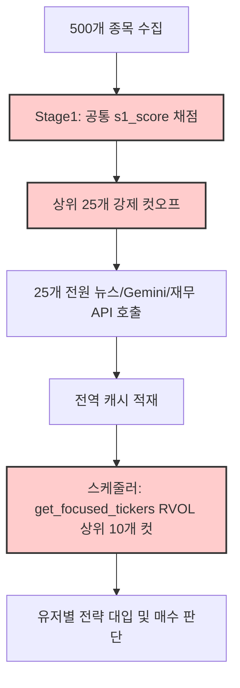
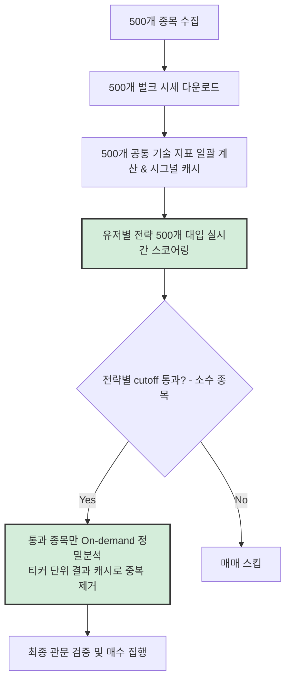

# 🏆 94개 전략 활성화를 위한 실시간 스캐너 & 스케줄러 아키텍처 개편 계획서 (v3)

본 계획서는 1단계의 모멘텀 편향 공통 필터링(`s1_score` 및 25개 강제 컷오프)으로 인해 역추세, 낙주 반등, 변동성 수축형 등 돌파 이외의 전략들이 실거래에서 배제되는 병목 현상을 해결하기 위한 아키텍처 개편 설계도입니다.

> **v2 개정 사유**: v1 초안은 스캐너(`scanner.py`)의 병목 2곳만 다루어, **스케줄러 진입 단계의 세 번째 모멘텀 병목(`get_focused_tickers`)** 을 놓쳤습니다. 이 필터가 남아있으면 스캐너를 아무리 개방해도 전략 채점 이전에 종목이 RVOL 기반 ~10개로 재차 잘려 개편 목적이 무력화됩니다. v2는 이 병목의 제거·재배치와, On-demand 정밀분석의 다중 유저·전략 팬아웃 현실화, 하네스 검증 계획을 보강했습니다.
>
> **v3 개정 사유**: Critical Auditor 감사 보고서([docs/history/strategy_architecture_audit.md](history/strategy_architecture_audit.md))의 4개 지적을 코드로 교차검증하여, 사실로 확인된 3건(비동기 레이스·`inspect` 병목·자금 선점 레이스)의 방어 설계를 본문에 반영하고, 과장으로 판명된 1건(런타임 Crash)은 실측 근거와 함께 정정했습니다. 상세는 **§감사 대응** 참조.

---

## 💡 개편 목적 및 기대 효과

*   **94개 전략의 완전 가동**: 1단계의 강제 필터 **및 스케줄러의 focusing 모멘텀 필터**를 제거/재배치하여, 모든 전략이 300~500개 시드 종목 전체를 온전히 평가할 수 있게 합니다.
*   **API 트래픽 대폭 절감**: 무겁고 차단되기 쉬운 뉴스 검색, Gemini AI 뉴스 분석, 개별 재무제표 스크래핑을 예선 통과한 극소수 종목에 대해서만 동적(On-demand)으로 수행하되, **티커 단위 결과 캐시(중복 제거)** 로 다중 유저·전략 팬아웃까지 통제합니다.
*   **성능 향상**: 대량 시세 조회가 벌크(Bulk) 처리와 백그라운드 캐싱(10분 주기)으로 이루어져 API 차단 위험이 없으며, 실시간 채점은 순수 메모리 상의 수식 계산만으로 처리합니다. **단, 500종목 × 전략슬롯 × 유저 규모의 채점 비용은 1분 루프 내 실측으로 검증 후 확정합니다.**

---

## 🚧 현행 3중 모멘텀 병목 (Root Cause — 코드 대조 검증됨)

| # | 위치 | 코드 근거 | 성격 | v1 반영 여부 |
| :-- | :-- | :-- | :-- | :-- |
| ① Stage 1 게이트 | `scanner.py:269–289` | `if s1_score >= 30 or rvol >= 2.5 ...` | 갭·RVOL·정배열 등 **돌파형 점수** 미달 종목 탈락 | ✅ v1이 다룸 |
| ② Stage 2 컷오프 | `scanner.py:319` | `sorted(..., key=(rvol, s1_score))[:25]` | RVOL 우선 정렬 후 **상위 25개만** 정밀분석 진입 | ✅ v1이 다룸 |
| ③ **Focusing 필터** | `multi_strategy_manager.py:184–216` | `has_accumulation = rvol >= 2.0 ...` → `candidates[:10]` | 스케줄러 진입 시 **전략 채점 이전에** RVOL 매집봉 상위 ~10개로 재차 컷 | ❌ **v1 누락 — v2에서 보강** |

*   ③은 `scheduler.py:1461`에서 `focused_tickers = ms_manager.get_focused_tickers(...)`로 호출되고, `scheduler.py:1488`의 `if clean_ticker not in focused_tickers: continue`로 **`calculate_score` 호출 전에** 종목을 걸러냅니다. 즉 ①②를 모두 걷어내도 ③이 남으면 역추세·수축·낙주반등 종목은 유저 전략에 도달하지 못합니다.

---

## 🔄 데이터 흐름 개편 비교 (Data Flow Comparison)

### 1. 기존 아키텍처 (3중 병목)

```mermaid
graph TD
    A[500개 종목 수집] --> B[Stage1: 공통 s1_score 채점]
    B --> C[상위 25개 강제 컷오프]
    C --> D[25개 전원 뉴스/Gemini/재무 API 호출]
    D --> E[전역 캐시 적재]
    E --> F[스케줄러: get_focused_tickers RVOL 상위 10개 컷]
    F --> G[유저별 전략 대입 및 매수 판단]
    style B fill:#ffcccc,stroke:#333,stroke-width:2px
    style C fill:#ffcccc,stroke:#333,stroke-width:2px
    style F fill:#ffcccc,stroke:#333,stroke-width:2px
```
*   *문제점*: 역추세/수축/하락장 대응 종목들이 ①`s1_score` → ②25컷 → ③focusing의 3중 모멘텀 관문에서 모조리 탈락하여 유저 전략의 평가를 받아보지도 못함.

### 2. 개편 아키텍처 (정공법)

```mermaid
graph TD
    A[500개 종목 수집] --> B[500개 벌크 시세 다운로드]
    B --> C[500개 공통 기술 지표 일괄 계산 & 시그널 캐시]
    C --> D[유저별 전략 500개 대입 실시간 스코어링]
    D --> E{전략별 cutoff 통과? - 소수 종목}
    E -->|Yes| F[통과 종목만 On-demand 정밀분석<br/>티커 단위 결과 캐시로 중복 제거]
    F --> G[최종 관문 검증 및 매수 집행]
    E -->|No| H[매매 스킵]
    style D fill:#d4edda,stroke:#333,stroke-width:2px
    style F fill:#d4edda,stroke:#333,stroke-width:2px
```
*   *장점*: 500개 종목 전체에 대해 각 유저 전략이 **자신의 cutoff 기준으로 직접 선발**하며(중앙 집중식 focusing 제거), 무거운 개별 통신 API는 통과 종목에 한해 티커 단위로 1회만 호출.

---

## 🛠️ 제안하는 파일 변경 세부사항 (Proposed Changes)

### 1. [backend/app/scanner/scanner.py](file:///d:/dev/workspace/stockAuto/backend/app/scanner/scanner.py) [MODIFY]
*   **①②병목 삭제**: `s1_score` 예선 컷오프(`s1_score >= 30`) 및 `[:25]` 강제 정렬 컷오프를 제거하고, 300~500개 시드 종목 전체를 예선 탈락 없이 시그널 캐시에 유지합니다.
*   **무거운 개별 분석의 스캐너 분리**: 스캔 주기(10분)에서는 뉴스 검색·Gemini 감성분석·재무 건전성 필터링을 수행하지 않고, 오직 15분봉/일봉 기술 지표(RVOL, EMA, VWAP, ATR, VCP, Cup & Handle, Double BB 등)만 벌크로 일괄 가공해 **가벼운 시그널 캐시**로 적재합니다.
    *   현행 `scan_overseas_market`의 Stage 2 `news_tasks`/`fundamental_tasks` `asyncio.gather`(`scanner.py:342–350`)를 스캐너에서 제거하고, 아래 ②의 On-demand 파이프라인으로 이관합니다.
*   **경계 조건**: 500개 벌크 지표 계산은 유지하되, 캐시 스키마(`latest_scanned_signals`의 `details` 필드)에 각 전략이 요구하는 지표가 모두 포함되는지 사전 점검(전략별 `required_indicators` 대조).

### 2. [backend/app/bot/multi_strategy_manager.py](file:///d:/dev/workspace/stockAuto/backend/app/bot/multi_strategy_manager.py) [MODIFY] — **v2 신규**
*   **③Focusing 모멘텀 필터 재배치**: `get_focused_tickers`의 RVOL≥2.0 매집봉 기반 상위 10개 선발 로직이 **전략 채점보다 먼저** 적용되는 구조를 해체합니다. 택1:
    *   **(A안·권장) 전략 후단 이동**: 각 전략이 500종목을 자신의 `calculate_score`/`get_cutoff_score`로 먼저 선발한 뒤, 자금 파편화 방지용 focusing은 **cutoff 통과 종목 내에서만** 상한(예: 전략별 상위 N) 적용.
    *   **(B안) 파라미터화**: `get_focused_tickers`를 옵션 인자(`momentum_gate: bool`)로 감싸, 돌파형이 아닌 전략 슬롯에는 게이트를 우회. (전략 카테고리 메타데이터 필요)
*   자금 파편화 방지라는 `get_focused_tickers` 본연의 목적(주석 `multi_strategy_manager.py:186–189`)은 유지하되, **선발 기준을 RVOL 단일 축에서 전략 점수 축으로 전환**하는 것이 핵심입니다.
*   **점수 내림차순 자금 배정 조율(감사 §구멍4 반영)**: cutoff 통과 종목들의 On-demand 게이트 검증을 **먼저 모두 완료(gather)한 뒤**, 최종 후보를 **점수 내림차순으로 정렬하여 예수금을 순차 배정·집행**합니다. 이렇게 하지 않으면 API 네트워크 지연으로 저점수 종목(B)이 먼저 체결되어 예수금이 고갈되고, 고점수 종목(A)이 자금 부족으로 탈락하는 **자본 고갈(Capital Starvation) 레이스**가 발생합니다. 즉 "검증→정렬→배정"을 반드시 이 순서로 동기화합니다.

### 3. [backend/app/bot/scheduler.py](file:///d:/dev/workspace/stockAuto/backend/app/bot/scheduler.py) [MODIFY]
*   **유저별 500개 종목 재채점 가동**: 1분 주기 루프(`run_user_trading_flow` ➔ `process_entry_signals`)에서, 캐싱된 300~500개 종목 전체에 대해 사용자의 전략 인스턴스를 대입해 `calculate_score`를 연산합니다.
    *   `process_entry_signals:1486`의 `for signal in target_signals` 순회 대상을 focusing 축소본이 아닌 **전체 시그널**로 확대하고, `1488`의 `if clean_ticker not in focused_tickers: continue` 게이트를 위 2번의 재배치 방식에 맞게 수정합니다.
    *   **`inspect.signature` 리플렉션 제거(감사 §구멍2 반영)**: 500종목 × 전략 × 유저 규모의 핫 루프가 채점 브릿지 `calculate_strategy_score`(`scanner.py:103–108`)를 경유할 경우, 매 호출 `inspect.signature(...)` 리플렉션이 CPU 병목이 됩니다. **전략 생성 시점에 `score_card` 지원 여부를 불리언 플래그(예: `strategy_instance.supports_score_card`)로 1회 캐싱**하고 루프 내에서는 플래그만 분기하도록 경량화합니다. (현행 트레이딩 루프는 `1491`에서 `calculate_score`를 직접 호출해 이 브릿지를 거치지 않으므로, 500 확장 시 브릿지 재사용 여부를 착수 시 확정합니다.)
*   **동적 정밀 분석 파이프라인 구축 (On-demand Gatekeeper)**:
    *   각 전략 cutoff를 돌파한 종목에 대해서만 무거운 정밀 분석 함수를 동적 체인 호출:
        1.  `check_fundamental_health(ticker)`: 재무 건전성 조사
        2.  `fetch_ticker_news(ticker)` + `analyze_news_sentiment(...)`: 최신 뉴스 수집 및 Gemini AI 감성 판독
    *   모든 동적 검증(재무 흑자 여부, 뉴스 감성 점수 등) 통과 종목만 최종 타점으로 인정해 매수 주문 집행.
    *   **팬아웃 통제(중복 제거 + 단일 비행)**: On-demand 호출은 `유저 수 × 전략 슬롯 × 통과 종목`으로 곱셈 증가할 수 있으므로, **트레이딩 루프 1회 안에서 티커 단위 결과 캐시**(예: `{ticker: fundamental/news 결과}` in-memory dict, 루프 스코프)를 둡니다. **단, 유저 루프가 `asyncio.gather`로 동시 실행되므로(scheduler.py:1954) 단순 dict 캐시는 동시 캐시 미스 레이스로 무력화됨** → **티커 단위 `asyncio.Lock` 풀 기반 단일 비행(single-flight) 패턴**으로 동일 티커의 중복 in-flight 호출을 원천 차단합니다(감사 §구멍1 반영). 참고 선례: `scanner.py:118` `check_market_sentiment`의 이중 확인 락 패턴.

---

## 📊 API 절감 재산정 (v1 "90%" 주장 보정)

| 구분 | 기존 | 개편(순진한 On-demand) | 개편(티커 캐시 적용) |
| :-- | :-- | :-- | :-- |
| 정밀분석 호출 대상 | 매 스캔 25종 전원 | 유저×전략×통과종목 (곱셈 폭증 위험) | 루프당 **유니크 통과 티커** 1회 |
| 예시(5유저·8슬롯·통과3종) | 25 | 최대 120 | ≤ 15 (중복 제거 후) |

*   → 절감률은 시장 상황·통과 종목 수에 따라 변동하므로 **고정 %를 단정하지 않고**, 검증 단계에서 실측 로그로 확정합니다.

---

## 🔍 감사 대응 (Critical Auditor Findings 교차검증)

감사 보고서([strategy_architecture_audit.md](history/strategy_architecture_audit.md))의 4개 지적을 실제 코드로 검증한 판정과 조치입니다. **감사관 주장을 그대로 수용하지 않고, 근거 코드와 대조하여 과장 1건을 정정**했습니다.

| # | 감사 지적 | 코드 검증 | 판정 | 조치 |
| :-- | :-- | :-- | :-- | :-- |
| 1 | 팬아웃 캐시 레이스 컨디션 | 유저 루프 `asyncio.gather(*tasks)` 동시 실행(`scheduler.py:1954`) 확인 | ✅ **사실** | 티커 단위 `asyncio.Lock` 풀 single-flight (§변경 3) |
| 2 | `inspect.signature` 리플렉션 병목 | `calculate_strategy_score`(`scanner.py:103–108`)가 매 호출 `inspect.signature` 실행, 후보 루프(`scanner.py:474`)에서 사용 | ✅ **사실**(단 현행 트레이딩 루프는 미경유) | 생성 시점 capability 플래그 캐싱 (§변경 3) |
| 3 | 전단 채점 시 None 참조 런타임 Crash | 유일 소비처 `strategy_c.py:188–189`가 `_safe_get(row, key, default)` 사용, `_safe_get`(`base_strategy.py:76–88`)이 dict/Series/NaN 안전 폴백. 전략 전체에 raw 접근(`row['news_sentiment_score']` 등) **0건**. `is_fundamental_healthy`는 전략에서 참조 자체 없음 | ⚠️ **과장 — Crash 불성립** | 아래 정정 참조 |
| 4 | 자금 선점 레이스(Capital Starvation) | On-demand 게이트를 비동기화하면 응답 순서가 점수 순서를 역전 가능 | ✅ **사실** | 검증→점수 내림차순 정렬→배정 동기화 (§변경 2) |

### §구멍3 정정 — "루프 전체 Crash"는 현재 코드에서 발생하지 않음
*   감사관은 `KeyError`/`TypeError: NoneType + float`로 스케줄러 루프 전체가 중단된다고 주장했으나, 뉴스/재무 필드를 참조하는 유일 전략 `strategy_c`는 이미 **기본값을 가진 `_safe_get`** 으로 접근합니다(`news_sentiment` → `'NEUTRAL'`, `news_sentiment_score` → `0.0`). `_safe_get`은 dict·Series·객체 및 `NaN`을 모두 방어하므로 예외가 전파되지 않습니다.
*   따라서 실제 리스크는 Crash가 아니라 **의미론적 편차**입니다: 전단 채점 시 뉴스가 아직 없어 뉴스 의존 전략이 중립(0.0)으로 채점됨. 이는 뉴스를 **후단 On-demand 게이트에서 최종 검증**하는 본 설계와 일관되므로 허용 가능합니다.
*   **예방적 가드레일(회귀 방지)**: (a) 모든 전략의 `calculate_score`가 뉴스/재무 필드에 반드시 `_safe_get`(또는 동등 안전 접근)만 사용하도록 lint/테스트로 강제, (b) 전단/후단을 구분하는 명시적 스테이지 플래그(예: `is_prescoring: bool`)를 `calculate_score` 시그니처 확장으로 도입 검토, (c) 신규 전략이 raw 접근을 추가하지 못하도록 단위 테스트로 잠금(§검증 2).

---

## 🧪 검증 계획 (Verification Plan) — 하네스 기준 강화

### 1. 필수 하네스 통과 (완료 보고 전)
*   **`python scripts/verify_harness.py`** 전체 통과(계약/컴파일/pytest/lint/tsc/카오스/롤백). 미통과 시 "미검증"으로 사유와 함께 보고. *(AGENTS.md §완료 보고 전 검증)*
*   **구문 무결성**:
    ```bash
    python -m py_compile backend/app/scanner/scanner.py backend/app/bot/scheduler.py backend/app/bot/multi_strategy_manager.py
    ```

### 2. 신규 경로 단위 테스트 (추가 작성)
*   **전 종목 스코어링 경로**: `process_entry_signals`가 focusing 축소 없이 전체 시그널을 채점하는지, 비돌파형 전략(예: 역추세/수축)이 실제로 cutoff를 통과해 매수 인텐트를 생성하는지 검증하는 픽스처 테스트.
*   **팬아웃 캐시 + 레이스(§구멍1)**: 동일 티커가 복수 유저·전략에 걸릴 때 `check_fundamental_health`/`fetch_ticker_news`가 **1회만** 호출되는지 mock 호출 카운트로 검증. 특히 **다중 유저 루프를 동시 `gather`로 띄운 상태에서도** 중복 in-flight 호출이 0인지(single-flight 락 유효성) 동시성 테스트.
*   **`inspect` 제거(§구멍2)**: 채점 핫 루프에 `inspect.signature`가 호출되지 않는지(capability 플래그 경유) 확인. 500종목 채점 마이크로벤치로 리플렉션 제거 전후 소요시간 비교.
*   **전단 채점 안전성(§구멍3)**: 뉴스/재무 필드가 비어있는 시그널로 전 전략의 `calculate_score`를 호출해도 예외 없이 수치를 반환하는지(전 전략 스모크 테스트) + raw 접근 도입 방지 정적 검사.
*   **자금 배정 순서(§구멍4)**: 저점수 종목의 게이트 응답이 먼저 도착하도록 지연을 mock한 상황에서, 최종 집행이 **점수 내림차순**으로 이뤄지고 고점수 종목이 예수금을 우선 확보하는지 검증.
*   **회귀 방지**: 기존 돌파형 전략의 매수 판정이 개편 전후 동일한지(골든 스냅샷) 확인.
*   **백테스트 브릿지**: `run_backtest.py`가 시그널 전처리 흐름 변경 후에도 오류 없이 실행되는지 점검.

### 3. 수동 및 로그 검증 (`local` 시뮬레이션)
*   500개 종목 기술 지표가 10분 주기로 정상 캐싱되는지 로그 검사.
*   자동 매매 가동 시 300~500개 종목 스코어링의 **1분 루프 내 소요 시간 실측**(성능 주장 검증 — 지연 임계 초과 시 배치/샤딩 대안 검토).
*   진입 cutoff 통과 종목에 한해서만 뉴스/Gemini 로그가 찍히는지, 그리고 **동일 티커 중복 호출이 없는지** 확인.

---

## ⚠️ 잔여 리스크 & 오픈 이슈

1.  **성능**: 500 × 전략 × 유저 채점 비용이 1분 루프를 초과할 가능성. 실측 전까지는 "지연 없음"을 단정하지 않으며, 초과 시 전략별 벡터화/유저 샤딩을 후속 과제로 둠.
2.  **캐시 스키마 완전성**: 스캐너에서 개별 정밀분석을 제거하면 `details`에 없던 지표를 요구하는 전략이 런타임 KeyError를 낼 수 있음 → 전략별 요구 지표 사전 대조 필수.
3.  **`get_focused_tickers` 자금 파편화 보호**: focusing 제거/완화로 소액 다종목 분산 매수가 재발하지 않도록, 전략 점수 기반 상한을 반드시 병행.
4.  **전략 개수 정합**: 저장소 전략 파일 97종·팩토리 등록분 기준으로 "94"의 정확한 활성 개수를 착수 전 재확인.
5.  **단일 비행 락 생명주기(§구멍1 파생)**: 티커 락 풀을 루프 스코프로 둘지 전역으로 둘지 결정 필요. 전역이면 이벤트 루프 재생성 시 stale 락 위험(`scanner.py:98`의 `loop_id` 기반 관리 선례 참고), 루프 스코프면 매 1분 재생성 비용. 착수 시 벤치로 확정.
6.  **스테이지 플래그 확산(§구멍3 파생)**: `is_prescoring` 도입 시 94개 전략 시그니처 일괄 영향 → 하위호환(기본값) 보장 및 미적용 전략의 동작 불변 확인 필요.

---

## 💬 토론 및 검토 대기

본 v3 계획서를 검토해 주시고, 아래 결정 사항에 의견을 주시면 실제 구현 및 하네스 검증에 착수하겠습니다. (착수 전 당일 `docs/tasks/YYYY-MM-DD.md`에 작업 선등록 예정)

*   **결정 1**: `get_focused_tickers` 재배치 — A안(전략 후단 이동, 권장) vs B안(모멘텀 게이트 파라미터화).
*   **결정 2**: 단일 비행 티커 락 풀의 스코프 — 전역 vs 루프 스코프(잔여 리스크 5).
*   **결정 3**: 전단/후단 스테이지 플래그(`is_prescoring`) 도입 여부 — 도입 시 94개 전략 하위호환 처리(잔여 리스크 6).
