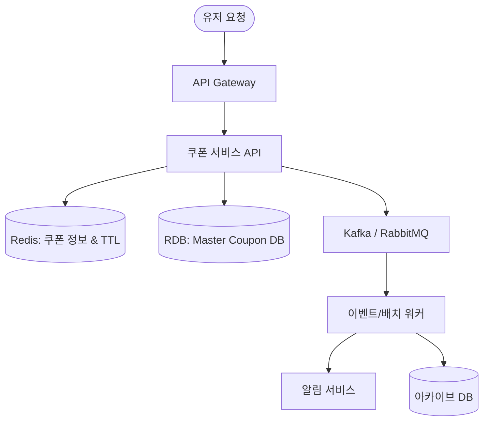

# 🏛️ 대규모 음악 서비스 쿠폰 아키텍처 가이드 (Coupon System Architecture)

이 문서는 수천만 명 이상의 사용자를 보유한 음악 스트리밍 서비스에서 안정적으로 쿠폰 발급, 검증, 그리고 만료 처리를 수행하기 위한 시스템 아키텍처 설계도와 구성 요소 해설입니다.

---

## 1. 시스템 아키텍처 다이어그램 (Architecture Diagram)

---

## 2. 컴포넌트별 역할 해설

### ⚡ 실시간 처리 레이어 (Fast Path)
사용자의 접속 및 요청 처리가 즉각적으로 이루어지는 최전방 영역입니다. **응답 시간(Latency) 최소화**가 최우선 목표입니다.

| COMPONENT | 핵심 역할 | 대규모 트래픽 대응 방식 |
| :--- | :--- | :--- |
| **API Gateway** | 진입점 제어, 인증, 보안 및 라우팅 | 과도한 요청(DDoS) 방지용 **Rate Limiting** 적용. |
| **쿠폰 서비스 API** | 비즈니스 로직 연산 서버 | 무상태(**Stateless**) 서비스로 설계하여 트래픽에 맞춰 자유롭게 가로 스케일아웃(Scale-out). |
| **Redis Cache** | 인메모리(In-Memory) 초고속 데이터 검증 | RDB 부하를 막는 방패. 선착순 잔여 수량 차감(`DECR`), 중복 발급 여부(`Set`)를 1ms 이내로 고속 처리. |

### 🐢 비동기 처리 레이어 (Slow/Async Path)
디스크 쓰기, 데이터 보존, 외부 연동 등 **시간이 걸리고 무거운 연산**을 백그라운드로 격리해 처리하는 영역입니다. **데이터 무결성과 시스템 안정성**이 최우선 목표입니다.

| COMPONENT | 핵심 역할 | 대규모 트래픽 대응 방식 |
| :--- | :--- | :--- |
| **Kafka / RabbitMQ** | 안전한 메시지 수송선 및 완충지대 | 폭발적인 요청 데이터를 디스크에 즉시 안전하게 물리적으로 영속화(Commit Log). 대기열 분산 및 스케일아웃 지원. |
| **배치/이벤트 워커** | 큐에서 이벤트를 꺼내 RDB에 적재하는 일꾼 | RDB가 처리할 수 있는 속도로만 소비(Pull) 속도를 제어하여 DB 다운을 방지(**Backpressure 제어**). |
| **RDB (Master DB)** | 영구 신뢰 데이터 원장 (SSOT) | 최종적인 발급 내역 및 정산 데이터를 ACID 트랜잭션 하에 보관. |
| **DB 아카이브** | 만료된 오래된 데이터 분리 보관소 | 만료/사용 완료된 수억 건의 데이터를 콜드 스토리지(S3, DynamoDB 등)로 이관하여 RDB 인덱스 크기를 최소화하고 검색 성능을 보존. |

---

## 3. 핵심 설계 전략

### 💡 1. 만료일 지연 평가 (Lazy Evaluation)
* **아이디어**: 매분/매시간 수억 건의 쿠폰 테이블을 `UPDATE coupons SET status = 'EXPIRED'`할 필요가 없습니다.
* **적용**: 쿠폰 데이터에는 만료 시점(`expire_at`) 타임스탬프만 기록하며, 기본 조회 시에는 `expire_at > NOW()` 조건문으로 **조회 시점에 실시간 검증**을 수행합니다. 
* **결과**: 상시 발생하는 대량의 DB Write I/O 부하를 완전히 차단합니다.

### 🔔 2. 만료 알림 및 예외 처리
* **알림 발송 (Push)**: 지연 큐(Delayed Queue) 혹은 매일 오프피크 시간대에 실행되는 배치 프로그램이 `expire_at` 범위를 읽어 푸시를 쏩니다. 이때 발송 중복을 막기 위해 발송 여부(`is_notified_3d`)만 마킹합니다.
* **실시간 권한 회수 (음악 재생)**: 스트리밍 권한 만료일 정보를 Redis 세션에 올려두고 곡 전환이나 주기적 토큰 갱신 시점에 검증합니다. 만약 환불/정지 같은 강제 상태 변화가 있을 때만 이벤트를 발행하여 캐시를 무효화(Evict)합니다.
