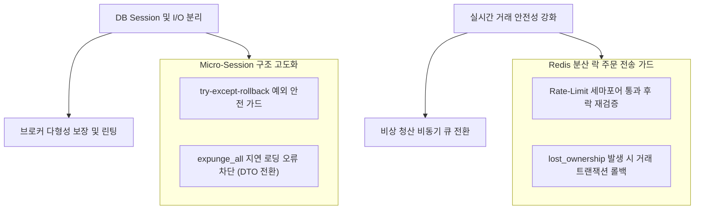

# StockAuto 백엔드 코어 엔진 안정성 개선 기획서 (Backend Core Stability Plan)

본 문서는 StockAuto 자동 매매 시스템의 백엔드 코어 아키텍처(FastAPI, DB Session, Redis Lock, Broker 연동 등)를 정밀 분석하여, 시스템의 실시간 트레이딩 안전성과 엔진의 무결성을 확보하기 위한 아키텍처적 약점 진단 및 개선 방안을 제안합니다.

---

## 🏛 1. 백엔드 코어 아키텍처 개요 및 진단 방향

StockAuto 백엔드 코어는 초당 수십 건 이상의 마켓 데이터 분석, 다중 전략 스케줄러, 실시간 주문 실행 및 체결 상태 복구(Reconciliation)를 담당합니다. 
자동 매매의 특성상 **"돈이 움직이는 경로"**에서의 예외 누락, 비동기 레이스 컨디션, 락(Lock) 소유권 유실, DB 커넥션 고갈은 즉각적인 금전적 손실이나 시스템 다운타임으로 직결됩니다.

따라서 본 기획서는 **까칠한 감사관(Critical Auditor) 프로토콜**을 적용하여 백엔드 소스코드 전반에 내재된 잠재적 장애 시나리오와 예외 케이스를 비판적으로 진단하고 해결책을 수립합니다.

---

## 🚫 2. 안정성 약점 상세 분석 및 비판 (Severity Ratings)

### 🚨 [P0] `TossBroker` 연동 시 다형성 위반으로 인한 런타임 크래시 및 주문 유실
*   **해당 위치**: `backend/app/brokers/toss_broker.py` (L83-L113) 및 `backend/app/brokers/base_broker.py`
*   **위반 불변식**: 브로커 엔진 인터페이스 단일화 원칙(Polymorphism) 및 Duck Typing 안정성 위반
*   **생산자/소비자 영향**: 
    *   **생산자**: `TossBroker.buy_order(...)`, `TossBroker.sell_order(...)`
    *   **소비자**: `scheduler.py:117` (`execute_and_poll_order` 내부의 `safe_broker_call`)
*   **상세 진단**:
    *   `scheduler.py:117`에서는 주문 전송 시 비동기 스케줄링을 극대화하기 위해 `kwargs["skip_poll"] = True`를 강제로 주입하여 브로커의 `buy_order`/`sell_order` 메서드를 호출합니다.
    *   하지만 `TossBroker`의 `buy_order`와 `sell_order` 시그니처에는 `skip_poll` 매개변수가 선언되어 있지 않고, `**kwargs`도 받지 않습니다.
    *   결과적으로 사용자가 거래 모드를 **TOSS**로 활성화한 상태에서 봇이 작동하는 순간, `TypeError: buy_order() got an unexpected keyword argument 'skip_poll'` 예외가 발생하며 **스케줄러 루프 전체가 즉시 폭사(Crash)**합니다.
    *   또한 이 시점에 주문 인텐트가 `SUBMITTING`으로 고착되거나 이미 API 서버로 날아간 주문이 DB에 반영되지 않아 **미아 주문(Orphan Order)**이 대량 발생할 위험이 있습니다.
*   **해결 방안**:
    1. `BaseBroker` 추상 클래스의 `buy_order` 및 `sell_order` 시그니처에 `skip_poll: bool = False, **kwargs` 매개변수를 공식 포함하여 규격을 재정비합니다.
    2. `TossBroker`의 주문 메서드 역시 동일하게 `skip_poll` 매개변수를 받도록 수정하고, 내부에서 `kwargs`를 안전하게 소화하도록 설계합니다.

---

### 🚨 [P0] Redis Lock 갱신 실패(CRITICAL_LOST) 후 주문 API 전송 전 검증 누락 및 이중 주문 위험
*   **해당 위치**: `backend/app/core/locks.py` ([locks.py](file:///d:/dev/workspace/stockAuto/backend/app/core/locks.py#L90-L109)) 및 `backend/app/bot/scheduler.py`의 주문 실행 메서드
*   **위반 불변식**: 분산 락 배타적 점유 및 이중 주문 방지 보증 위반
*   **상세 진단**:
    *   `locks.py`의 `RedisLockLease`는 백그라운드 태스크로 `_renew_loop`를 기동하여 주기적으로 락의 TTL을 연장하며, 네트워크 에러나 타임아웃으로 연장에 실패하면 `self.lost_ownership = True`로 마크합니다.
    *   `scheduler.py` 내의 `execute_and_poll_order`는 주문이 전송된 "이후" 폴링 루프에서 매번 `lost_ownership`을 성실히 검증합니다.
    *   **그러나, 실제 주문 API (`safe_broker_call`)를 호출하여 증권사로 패킷을 쏘기 직전 단계에서는 `lost_ownership`을 전혀 체크하지 않습니다.**
    *   예를 들어, 락을 획득한 후 주문 발송 대기 큐(Rate-Limit 세마포어)에서 대기하거나 네트워크 순동이 발생하여 락 소유권을 상실(`lost_ownership = True`)했음에도 불구하고, 대기 큐를 통과한 즉시 검증 없이 주문 API를 호출하게 됩니다.
    *   이 시점에 다른 분산 노드(또는 재시작된 동일 노드)가 동일 종목에 대한 락을 새로 획득했다면, 동일 타겟에 대해 두 대의 서버가 **이중 주문(Double Submission)**을 날려 심각한 금융 사고(원치 않는 추가 매수/매도)가 발생합니다.
*   **해결 방안**:
    *   `scheduler.py`의 주문 전송 함수(`_execute_single_buy`, `_execute_single_sell`) 및 `execute_and_poll_order` 진입 즉시, `safe_broker_call`을 호출하기 바로 직전에 `if lease and getattr(lease, "lost_ownership", False):` 검증 가드를 추가하여 즉각 실행을 중단하고 예외(또는 에러 상태)를 반환하도록 강화해야 합니다.

---

### ⚠️ [P1] Micro-Session 패턴 내 동기식 API 호출로 인한 DB 커넥션 풀 고갈 (Connection Starvation)
*   **해당 위치**: 
    *   `backend/app/bot/order_reconciler.py:470` ([order_reconciler.py](file:///d:/dev/workspace/stockAuto/backend/app/bot/order_reconciler.py#L466-L476))
    *   `backend/app/bot/order_discovery.py:126` ([order_discovery.py](file:///d:/dev/workspace/stockAuto/backend/app/bot/order_discovery.py#L122-L130))
*   **위반 불변식**: 데이터베이스 세션 단발 점유 최소화(Micro-Session) 원칙 위반
*   **상세 진단**:
    *   스케줄러 및 백그라운드 태스크에서 네트워크 API 호출 중 DB 커넥션을 점유하지 않도록 `micro_session` 패턴을 도입했으나, 주문 복구 루프와 고아 주문 탐지 엔진에서는 이 원칙이 훼손되었습니다.
    *   `reconcile_open_orders_once` 루프 내에서는 세션(`db`)을 열고 락을 건 뒤 `_reconcile_one_order`를 호출합니다.
    *   `_reconcile_one_order` 내부에서는 **DB 세션이 활성화된 상태**에서 동기식 네트워크 I/O인 `broker.check_order_status(...)`를 호출합니다.
    *   마찬가지로 `discover_orphan_orders_once` 내에서도 세션이 열린 상태로 `broker.list_order_history(...)`를 호출합니다.
    *   증권사 API 서버의 네트워크 반응 속도가 느려지거나 타임아웃 대기 상태(예: 10초)에 빠지면, 해당 DB 커넥션은 10초 동안 풀에 반환되지 못하고 홀딩됩니다.
    *   동시에 처리해야 할 계정이나 미결 주문 수가 늘어나면 백그라운드 워커가 백엔드의 DB 커넥션 풀을 순식간에 고갈(Connection Starvation)시켜, 일반 유저의 API 요청(FastAPI) 처리를 전면 블로킹하는 연쇄 장애로 번집니다.
*   **해결 방안**:
    1. **I/O와 트랜잭션의 물리적 격리**: DB 세션 바깥에서 먼저 증권사 API 조회를 수행하고 결과(DTO/dict)를 확보한 다음, 찰나의 순간에만 `micro_session`을 열어 데이터베이스에 체결 내역(Holding, TradeLog, BrokerOrder)을 갱신하는 구조로 리팩터링해야 합니다.
    2. 동기식 브로커 호출을 감싸는 `asyncio.to_thread` 래퍼를 복구 엔진에도 전면 적용하여 이벤트 루프 및 DB 풀의 동시 지연을 격리합니다.

---

### ⚠️ [P1] 스케줄러 내 `micro_session` 예외 롤백 누락 및 `DetachedInstanceError` 발생 위험
*   **해당 위치**: `backend/app/bot/scheduler.py:339` ([scheduler.py](file:///d:/dev/workspace/stockAuto/backend/app/bot/scheduler.py#L337-L361))
*   **위반 불변식**: DB 트랜잭션 예외 안전성 및 엔티티 상태 SSOT 유지 보증 위반
*   **상세 진단**:
    1. **예외 발생 시 롤백 누락**:
        *   `micro_session` 컨텍스트 매니저 내부에는 `except` 블록이 없으며, 오직 `finally` 블록에서 `db.close()`만을 호출합니다.
        *   `yield db` 실행 중 비즈니스 예외나 제약조건 오류(IntegrityError 등)가 나면, 트랜잭션이 명시적으로 `rollback()`되지 않은 불안정한 상태로 세션이 닫혀 데이터베이스 상태 오염을 유발할 수 있습니다.
    2. **`db.add()` 남용에 따른 충돌**:
        *   컨텍스트 진입 시 `ctx.db_settings` 및 `ctx.holdings`를 매번 `db.add()`로 세션에 강제 귀속시킵니다.
        *   기존 세션에서 detached된 인스턴스를 새 세션에 `add`하는 과정에서 영속성 상태가 꼬이거나 프라이머리 키 중복 예외가 발생할 위험이 농후합니다.
    3. **`db.expunge_all()` 적용 후 `DetachedInstanceError` 위험**:
        *   `finally` 절에서 `db.expunge_all()`을 강제로 호출하여 모든 영속성 객체를 분리(Detach)시킨 뒤 `ctx.db = old_db`로 원복합니다.
        *   이후 스케줄러 비즈니스 로직(예: 잔고 갱신, 주문 판단)에서 `ctx.db_settings` 또는 `ctx.holdings` 내부의 연관 관계 속성(Relationship)에 접근하거나 지연 로딩(Lazy Loading)을 시도할 경우, 부모 세션이 소멸되어 `DetachedInstanceError` 예외가 발생하며 스케줄러 루프가 붕괴됩니다.
*   **해결 방안**:
    1. `micro_session` 내에 `except Exception:` 블록을 추가하여 예외 발생 시 반드시 `db.rollback()`을 호출하도록 안정화합니다.
    2. detached 객체를 무조건 `db.add()`하는 방식 대신, 읽기 전용 데이터는 세션과 무관한 불변 DTO 객체(또는 Pydantic 모델)로 가공하여 `ctx`에 들고 있도록 설계 구조를 개선합니다. 
    3. 상태 변경이 필요한 대상 엔티티만 필요 시점에 `db.merge()`를 통해 영속성 컨텍스트에 편입시킵니다.

---

### ⚠️ [P1] 수동 강제 청산(Force-Liquidate) 시 동기식 순차 폴링에 따른 매매 지연 및 슬리피지(Slippage) 누적
*   **해당 위치**: `backend/app/trades/router_account.py:310` ([router_account.py](file:///d:/dev/workspace/stockAuto/backend/app/trades/router_account.py#L309-L330))
*   **위반 불변식**: 비상 상황 청산의 신속성 및 주문 비동기성 보증 위반
*   **상세 진단**:
    *   사용자의 수동 청산 API인 `force_liquidate`는 보유 중인 모든 종목을 긴급하게 즉시 전량 매도해야 하는 기능입니다.
    *   하지만 종목별 매도 주문을 전송하는 코드(`broker.sell_order`)를 호출할 때 `skip_poll=True` 옵션을 인수로 전달하지 않았습니다.
    *   이로 인해 `KISBroker`는 기본값인 `skip_poll=False`로 동작하여, 매 주문마다 최대 10초(5회 * 2초) 동안 루프를 돌며 체결을 동기적으로 확인(`_confirm_fill`)하게 됩니다.
    *   사용자가 15개 종목을 들고 있었다면 전체 청산이 완료될 때까지 **최장 2분 30초 동안 순차적으로 대기**해야 합니다. 급락장 또는 패닉셀 환경에서 2분 이상의 매매 지연은 감당할 수 없을 정도로 파괴적인 가격 슬리피지(Slippage)와 손실을 초래합니다.
*   **해결 방안**:
    *   `router_account.py` 내 청산 주문 전송 시 `skip_poll=True`를 필수 명시하여 주문 전송 자체는 밀리초 단위로 병렬/순차 완료되도록 변경하고, 잔여 미체결 및 체결 확정 처리는 백그라운드의 `order_reconciler`가 비동기적으로 처리하도록 역할을 위임해야 합니다.

---

## 🛠 3. 백엔드 코어 엔진 안정성 개선 아키텍처 로드맵

기획서의 내용을 실 소스코드에 적용할 때 핵심이 되는 4대 아키텍처 개선 방향을 제시합니다.

### 1단계: Micro-Session 예외 안전성 확보 및 트랜잭션 격리
*   `scheduler.py`의 `micro_session` 데코레이터/컨텍스트 매니저를 구조화하여, 롤백을 기본 탑재하고 `DetachedInstanceError` 예방을 위해 `ctx` 전반을 불변 상태 DTO로 관리하도록 개선합니다.
*   `db.add(ctx.db_settings)`와 같이 라이프사이클을 알 수 없는 무분별한 `add`를 금지하고, 필요한 시점에 ID를 기반으로 읽어오거나 `db.merge()`를 선별 적용합니다.

### 2단계: DB Connection - API I/O 완전 물리적 분리 Pipeline 도입
*   모든 복구 엔진(`order_reconciler`, `order_discovery`)에서 `DB 조회 -> DB 세션 close -> 증권사 API 호출 -> DB 세션 오픈 및 반영 -> DB 세션 close` 단계를 거치는 **"I/O - DB 격리 파이프라인"**을 규격화합니다.
*   네트워크 대기 시간 동안 풀의 DB 커넥션 점유 시간을 0초에 수렴하게 만들어 고가용성 멀티테넌트 환경을 대비합니다.

### 3단계: 브로커 다형성 규격 정규화 및 테스트 하네스 구축
*   `BaseBroker`를 재정의하여 `skip_poll`을 표준 규격화하고, `TossBroker` 및 향후 추가될 모든 브로커가 이를 반드시 지원하게 만듭니다.
*   모든 브로커 구현체들의 인터페이스 시그니처와 데이터 반환 타입을 컴파일 시점에 체크하는 정적 테스트 하네스 검증 단계를 `pytest` 스위트에 신규 편입합니다.

### 4단계: 분산 락 라이프사이클 가드 및 긴급 청산 최적화
*   주문 전송 가드(Rate Limit 세마포어 직후)에 Redis Lock 소유권 검증 가드를 신설하여 분산 다중 노드 기동 시에도 이중 매수/매도가 절대 불가능하게 보장합니다.
*   `force_liquidate` API의 즉시 매도 발송을 병렬 비동기(`skip_poll=True`) 방식으로 개편하여 긴급 청산 지연을 제거합니다.

---

## 📈 4. 기대 효과 및 잔여 리스크

*   **기대 효과**:
    *   **안정성 향상**: 토스 거래 모드 사용 시의 런타임 크래시를 원천 차단하고 이중 주문 위험을 0%에 수렴시킵니다.
    *   **성능 최적화**: API 대기 시간과 DB 점유를 격리하여 트레이딩 엔진 가동 시 커넥션 풀 고갈 장애가 발생하지 않습니다.
    *   **비상 대처 시간 단축**: 전체 보유 주식의 강제 청산 처리가 종목 개수 비례 순차 대기에서 즉각 병렬 처리로 개편되어 시장 위험에 즉시 노출되지 않습니다.
*   **잔여 리스크 (Residual Risks)**:
    *   **증권사 레이트 리밋 초과**: `force_liquidate` 시 한 번에 수십 건의 매도 주문을 동시 전송하면 증권사 방화벽에 의해 일시 밴(Blocked) 처리될 위험이 있습니다. 따라서 세마포어를 우회하지 않고 큐잉(Queueing)을 정밀 설계하는 2차 검증이 요구됩니다.
    *   **분산 환경 클럭 동기화**: Redis Lock 갱신 주기(`time.monotonic()`)는 안전하지만, 여러 서버의 시스템 클럭 오차가 클 경우 체결 기록의 타임스탬프 순서가 다소 흔들릴 수 있습니다.
