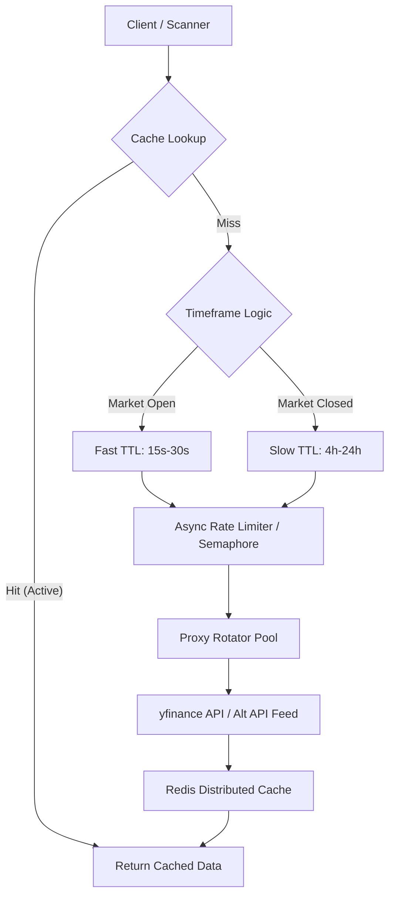
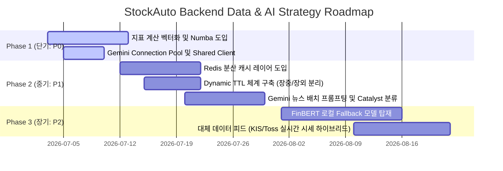

# StockAuto 성능 및 AI 뉴스 지능화 기획서 (Backend Data & AI Strategy)

본 문서는 **StockAuto** 자동 매매 봇 프로젝트의 가상 백엔드 데이터 및 AI 개발자(Backend Data/AI Developer)로서, 기존 데이터 수집 및 연산 구조의 병목을 진단하고, yfinance 속도 한계 극복, LLM(Gemini) 뉴스 감성 및 호악재(Catalyst) 판독 고도화, 그리고 pandas/numpy 지표 계산 최적화 방안을 제시하는 기술 기획서입니다.

---

## 1. 개요 (Executive Summary)

현재 StockAuto의 백엔드 아키텍처는 마켓 스캐너와 가상 브로커(Simulated Broker) 등을 통해 실시간 주가 분석 및 매매 신호 포착을 수행하고 있습니다. 그러나 시스템이 다루는 종목 수가 늘어나고(나스닥/NYSE 전수 조사), 분석 주기가 단축됨에 따라 다음과 같은 핵심 성능 병목 및 기능적 한계가 발생하고 있습니다.

1. **yfinance API 처리 병목**: 단일 글로벌 락(`_yf_lock`)과 API 호출 간 강제 지연(`_yf_min_interval = 0.25`)으로 인해 수백 개 종목의 실시간 시세를 병렬로 조회하지 못하고 심각하게 직렬화 지연이 발생하고 있습니다.
2. **Gemini API 호출 오버헤드 및 감성 분석의 단순성**: 뉴스 분석 시 매번 HTTP 커넥션을 재연결하고, 개별 종목별로 API를 단일 호출하여 레이트 리밋(Rate Limit)과 응답 지연에 취약합니다. 또한, 단순 긍/부정 판독을 넘어 주가 변동의 트리거가 되는 구체적인 호악재 재료(Catalyst) 분류 체계가 부재합니다.
3. **지표 연산의 비효율성**: OBV, OBV Divergence, Double BB 등 복잡한 기술적 지표 계산에서 Pandas Dataframe에 대한 순수 파이썬 루프와 `.iloc` 반복 참조를 수행하여 CPU 자원을 낭비하고 연산 속도가 기하급수적으로 저하됩니다.

본 기획서는 위 3대 기술적 한계를 극복하고 시스템의 성능을 최소 10배 이상 가속화하며, 매매 전략의 지능화 수준을 퀀트 수준으로 격상시키기 위한 구체적인 솔루션을 제안합니다.

---

## 2. yfinance API 속도 한계 극복 및 고속 비동기 병렬 처리 방안

### 2.1. 현황 및 한계점
* **글로벌 직렬화 락**: `backend/app/scanner/data_provider.py` 내의 `_yf_lock`은 Yahoo Finance의 crumb 세션 흔들림을 막기 위한 가드 장치이지만, 이로 인해 비동기 루프(`asyncio.to_thread`)를 타더라도 실제 물리 연산은 스레드 간 대기로 인해 동기 직렬화(0.25초 간격)됩니다. 100개 종목을 조회 시 최소 25초 이상 소요되어 실시간 5분봉 스캔 주기를 충족하기 어렵습니다.
* **프로세스 내 휘발성 캐시**: `_ohlcv_cache` 등 메모리 내 딕셔너리로 구현되어 있어, 백엔드 서버를 재시작하거나 Multi-Worker 환경(예: uvicorn 워커 분할)으로 실행 시 캐시 공유가 불가능하고 불필요한 중복 호출이 누적됩니다.
* **획일화된 캐시 TTL**: 시장 운영 상태(장중 vs 장외, 평일 vs 주말)에 관계없이 고정된 TTL(OHLCV 45초, 뉴스 10분 등)을 사용하여 장외 시간에도 yfinance에 불필요한 요청을 지속적으로 보냅니다.

### 2.2. 개선 아키텍처 및 구현 전략



#### ① Redis 분산 캐시 레이어 도입
* 다중 워커 환경 및 서버 재시작 시에도 일관된 캐싱을 유지하기 위해 Redis를 도입합니다.
* Redis Hash 구조를 활용하여 `ticker:interval:period`를 키로 지정하고, JSON 또는 압축 직렬화(MessagePack 등)된 OHLCV 데이터를 보존합니다.

#### ② 장중/장외 시간대에 따른 동적 캐시 TTL (Dynamic TTL)
* **장중(미국 동부 시간 09:30 ~ 16:00)**: 변동성이 크므로 실시간 대응을 위해 OHLCV 캐시 TTL을 **15초~30초**로 타이트하게 관리합니다.
* **장외/애프터마켓 및 주말/공휴일**: 데이터가 변하지 않으므로 캐시 TTL을 **4시간에서 최대 24시간**으로 대폭 늘려 API 호출 횟수를 90% 이상 절감합니다.

#### ③ 비동기 세마포어(Semaphore) 및 프록시 IP 풀 도입
* 글로벌 스레드 락(`_yf_lock`) 대신 `asyncio.Semaphore(value=5)`를 사용하여 제어된 수준의 동시 비동기 요청을 허용합니다.
* Yahoo Finance의 IP 차단 및 레이트 리밋을 우회하기 위해 **프록시 로테이터(Proxy Rotator)** 또는 무료/저가형 프록시 풀을 `yf.download(..., proxy=...)` 파라미터에 바인딩하여 병렬 수집 효율을 극대화합니다.

#### ④ 멀티 소스 데이터 공급망 구축 (Alternative Data Feeds)
* yfinance의 완전한 서비스 장애를 방지하기 위해 국내 증권사(한국투자증권 KIS, 토스증권 API) 해외 시세 피드 및 저가형 글로벌 시세 API(Financial Modeling Prep, Finnhub 등)를 1차 폴링 채널로 두고, 실패 시 yfinance로 Fallback하는 이중 피드 구조를 도입합니다.

---

## 3. LLM(Gemini) 연동 해외 뉴스 감성 및 호악재 판독(Catalyst) 고도화 방안

### 3.1. 현황 및 한계점
* **Connection 재사용 누락**: `GeminiClient` 내에서 API 호출 시마다 `async with httpx.AsyncClient() as client:`를 선언하여 매번 TCP/SSL 핸드셰이크가 발생해 네트워크 지연이 심화됩니다.
* **대량 호출 시 Rate Limit 노출**: 후보군 25개 종목에 대한 스캔 시 각 종목별로 개별적인 비동기 태스크를 발행해 Gemini API에 동시 호출을 보냄으로써 API 요청 율 제한(RPM/TPM) 초과 경고를 유발하기 쉽습니다.
* **단순 감성 분류의 한계**: 호재/악재의 여부와 요약만 1문장으로 제공할 뿐, 해당 뉴스가 주가를 며칠 동안 견인할 수 있는 모멘텀 재료(Catalyst)인지에 대한 정성적/정량적 가치 판단 로직이 결여되어 있습니다.

### 3.2. 고도화 설계 방안

#### ① HTTP 커넥션 풀링(Connection Pooling) 적용
* `GeminiClient` 내부에 전역 혹은 싱글톤으로 유지되는 비동기 클라이언트를 재사용하도록 변경합니다.
  ```python
  # (예시 설계안)
  class GeminiClient:
      _shared_client: httpx.AsyncClient = None
      
      @classmethod
      def get_client(cls):
          if cls._shared_client is None or cls._shared_client.is_closed:
              cls._shared_client = httpx.AsyncClient(
                  limits=httpx.Limits(max_keepalive_connections=10, max_connections=30),
                  timeout=8.0
              )
          return cls._shared_client
  ```

#### ② 멀티 종목 뉴스 통합 배치 프롬프팅 (Batch Prompting)
* 후보군 25개 종목을 각각 호출하는 대신, 5개 혹은 10개 종목의 최신 뉴스 헤드라인을 단일 JSON 페이로드로 묶어 하나의 Gemini API 요청으로 처리합니다.
* 이를 통해 API 호출 횟수를 1/5 이하로 감소시키고 Token 효율을 극대화합니다.

#### ③ Catalyst(호악재 핵심 재료) 판독 및 전략 가중치(Multiplier) 연동
* 프롬프트를 고도화하여 뉴스의 성격을 구체적인 **Catalyst 카테고리**로 분류하고 신뢰도를 측정합니다.
* 분류된 카테고리에 따라 매매 점수 연산 시 곱해지는 **전략 가중치(Multiplier)**를 차등 제공합니다.

| Catalyst 분류 | 세부 내역 | 모멘텀 영향력 | 점수 가중치 (Multiplier) |
| :--- | :--- | :--- | :--- |
| **Earnings Surprise** | 예상치를 상회하는 분기 실적 발표 | 중장기 우상향 | `1.25` |
| **M&A / Partnership** | 인수합병, 대기업과의 독점 공급 계약 | 단기 급등 | `1.30` |
| **FDA Approval / Patent** | 임상 성공, 특허 취득, 인허가 통과 | 강력한 재료 | `1.50` |
| **Product Launch** | 신제품 발표 및 시장 출시 | 단기 관심 | `1.10` |
| **Legal / Regulation** | 소송 제기, 정부 규제 적발, 조사 개시 | 단기/중기 악재 | `0.70` (매수 디스카운트) |
| **Executive Change** | CEO/CFO 등 핵심 임원 교체 | 불확실성 | `0.90` |

#### ④ 로컬 파이낸셜 감성 모델(FinBERT)과의 하이브리드 Fallback 구조
* Gemini API 미설정 또는 호출 실패 시 활성화되는 로컬 Fallback 사전식(`LEXICON_POSITIVE/NEGATIVE`) 판정의 한계를 보완하기 위해, 가벼운 로컬 금융 특화 NLP 모델인 **FinBERT**를 로컬 추론 엔진(ONNX 가속 적용)으로 장착합니다. CPU 환경에서도 10ms 이내로 정밀한 다국어 금융 문맥 이해를 수행하도록 설계합니다.

---

## 4. pandas/numpy 지표 계산 최적화 방안

### 4.1. 현황 및 한계점
* **OBV 루프 연산 병목**: `backend/app/scanner/indicators.py`의 `calculate_obv` 함수는 `for i in range(1, len(close))`를 돌며 `.iloc` 조회를 수천 번 수행합니다. 이는 Pandas가 제공하는 벡터화 장점을 완전히 차단하고 대형 백테스팅이나 대량 종목 스캔 시 성능 저하의 주범이 됩니다.
* **OBV Divergence 선형 회귀 롤링 병목**: `calculate_obv_divergence` 내에서 매 윈도우 시점마다 `np.polyfit`을 루프로 돌며 계산합니다. NumPy의 선형 회귀 연산은 매우 무거우며, 이를 수천 번 반복하면 싱글 스레드 CPU 점유율이 100%에 도달하게 됩니다.
* **Double BB Reversion 신호 상태 머신 지연**: 1분봉 데이터 전체를 순회하며 조건부 분기(`broke_3sd`, `setup_active` 등)를 도는 순수 파이썬 루프 구조가 존재합니다.

### 4.2. 최적화 및 벡터화(Vectorization) 기법 적용안

#### ① OBV 연산의 완전 벡터화 (NumPy Vectorization)
* 파이썬 루프를 걷어내고, 주가 변동 방향을 `np.sign`으로 1차원 벡터 연산한 후 거래량을 곱해 누적합(`cumsum()`)을 구합니다.
  ```python
  # (예시 최적화 코드)
  def calculate_obv_vectorized(df: pd.DataFrame) -> pd.Series:
      if df.empty: return pd.Series()
      close_diff = df['Close'].diff()
      # 가격 상승: 1, 하락: -1, 보합: 0
      direction = np.sign(close_diff).fillna(0)
      obv = (direction * df['Volume']).cumsum()
      return obv
  ```
  > [!TIP]
  > 이 방식 도입 시 기존 루프 방식 대비 연산 속도가 **약 100배에서 200배** 이상 향상됩니다.

#### ② OBV Divergence의 롤링 선형 회귀 벡터화 및 점진적(Incremental) 갱신
* 전체 히스토리를 매번 처음부터 회귀 분석하는 대신, 윈도우 내의 가격과 OBV의 피어슨 상관계수(`pearsonr`) 또는 단순 공분산 스케일러를 pandas rolling 기능(`df.rolling().cov()`)을 통해 일괄 연산 처리합니다.
* 실시간 스캔 환경에서는 **마지막 1개의 캔들이 추가되었을 때의 변화량만 반영하는 점진적(Incremental) 연산** 로직을 설계하여 전체 연산 복잡도를 $O(N)$에서 $O(1)$로 단축합니다.

#### ③ Numba JIT 컴파일러를 통한 상태 머신 가속화
* 상태 전이가 연속적으로 일어나 벡터화가 까다로운 `calculate_double_bb_reversion_signals` 루프 구간에는 `@numba.jit(nopython=True)` 데코레이터를 적용합니다. 
* NumPy 배열 포인터를 Numba JIT에 넘겨 C언어 실행 속도 수준으로 컴파일된 네이티브 코드로 연산을 가속합니다.

---

## 5. 단계별 이행 로드맵 (Action Items)

본 성능 및 AI 지능화 전략의 성공적인 도입을 위해 개발 우선순위에 따라 단기, 중기, 장기 단계로 추진합니다. (※ 소스코드 수정 없이 아키텍처 및 세부 설계 사양을 고정하여 구현 태스크 백로그로 이관합니다.)

### 🚀 단계별 로드맵



1. **단기 과제 (P0 - 즉시 반영 대상)**:
   * `indicators.py` 내의 OBV 및 OBV Divergence 연산의 파이썬 루프를 제거하고 **NumPy 벡터화 코드**로 전면 전환.
   * `GeminiClient`에 `httpx.AsyncClient` 싱글톤 커넥션 풀링을 적용하여 네트워크 레이턴시 감소.
2. **중기 과제 (P1 - 2~3주 내 반영 대상)**:
   * Redis 분산 캐시 레이어 도입 및 미국 주식 정규장 개장 여부에 따른 **Dynamic TTL 가드** 이식.
   * Gemini API 호출 시 **대량 종목 배치(Batch) 프롬프팅**을 탑재하여 Rate Limit 원천 차단.
   * 단순 감성 점수 외에 **Catalyst 분류(Earnings, FDA 등) 체계**와 전략 가중치 곱셈기 구현.
3. **장기 과제 (P2 - 1개월 내 반영 대상)**:
   * OpenAI/Gemini 미설정 환경을 위해 CPU 가속화된 **로컬 FinBERT NLP 감성 판독 엔진** 도입.
   * 시세 데이터 수집 다변화 및 프록시 IP 풀 자동 관리 모듈 이식.
