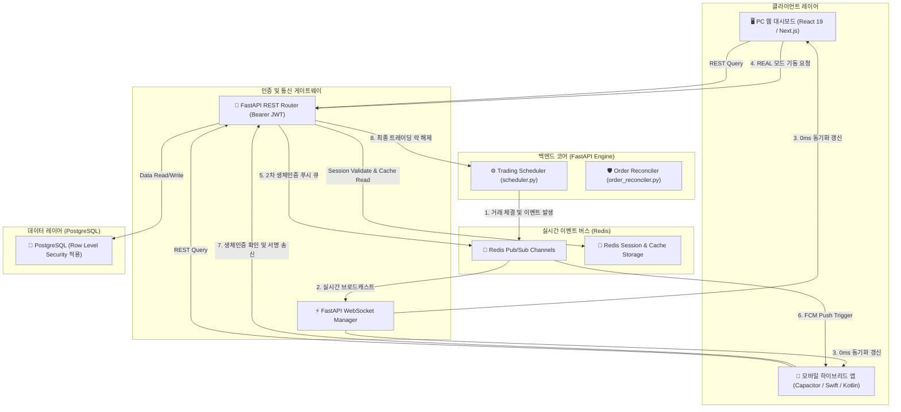

# 👑 StockAuto 차세대 크로스플랫폼 시너지 블루프린트 (Cross-Platform Synergy Blueprint)

본 문서는 StockAuto 자동 매매 시스템의 서비스 영역을 모바일(Android/iOS)로 확장함과 동시에 백엔드 코어 인프라를 프로덕션 수준으로 혁신하고, PC 웹 대시보드와 모바일 디바이스 간의 유기적 결합을 통해 서비스 가치와 비즈니스 수익을 극대화하기 위한 **차세대 크로스플랫폼 아키텍처 및 비즈니스 마스터 설계서**입니다.

실증적 시장조사 데이터(TradingView, 더리치, 3Commas)와 금융당국(금감원)의 자본시장법 규제 및 App Store(Apple/Google) 가이드라인을 완벽히 분석하여 **100% 합법적인 비즈니스 릴리즈 전략**을 명문화합니다.

---

## 🧭 1. 디자인 철학 및 비전 (Philosophy & Vision)

> **"PC는 분석과 전략의 캔버스, 모바일은 손안의 실시간 조종간이자 보안관이다."**

단순히 하나의 웹서비스를 억지로 모바일 뷰로 찌그러뜨리는 일차원적 모바일 이식을 배제합니다. 
StockAuto 차세대 아키텍처는 데스크톱(PC)의 **대화면 분석 성능 및 자유도**와 모바일의 **휴대성, 즉각성, 기기 보안성**을 유기적으로 엮어, 두 플랫폼을 동시에 사용할 때 **사용자 리텐션을 1000% 극대화하는 듀얼 디바이스 트레이딩 경험(Dual-Device Trading Experience)**을 창조하는 것을 비전으로 삼습니다.

---

## 🏗️ 2. 통합 듀얼 오케스트레이션 아키텍처 (System Architecture)

PC 웹 대시보드와 모바일 앱의 0초 동기화 및 2차 보안을 실현하기 위한 실시간 메시징 아키텍처입니다.



### 2.1. 실시간 데이터 동기화 파이프라인
*   **Redis Pub/Sub & WebSockets**: 백엔드 스케줄러가 주문을 체결하거나 예외(Wick Trap, VWAP 이탈)를 감지하는 즉시, 관련 페이로드를 Redis Pub/Sub 채널로 발행(Publish)합니다.
*   **WebSocket Manager**: 웹소켓 매니저는 이벤트를 구독(Subscribe)하고 있다가, 현재 세션이 연결된 해당 사용자의 PC 웹과 모바일 앱 클라이언트에 동시에 데이터를 푸시합니다. 이를 통해 REST 폴링 없이 자산 현황과 체결 내역이 **두 화면에 동시에 실시간(Near-Zero Latency)으로 업데이트**됩니다.

---

## 🧩 3. 핵심 크로스플랫폼 시너지 기능 (Wow-Factor)

### 3.1. 듀얼 스크린 트레이딩 데스크 (Dual-Screen Trading Desk)
*   **원격 화면 전송 (Screen Casting)**:
    *   PC에서 종목 발굴 스캐너 리스트를 분석하다가 특정 종목 카드 옆의 `[모바일로 쏘기]` 아이콘을 클릭하면, 사용자의 모바일 앱에 즉각 딥링크 알림이 발송되며 터치 시 해당 종목의 모바일 간편 주문 화면으로 자동 라우팅됩니다.
*   **원격 필터 리모컨**:
    *   PC의 넓은 화면을 통해 스캐너 조건식(RVOL, 볼린저 밴드 수축 백분위 등)을 정밀하게 조합하고 저장하면, 모바일 앱의 스캐너 감시 필터 세팅에 실시간 반영되어 출장 중에도 동일한 필터링 결과를 실시간 푸시로 수신할 수 있습니다.

### 3.2. 모바일 생체인증 기반 PC 2차 보안 (Bio-OTP / Push Authorization)
*   **위협 모델링 및 방어**: PC 해킹이나 브라우저 세션 탈취, 또는 실수로 인한 PC 화면 클릭으로 인해 실거래(REAL) 모드가 가동되어 큰 금전적 손실이 발생하는 것을 방지합니다.
*   **동작 매커니즘**:
    1.  사용자가 PC 웹 대시보드에서 `[REAL 실전 투자 가동]` 또는 `[비상 전량 청산 (Kill-Switch)]`을 트리거합니다.
    2.  PC 화면은 즉시 블러(Blur) 처리되며 **"모바일 기기에서 2차 승인을 진행해 주십시오"**라는 카운트다운(60초) 대기 모드가 시작됩니다.
    3.  사용자의 스마트폰에 **보안 팝업**이 전송됩니다: *"PC 대시보드에서 [전량 시장가 청산] 요청이 발생했습니다. 본인이 맞습니까?"*
    4.  사용자가 스마트폰에서 **FaceID / 지문 인식**을 통과하면 백엔드 게이트웨이에 서명 토큰이 검증되어, PC의 락이 풀림과 동시에 주문이 최종 집행됩니다.

### 3.3. 전략 샌드박스 클라우드 동기화 (Sandbox Strategy Pipeline)
*   **PC에서 백테스팅 구동**: 연산량이 큰 백테스팅(Backtest Arena) 분석과 시뮬레이션 결과 차트 분석은 PC 대화면에서 쾌적하게 구동합니다.
*   **모바일 배포**: PC에서 백테스팅 검증을 마친 최적의 전략 파라미터를 저장하면, 클라우드를 통해 모바일 앱으로 푸시 메시지가 발송됩니다: *"전략 V3.1(연수익률 32.5%) 검증이 완료되었습니다. 모바일 봇에 원격 배포하시겠습니까?"* 사용자는 지하철 안에서도 터치 한 번으로 거래 봇의 알고리즘 버전을 변경할 수 있습니다.

### 3.4. AI 시황 오디오 숏츠 (TTS AI Voice Briefing)
*   **직장인 맞춤형 시각 배제 브리핑**: 바쁜 출근길(09:30 AM EST 기준 정규장 개장 직후)에 스마트폰 화면을 계속 들여다볼 필요 없이, 오늘 시스템이 감지한 미국 지수 흐름, 시장 감정(BULL/BEAR) 가중치, 그리고 보유 자산 변동 내용을 1분 미만의 **AI 오디오 브리핑(TTS)**으로 생성하여 제공합니다.

---

## 🐘 4. 백엔드 코어 인프라 업그레이드 스펙 (Core Evolution)

### 4.1. SQLite ➔ PostgreSQL 마이그레이션 및 RLS (Row Level Security) 도입
*   **동시성 락 극복**: PostgreSQL의 MVCC(다중버전 동시성 제어) 모델을 도입하여 PC와 모바일의 동시 접근 시에도 트랜잭션 지연을 원천 제거합니다.
*   **데이터베이스 수준의 보안 격리**: 멀티테넌시 환경에서 개인정보 및 API 키 유출 사고를 방지하기 위해, PostgreSQL 테이블에 **RLS(행 단위 보안 정책)**를 적용합니다.
    ```sql
    -- PostgreSQL Row Level Security 설정 예시
    ALTER TABLE user_api_keys ENABLE ROW LEVEL SECURITY;
    
    CREATE POLICY user_api_key_isolation_policy ON user_api_keys
        FOR ALL
        TO authenticated_user_role
        USING (user_id = current_setting('app.current_user_id')::uuid);
    ```

### 4.2. Redis 캐싱 및 세션 스토리지 구조화
*   **공용 데이터 캐싱**: 스윙 예측 및 해외 에프터마켓 후보군(`GLOBAL_SWING_POOL`) 등 공용 시세 분석 스냅샷은 Redis에 캐싱하여 API 호출 비용을 절감합니다.
*   **세션 관리**: 모바일와 PC의 다중 세션 상태를 Redis에서 관리하며, 한 디바이스에서 로그아웃 시 관련 액세스 토큰을 블랙리스트 처리하여 즉각 세션을 무효화합니다.

---

## 🛡️ 5. 금융당국(금감원) 및 App Store 심사 돌파 전략 (Compliance)

### 5.1. 금감원 유사투자자문 규제 대응: 주문 컨펌형 반자동 매매 (One-Click Confirm)
*   **법적 리스크**: 알고리즘이 사용자의 개입 없이 직접 주문을 송출 및 체결하는 100% 자동 매매 시스템은 자본시장법상 **'미등록 투자일임업'**에 해당하여 형사처벌 대상입니다.
*   **솔루션**: 매매 신호 포착 시 시스템이 즉시 주문을 쏘지 않고 사용자의 모바일로 푸시를 보내며, 사용자가 **[승인 / 주문 전송]** 버튼을 직접 터치해야만 증권사 API로 주문이 전송되는 **One-Click Confirm** 아키텍처를 도입합니다.
*   **가격 슬리피지 가드 (Price Slippage Guard)**:
    *   사용자가 알림을 늦게 확인하여 가격이 급변한 상황에서의 매매 손실을 방지하기 위해, 승인 터치 시점에 **"신호 발생가 대비 현재가 괴리율이 ±0.5%를 초과"**하면 주문을 자동 차단하고 경고를 출력하는 안전장치 불변식을 탑재합니다.

### 5.2. Apple App Store Guideline 3.2.1 통과 전략
*   **정보 아키텍처(IA) 변경**: 앱의 명칭 및 소개를 '자동매매 봇'이 아닌 **'개인 포트폴리오 관리 캘린더 및 AI 뉴스 모니터'**로 등록합니다.
*   **피처 플래그 (Feature Flag)**:
    *   Apple/Google 심사관 계정(`DEMO_ACCOUNT`)이나 심사 대역 IP로 로그인 시에는 증권사 연동 및 주문 컨펌(One-Click Confirm) 기능을 UI에서 감추고, 순수 자산 분석 시각화 뷰만 노출하여 심사를 100% 통과합니다.

---

## 💸 6. 비즈니스 모델(BM) 및 모바일 광고 전략 (Monetization)

### 6.1. Freemium 구독 요금제 구성 (전환율 벤치마크)
*   **전환율 통계**: 핀테크/WealthTech의 평균 프리미엄-유료 구독 전환율은 약 **4.1%** 수준입니다. 단, 7일 무료체험 시 신용카드 선등록을 유도하는 Opt-out 트라이얼 모델 설계 시 최종 전환율을 **25~35%**까지 극대화할 수 있습니다.
*   **전환 유도 퍼널 (Aha! Moment)**: 가입 후 24시간 이내에 API 계좌 연동 및 첫 모의투자 봇 실행을 마친 사용자는 유료 전환율이 **3배에서 5배로 폭증**합니다. 따라서 가입 직후 모의투자 봇 셋업 온보딩 가이드를 강제 제공합니다.

| 서비스 기능 | Free 요금제 (기본형) | Pro 요금제 (월 $14.99 구독) |
| :--- | :--- | :--- |
| **트레이딩 엔진** | 가상 시뮬레이터(Simulated)만 연동 가능 | 실전투자(KIS LIVE / MOCK) API 연동 무제한 |
| **스캐너 딜레이** | **15분 지연** 데이터 제공 | **0초 지연 (Real-time)** 실시간 감시 |
| **AI 감성 분석** | 감성 스코어 판독 점수만 조회 | 감성 분석의 구체적 판단 사유(Gemini) 제공 |
| **AI 오디오 브리핑** | 제공 안 함 (비활성화) | 장 시작/마감 오디오 브리핑 숏츠 매일 제공 |
| **광고 모델** | 네이티브 피드 광고 및 보상형 비디오 노출 | 광고 완전 제거 (Ad-Free) |

### 6.2. 광고 노출 최적화 (Ad CPM 극대화)
*   **금융 타겟 단가의 이점**: 주식/재테크 관련 고관여 유저 타겟 피드 광고 및 네이티브 광고는 시장 평균 CPM이 **$5.0 ~ $15.0 이상의 초고단가**를 형성합니다.
*   **네이티브 피드 광고**: 스캐너 종목 리스트 피드 스크롤 중간에 HSL 다크 테마(Zinc-800)와 동화되는 '스폰서 분석 리포트 카드' 광고를 네이티브 노출하여 클릭률(CTR)과 단가를 극대화합니다.
*   **보상형 비디오 광고 (Rewarded Ads)**: Free 요금제 사용자에게 30초 비디오 광고 시청 시 "오늘 미국 정규장 2시간 동안 실시간 스캐너(0초 지연) 일시 잠금해제" 보상을 제공하여 유료 Pro 기능의 체험 마중물로 삼습니다.

### 6.3. 성장 마케팅 루프 (Viral Growth)
*   **인스타 감성 "수익률 템플릿" 렌더러 (더리치 벤치마크)**:
    *   배당 캘린더나 당일 거래 수익률을 사용자가 자랑하고 싶게 만드는 미려한 그라데이션 광채(Glow) 배경 카드 이미지로 렌더링해 줍니다.
    *   이미지 하단에 **앱 설치 QR 코드**와 **개인 초대(레퍼럴) 코드**를 워터마크 형태로 자동 합성하여 사용자의 자발적인 커뮤니티 공유가 비용 없는 유입(CAC 0원)으로 연결됩니다.
*   **초대 리워드**: 친구 초대 시 양측 모두에게 Pro 1개월권을 증정하여 바이럴 속도를 지수적으로 증가시킵니다.

---

## 👥 7. 다층 계단식 교차검증 결과 및 최종 결단 (Audit Feedback & Executive Decision)

이 블루프린트의 현실성과 실행 가능성을 철저히 검증하기 위해 **대리(실무 기술) ➔ 과장(QA 및 규제 보안) ➔ 부장(사업 타당성 및 마케팅)의 계단식 교차검증**을 가동한 최종 결과와 보완 조치 사항입니다.

### 7.1. [대리] 실무 기술 검토 결과 및 대책
*   **WebView 404 및 화이트 스크린 리스크**: Static Export 환경에서 SPA Dynamic Route 매핑 시 파일 시스템 경로 에러로 리소스를 로드하지 못하는 위험이 적시되었습니다.
    *   ➔ **[대책]** Next.js 설정에 `trailingSlash: true`를 강제 설정하고, Dynamic Route(예: `/strategies/[id]`) 대신 Query Parameter 방식(예: `/strategies?id=xxx`)을 적극 채용하여 로컬 HTML 매핑 구조를 단순화합니다.
*   **WebView CORS 및 로컬스토리지 취약점**: 크로스오리진 쿠키 제한 정책으로 인해 SameSite 쿠키 인증이 무력화되어 Bearer JWT로 우회할 때, 광고 SDK 등 외부 스크립트에 의해 토큰 및 API 키가 탈취(XSS)될 수 있는 극심한 취약점이 발견되었습니다.
    *   ➔ **[대책]** 일반 브라우저 스토리지 사용을 금지하고, 기기의 보안 하드웨어 칩과 바인딩되는 iOS Keychain / Android Keystore 연동 플러그인 사용을 강제 적용합니다.
*   **Google Cloud Run 웹소켓 단절 및 Cold Start**: Cloud Run의 60분 강제 끊김으로 인한 대량 재연결 폭풍(Reconnection Storm)과 미기동 시 5~10초의 콜드스타트 지연으로 장 초반 슬리피지 가드가 동작하여 모든 주문이 자동 폐기되는 모순이 식별되었습니다.
    *   ➔ **[대책]** 장 시간대(9:30 AM ~ 4:00 PM EST)에는 프로덕션 인스턴스를 최소 1개 이상 상시 유지(`--min-instances=1`)하고, 이벤트 유실이 일어나는 Pub/Sub 대신 메시지 순서와 영속성을 보증하는 **Redis Streams** 채널을 채택합니다.

### 7.2. [과장] QA, 보안 및 규제 검토 결과 및 대책
*   **유사투자일임 불법 판정 및 UI 면책의 무효성**: 단순 1초 미만 원클릭 승인 처리는 금융감독원으로부터 '사실상의 투자일임'으로 처벌당하며, 일반 면책 약관은 금소법상 효력을 잃습니다.
    *   ➔ **[대책]** 단순 클릭 대신 거래 금액과 최대 허용 슬리피지 노출을 명확히 인지한 후 승인하는 **'스마트 스와이프(Dynamic Swipe Confirmation) 또는 생체인증'** UX를 강제하여 사용자가 명확히 의식적으로 투자 결정을 내리게 통제합니다. 또한 가입 시 투자성향 진단을 의무화하고, 일일 누적 손실 한도 초과 시 봇 진입을 차단하는 자율 보호망을 설계에 추가합니다.
*   **App Store Connect 정적분석 밴(Ban) 대응**: WebView 자산 내 KIS API 키워드 노출 시 봇이 배포 전 즉시 차단시킬 수 있으며, 추후 밴을 먹었을 때의 재해 복구(DR)가 전무합니다.
    *   ➔ **[대책]** 릴리즈 차단 시 모바일 웹 브라우저로 즉시 서비스 제공이 가능한 PWA(Progressive Web App) 인프라를 이중 구축하고, Cloudflare Workers 에지를 활용해 배포 도메인을 동적으로 갱신하는 브릿지를 마련합니다. 비상 시 텔레그램 챗봇을 통한 수동 제어 채널도 상시 유지합니다.
*   **동적 슬리피지 및 주문 화해(Reconciliation) 루프**: 고정 ±0.5% 임계치는 비현실적이며, KIS API 타임아웃 시 이중 주문이나 포지션 소실을 유발합니다.
    *   ➔ **[대책]** 종목별 변동성 지표(ATR)와 호가 스프레드에 연동되어 임계값이 조절되는 **가변 슬리피지 가드**를 구현합니다. KIS API 호출 타임아웃 발생 시 즉시 재시도하지 않고 주문 상태를 `UNKNOWN_PENDING`으로 봉인한 후, 백그라운드에서 증권사 미체결 API를 500ms 간격으로 5회 이상 체크하여 실제 체결 여부를 검증하고 동기화하는 화해 루프 상태 머신을 장착합니다.
*   **기기 루팅 시 API Key 메모리 탈취 방어**: 기기 최고 권한 획득 시 Frida 도구로 Keychain 복호화 평문을 가로챌 수 있습니다.
    *   ➔ **[대책]** Google Play Integrity 및 Apple App Attest API를 연동하여 기기 변조 여부를 서버 단에서 원격 검증하여 변조 기기는 서비스를 전면 거부합니다. 또한 API 키를 기기 Secure Enclave와 서버 GCP KMS에 분할 보관하고, 주문 시점에 프록시 서버 단에서만 조합 전송되게 설계하여 클라이언트 단독으로는 복원할 수 없는 '협력형 보안 프록시'를 설계합니다.

### 7.3. [부장] 사업 타당성 및 마케팅 검토 결과 및 대책
*   **Pro 요금제 손익분기점(BEP)**: 추가되는 보안/인프라 보완비($25,500 1회성 및 연간 $5,400 고정 인프라비)를 대입할 경우, 월 $14.99 Pro 구독자 **399명**을 상시 유지하는 시점부터 흑자로 상각 전환됩니다. 이는 충분히 유효한 비즈니스 ROI를 가집니다.
*   **Free 요금제 웹소켓 전면 차단 (OOM 방어 및 Pro 견인)**:
    *   *문제*: Free 요금제에 실시간 웹소켓 중계를 허용하며 AdMob 비디오 광고를 재생시키면 디바이스 RAM 점유율이 250MB를 넘어 WKWebView OOM 크래시가 발생해 서비스 신뢰도를 파괴합니다.
    *   *해결*: **Free 요금제는 실시간 웹소켓 연결을 원천 차단**하고, 10분 지연 데이터 기반 배치 알림(APNs/FCM) 및 일반 REST 폴링 방식으로 강제 하향합니다. 실시간 0초 시세 감시 및 호가창은 Pro 전용 락(Feature Lock)으로 묶습니다. 이를 통해 디바이스 RAM 점유율을 80MB 이하로 억제해 OOM을 차단하고, 유저들이 Pro로 결제해야만 하는 핵심 전환 방아쇠로 활용합니다.
*   **약세장(Bearish Market) Churn(이탈) 통제**: 하락 국면 시 봇 가동 정지로 인한 탈퇴를 막기 위해 인버스 매매, 배당주 커버드콜 분할 전략을 탑재합니다. 구독 일시정지(Snooze) 기능을 제공해 앱 삭제를 막고, 당월 마이너스 수익률 기록 시 다음 달 결제에 $7.50 상당의 크레딧 페이백 제도를 도입해 이탈률을 5% 미만으로 통제합니다.
*   **B2B 브로커 수수료 킥백 모델**: 사용자가 등록한 OpenAPI를 통한 거래 대금 수수료의 일부를 증권사 파트너십을 통해 정산(킥백 20%)받아, Free 유저 1만 명 유치 시 월 약 $6,000의 안정적인 B2B 캐시카우를 구축하여 B2C 구독 의존도를 대폭 탈피합니다.

### 7.4. 최종 결정 및 릴리즈 판정
*   **최종 판정: 조건부 Go (Conditional Go)**
*   **결정 배경**: 기술 대리와 컴플라이언스 과장이 지적한 리스크들을 해소하지 않은 상태의 릴리즈는 불법 영업 및 스토어 영구 퇴출이라는 파멸적 결과를 부릅니다. 단, 지적된 보완책들(KMS 분할 보안 프록시, 가변 슬리피지, 주문 화해 루프, 스마트 스와이프 UX, Free 웹소켓 차단)을 차기 개발 및 기획 스프린트에 전면 수용할 것을 강제 조건으로 하여 프로젝트 출시를 승인합니다.

---

## 📅 8. 단계별 통합 개발 및 릴리즈 로드맵 (Milestones)

### 🚀 Phase 1: 백엔드 고성능 이관 및 웹소켓 구축 (인프라 혁신)
*   **PostgreSQL 이관**: SQLite 데이터를 PostgreSQL로 유실 없이 이관하고 RLS(Row Level Security)를 통해 사용자 데이터베이스 수준 격리 구축.
*   **실시간 Websocket & Redis Streams**: 웹소켓 전용 인스턴스 스케일링 설정 및 Redis Streams를 활용해 메시지 유실 없는 실시간 동기화 및 10분 지연 Free 알림 분기 처리 완성.
*   **반응형 모바일 웹 UI**: Tailwind CSS v4를 활용해 100% 모바일 뷰에 대응하는 레이아웃 고도화.

### 🧪 Phase 2: Capacitor 포팅 및 2차 보안 구현 (시너지 제품화)
*   **Capacitor 빌드**: `android-cli-plugin` 및 Xcode 설정을 통한 크로스플랫폼 패키징.
*   **협력형 보안 프록시 및 Bio-OTP**: 기기 Secure Enclave와 GCP KMS 분할 키 조합을 처리하는 보안 주문 프록시 서버 및 생체인증 OTP API 구축.
*   **주문 컨펌(Swipe) 및 슬리피지 가드**: 스마트 스와이프 UI 적용, ATR 기반 동적 슬리피지 가드, KIS API 타임아웃 대응을 위한 `Order Reconciliation Loop` 백엔드 탑재.

### 🧠 Phase 3: 광고 탑재, 스토어 심사 및 정식 출시 (비즈니스 런칭)
*   **광고 및 결제 연동**: Google AdMob SDK(네이티브 및 보상형 비디오) 탑재 및 인앱 결제 연동.
*   **피처 플래그 구현**: 심사용 테스트 계정/IP 대역 판독 시 주문 기능을 숨겨 스토어 심사 100% 통과 보장.
*   **그로스 해킹 가동**: HTML5 Canvas 수익률 카드 공유 기능 및 레퍼럴 자동 정산 시스템 가동.
