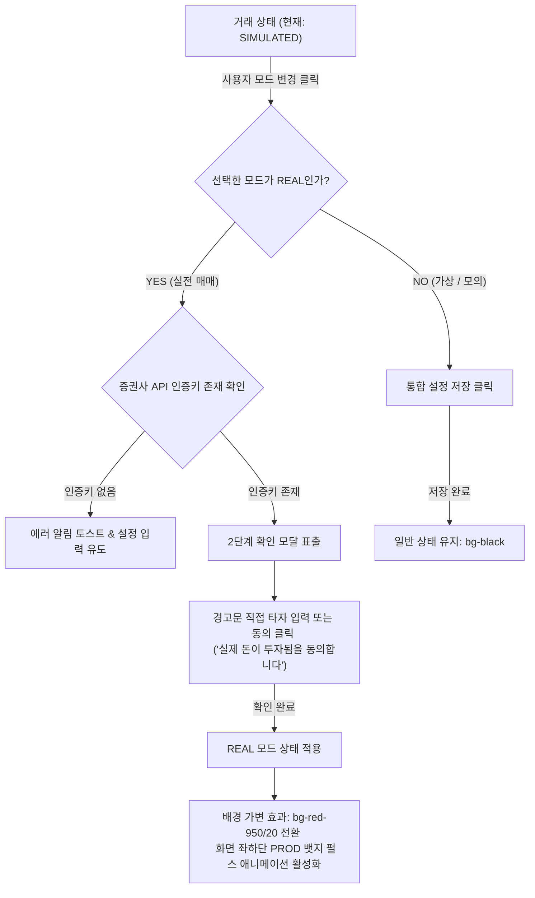

# StockAuto UX/UI 디자인 가이드라인 (Design Guidelines)

본 문서는 **StockAuto 자동 매매 봇 프로젝트**의 프론트엔드(Next.js 16 + React 19 + Tailwind CSS) 대시보드 화면을 위한 **UX/UI 디자인 가이드라인**입니다. Vercel 및 Linear 스타일의 미니멀리즘과 세련된 다크 모드, 고기능 차트 인터랙션, 그리고 거래 안전장치를 보장하는 상태 제어 흐름을 명세합니다.

---

## 🧭 1. 디자인 철학 및 컨셉 (Design Philosophy)

StockAuto의 디자인 핵심은 **"높은 정보 밀도(High Density) 속에서도 유지되는 명료함과 안정성"**입니다. 복잡한 주식 거래 지표와 자동 매매 로그를 다루는 대시보드이므로, 불필요한 시각적 소음을 제거하고 직관적인 의사결정을 돕는 프리미엄 UI를 지향합니다.

### 핵심 키워드
*   **Minimal High-Contrast (미니멀 고대비)**: 어두운 배경 위에 미려한 타이포그래피와 핵심 지표의 강한 명도 대조를 통한 시선 집중.
*   **Micro-Interactions (마이크로 인터랙션)**: 세그먼티드 컨트롤, 토글 버튼, 차트 호버링 등 사용자 동작에 즉각적이고 부드러운 애니메이션 피드백 제공.
*   **Operational Safety (운영 안정성)**: 실제 자산이 오가는 모의(Mock)/실전(Real) 거래 상태가 직관적으로 노출되며, 잘못된 제어로 인한 실수가 방지되는 예방적 설계.

---

## 🎨 2. 프리미엄 HSL 다크 모드 테마 시스템 (HSL Dark Mode Theme)

Tailwind CSS v4 및 CSS 변수 체계를 활용해, 미세하게 조절 가능한 HSL(색상, 채도, 명도) 테마 시스템을 적용합니다. HSL을 통해 투명도(Opacity)가 가미된 글래스모피즘(Glassmorphism) 효과를 효과적으로 연출할 수 있습니다.

### HSL 테마 색상 팔레트

| 계열 | 변수명 | HSL 값 | HEX 유사값 | 용도 및 시각적 정의 |
| :--- | :--- | :--- | :--- | :--- |
| **배경** | `--background` | `hsl(240 10% 3.9%)` | `#09090b` | 최하단 기본 배경색 (Jet Black) |
| **표면 (카드)** | `--card` | `hsl(240 10% 5.9%)` | `#0f0f12` | 대시보드 위젯 및 카드 표면 |
| **테두리** | `--border` | `hsl(240 5.9% 15%)` | `#27272a` | 요소 간 격리용 미세 경계선 (Zinc-800) |
| **프라이머리** | `--primary` | `hsl(250 95% 60%)` | `#6366f1` | 브랜드 정체성 및 핵심 UI 하이라이트 (Indigo) |
| **글자 기본** | `--foreground` | `hsl(0 0% 98%)` | `#fafafa` | 헤더 및 주요 텍스트 정보 (Almost White) |
| **글자 보조** | `--muted` | `hsl(240 5% 64.9%)` | `#a1a1aa` | 설명문, 비활성 탭, 단위 표시 (Zinc-400) |
| **안전/가상** | `--success` | `hsl(142.1 76.2% 36.3%)` | `#16a34a` | SIMULATED 모드, 수익 상태 (Green) |
| **경고/모의** | `--warning` | `hsl(37.9 92.1% 50.2%)` | `#d97706` | MOCK 모드, 보류 및 대기 상태 (Amber) |
| **파괴/실전** | `--destructive`| `hsl(346.8 77.2% 49.8%)` | `#dc2626` | REAL 모드, 손실 상태, 청산/삭제 (Red) |

### 폰트 시스템 (Typography)
*   **본문 및 숫자**: `Geist Sans`, `var(--font-sans)`, `-apple-system`, `BlinkMacSystemFont`를 결합하여 개발자 도구 스타일의 고정된 질감을 제공합니다.
*   **수치 및 데이터**: 고정폭 폰트(Geist Mono 또는 SF Mono)를 부분 적용하여 숫자가 자릿수에 상관없이 정렬되도록 하여 판독성을 개선합니다.

### 글래스모피즘 및 블러 가이드라인
*   카드는 단순 단색이 아니라 `hsla(240, 10%, 5.9%, 0.6)`의 반투명 카드 배경에 `backdrop-blur-md` 필터를 더해 뒤의 광채 효과(Glow Effect)가 부드럽게 보이도록 연출합니다.
*   다크 모드의 답답함을 환기시키기 위해, 화면 구석에 채도가 낮은 미세한 원형 그라데이션 광채(Ambient Glow)를 절대 좌표로 깔아줍니다:
    ```css
    /* Glow Effect 예시 */
    .glow-indigo {
      background: radial-gradient(circle, hsl(250 95% 60% / 0.05) 0%, transparent 70%);
    }
    ```

---

## 🧭 3. 대시보드 레이아웃 및 제어 구조 (Control & Layout)

사용자가 자신의 자산 현황을 파악하고 자동 매매 상태를 안전하게 제어하는 대시보드 구조의 가이드라인입니다.

### 1) 거래 상태 제어 (Simulated / Mock / Real) 제어 흐름
자동 매매의 실행 상태와 거래 환경은 분리되며, 특히 실계좌 자산이 움직이는 **REAL 모드** 활성화 시에는 우발적 클릭을 차단하는 2단계 확인 장치를 적용해야 합니다.



### 2) 거래 상태 피드백 UI 명세
*   **실시간 연동 인디케이터 (Live Status Indicator)**:
    *   대시보드 최상단 또는 네비게이션 바에 배치합니다.
    *   **로컬/시뮬레이션**: `Blue` 컬러 펄스 상태.
    *   **모의투자 (MOCK)**: `Amber` 컬러 펄스 상태.
    *   **실전투자 (REAL)**: `Red` 컬러가 주기적으로 깜빡이는(`animate-pulse`) 강력한 경고 상태로 유지되어, 사용자가 한눈에 실전 매매 중임을 경고받도록 설계합니다.
*   **배경 가변성**:
    *   REAL 모드가 가동 중일 경우, 대시보드 전체 배경에 `bg-red-950/15` 혹은 `bg-gradient-to-b from-red-950/20 to-black` 테마를 입혀 시각적 긴장감을 부여합니다.

---

## 📈 4. SVG 차트 컴포넌트 시각화 가이드라인 (SVG Chart Visuals)

주식 대시보드에서 자산 추이를 직관적으로 관찰할 수 있도록, 외부 라이브러리 의존성을 최소화하고 렌더링 성능이 극대화된 **순수 SVG 기반 차트**를 설계합니다.

### 1) SVG 차트 기본 레이아웃 규격
*   **ViewBox 구성**: 가로-세로 비율(Aspect Ratio)은 `800:240` 또는 `4:1` 수준의 와이드 레이아웃을 가져갑니다. 이는 세로 폭을 좁게 유지하여 대시보드 다른 위젯과의 시각적 조화를 이룹니다.
*   **패딩 (Padding)**: 상하좌우 최소 `24px` 이상의 패딩 영역을 확보하여 차트 선이 테두리에 바짝 붙어 잘리는 현상을 방지합니다.

### 2) 선(Line) 및 면(Area) 그라데이션 명세
차트의 시인성을 위해 단색 라인 대신 3색 그라데이션 라인과 반투명 그라데이션 채우기를 적용합니다.

```xml
<defs>
  <!-- 차트 하단 영역을 채우는 그라데이션 -->
  <linearGradient id="chart-gradient" x1="0" y1="0" x2="0" y2="1">
    <stop offset="0%" stop-color="rgb(99, 102, 241)" stop-opacity="0.25" />
    <stop offset="60%" stop-color="rgb(59, 130, 246)" stop-opacity="0.08" />
    <stop offset="100%" stop-color="rgb(9, 9, 11)" stop-opacity="0.0" />
  </linearGradient>
  
  <!-- 메인 꺾은선 그라데이션 (Vercel/Linear 스타일의 세련된 색상 변화) -->
  <linearGradient id="line-gradient" x1="0" y1="0" x2="1" y2="0">
    <stop offset="0%" stop-color="rgb(59, 130, 246)" />  <!-- Blue -->
    <stop offset="50%" stop-color="rgb(99, 102, 241)" /> <!-- Indigo -->
    <stop offset="100%" stop-color="rgb(168, 85, 247)" /> <!-- Purple -->
  </linearGradient>
</defs>
```

### 3) 호버 인터랙션 및 HTML 툴팁 가이드라인
*   **가이드선 (Guide Line)**: 마우스가 위치한 X축 좌표에 해당하는 차트 요소에 `stroke-dasharray="2 2"`의 반투명 수직 점선을 그려 정렬 기준을 줍니다.
*   **호버 핀 (Hover Pin)**: 호버된 데이터 포인트 위에 이중 원형(Circle) 핀을 렌더링합니다:
    *   **내부 원**: `radius="4"`, 흰색 단색 채우기, 프라이머리 컬러 테두리 (`stroke-width="2"`).
    *   **외부 광채 원**: `radius="6.5"`, 프라이머리 컬러 채우기, 투명도 25% (`fill-opacity="0.25"`).
*   **HTML 툴팁 (Floating Tooltip)**:
    *   SVG 내부 `<text>` 요소는 줄바꿈 및 스타일링에 한계가 있으므로, absolute 위치로 떠 있는 HTML 툴팁을 차트 영역 위에 띄웁니다.
    *   툴팁 카드 스타일: `bg-zinc-900/90 backdrop-blur-md border border-zinc-800 text-white rounded-lg shadow-2xl p-2.5`
    *   좌표 계산: 마우스 포인터의 상대적 위치 혹은 차트 포인트의 SVG 좌표를 브라우저 픽셀로 변환하여 툴팁의 `left`, `top` 스타일로 실시간 바인딩합니다. 프레임 드랍을 막기 위해 툴팁의 이동은 `transition-all duration-75 ease-out`으로 처리합니다.

---

## 📱 5. 사용성 및 접근성 (Usability & Accessibility)

### 1) 반응형 레이아웃 가이드
*   **모바일 (Mobile < 768px)**:
    *   그리드 레이아웃은 1열(`grid-cols-1`)로 단순화됩니다.
    *   가로 스크롤이 불가피한 테이블(거래 로그 등)은 `overflow-x-auto` 속성을 부여하되, 스크롤바가 화면을 해치지 않도록 스크롤바 커스터마이징 또는 숨기기 유틸리티를 적용합니다.
*   **데스크톱 (Desktop >= 1024px)**:
    *   최대 너비는 `max-w-[1600px]`로 제한하여 초광대역 모니터에서도 대시보드 요소가 너무 벌어지지 않도록 여백을 확보합니다.
    *   대시보드 위젯들을 `grid-cols-3` 혹은 `grid-cols-4`로 분할하여 단일 화면에서 스크롤 없이 주요 지표를 조망할 수 있게 구성합니다.

### 2) 비동기 및 예외 UI 피드백
*   **로딩 스켈레톤 (Skeleton UI)**:
    *   SWR/React Query의 `isLoading` 상태에서 데이터 형태와 유사한 모형의 무채색 Zinc 박스들을 `animate-pulse` 애니메이션으로 흐르도록 배치하여 로딩 인지 속도를 개선합니다.
*   **에러 뷰 (Empty / Error States)**:
    *   데이터가 비어 있거나 네트워크 실패 시 회색조 아이콘(예: `AlertTriangle`, `Ban`)과 함께 구체적이고 직관적인 에러 원인(예: "인증키 등록이 만료되었습니다. 재검증이 필요합니다.")을 제공하고 명시적인 "새로고침/재시도" 버튼을 노출합니다.

---

> **[UX/UI 디자이너 준수 사항]**
> *   디자인 일관성 유지를 위해 폰트 크기는 `text-[10px]`(초소형)부터 `text-2xl`(타이틀)까지 Tailwind 표준 스케일 범위 내에서 구조적으로 사용합니다.
> *   색상 활용 시 임의의 HEX 코드를 인라인에 삽입하는 것을 지양하고, 반드시 `globals.css` 및 `Tailwind Theme`에 정의된 HSL 시맨틱 토큰(Semantic Token)을 사용합니다.
