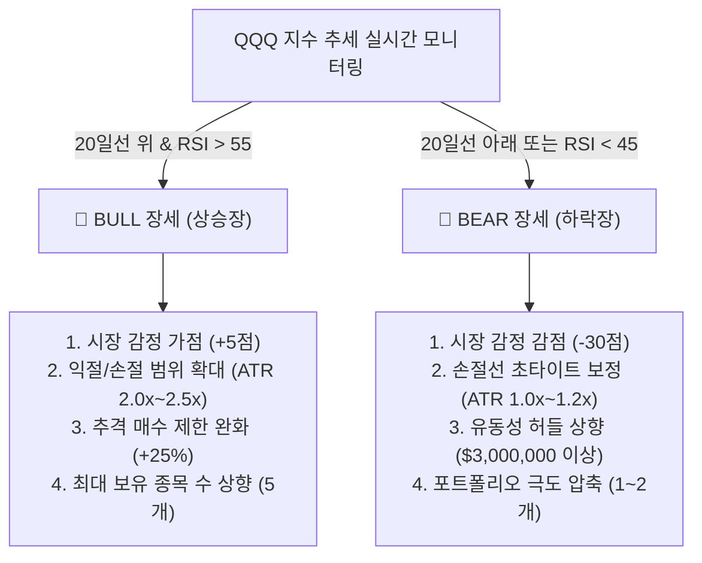

# 📋 StockAuto 차세대 자동 매매 시스템 제품 기획서 (Product Specification)

본 문서는 StockAuto 자동 매매 시스템의 비즈니스 가치 확장과 안정성 강화를 위해 스마트 알림 규칙, 장세별 대응 전략 시나리오, 그리고 신규 매매 모드(적립식 DCA 및 스윙 매매)의 상세 제품 스펙을 정의한 기획서입니다.

---

## 📌 1. 개요 및 배경 (Executive Summary)
*   **목적**: 감정에 흔들리지 않는 데이터 기반 자율 매매 봇의 거래 유연성을 극대화하고, 다양한 시장 환경(BULL/BEAR)에서도 자산의 안정적 증식 및 실시간 위험 제어가 가능하도록 비즈니스 로직 스펙을 고도화합니다.
*   **비즈니스 대상**: 안정적인 장기 우량주 적립을 원하는 직장인 투자자부터, 장중 급등주 돌파매매 및 수일간의 추세 흐름을 먹는 스윙 트레이더까지 다양한 사용자층을 타깃으로 합니다.
*   **핵심 가치**: 
    1. **실시간 정보 비대칭 해소**: 텔레그램 트레이딩 브릿지를 통한 즉각적인 자산 정보 및 위기 경보 제공.
    2. **시장 감정 적응성**: 상승/하락장에 최적화된 채점 및 리스크 관리 파라미터 자동 조절.
    3. **하이브리드 다각화**: 단타 위주의 엔진에서 탈립하여 적립식(DCA) 및 스윙(Swing) 매매 모델의 병행 기동 지원.

---

## 💬 2. 스마트 텔레그램 알림 시스템 (Smart Telegram Alert Rules)
텔레그램 브릿지는 단순 로그 출력이 아닌, 실시간 자산 보호망이자 원격 제어 인터페이스의 역할을 수행합니다. 모든 알림 메시지는 마크다운 포맷 카드로 시각화되어 사용자에게 전달됩니다.

### 2.1. 시스템 라이프사이클 및 시장 감정 알림
*   **봇 기동/정지 알림**: 
    *   **트리거**: 사용자가 대시보드나 텔레그램 명령으로 봇을 `/run` 또는 `/stop` 시킬 때.
    *   **내용**: "🤖 **StockAuto 봇 가동 시작**\n- 모드: `KIS LIVE` (실전투자)\n- 예수금: $12,450.00\n- 현재 보유 종목 수: 2개"
*   **장중 시황 및 세션 브리핑**:
    *   **트리거**: 매일 미국 정규장 개장 직후 (09:35 EST) 및 장 마감 15분 전 (15:45 EST).
    *   **내용**: QQQ 나스닥 지수 흐름 분석 결과와 오늘 시스템이 적용할 시장 감정 모드(BULLISH/BEARISH) 고지.

### 2.2. 매매 집행 카드식 알림
*   **정밀 매수 알림**:
    *   **트리거**: 봇의 매수 주문 체결 직후.
    *   **포맷**:
        ```markdown
        🟢 [매수 체결 완료]
        - 종목: AAPL (애플)
        - 체결단가: $185.20 (수량: 10주)
        - 총 매수금: $1,852.00
        - 손절 감시 기준선: $178.50 (ATR 1.5배)
        - 1차 익절 목표선: $195.20 (ATR 1.5배)
        ```
*   **트레일링 스탑 작동 예고**:
    *   **트리거**: 보유 종목이 최고가 대비 설정된 트레일링 스탑 감시 폭에 진입했을 때.
    *   **내용**: "⚠️ **[AAPL] 트레일링 스탑 트리거 활성화**\n- 현재가 $193.00이 고점($195.00) 대비 -1.0% 이탈했습니다. 추가 하락 시 자동 익절 청산 대기 중입니다."
*   **최종 청산(익절/손절) 알림**:
    *   **트리거**: 매도 주문 체결 직후.
    *   **포맷**:
        ```markdown
        🔴 [보유 종목 청산 완료]
        - 종목: TSLA (테슬라)
        - 청산사유: Trailing Stop (익절)
        - 매수가: $175.00 ➔ 매도가: $192.50
        - 최종 수익률: +10.00%
        - 실현 손익: +$175.00 (보유기간: 4시간 12분)
        ```

### 2.3. 실시간 위험 제어 및 예외 알림
*   **윗꼬리 설거지(Wick Trap) 경고**:
    *   **트리거**: 1분봉 기준 윗꼬리 비율(Wick Ratio)이 50%를 돌파하고 상대거래량(RVOL)이 3.0배 이상 폭발할 때.
    *   **내용**: "🚨 **위험 감지 (Wick Trap)**: [NVDA] 주가가 급상승 후 윗꼬리 55%를 형성하고 밀리고 있습니다. 단기 설거지 매물이 대량 출회되었으니 추격 매수를 엄격히 금지합니다."
*   **VWAP 이탈 경고**:
    *   **트리거**: 보유 중인 종목의 주가가 당일 거래량 가중 평균가(VWAP) 선을 아래로 강하게 하향 돌파(Breakdown)할 때.
    *   **내용**: "⚠️ **추세 붕괴 경고**: 보유 중인 [MSFT]가 VWAP($420.50) 라인을 하향 이탈했습니다. 지지 실패 시 추가 급락 우려가 있으니 대응 준비 바랍니다."

### 2.4. 양방향 텔레그램 명령어 반응 규격
*   `/status`: 현재 구동 요약 정보 전송.
*   `/run` / `/stop`: 봇 가동 및 정지 통제.
*   `/watchlist`: 현재 감시 중인 종목들의 실시간 스코어 및 등급(STRONG BUY/BUY/WATCH) 리스트 조회.
*   `/liquidate [티커 또는 all]`: 비상 상황 발생 시 즉각적으로 전체 또는 특정 보유 주식을 시장가로 전격 매도 청산할 수 있는 원격 비상 정지(Kill-Switch) 장치 제공.

---

## 📈 3. BULL/BEAR 장세 대응 매매 시나리오 (Adaptive Strategies)
시장 종합 감정(QQQ 지수 기준)에 맞춰 봇의 매매 호흡과 리스크 노출도를 실시간으로 보정합니다.



### 3.1. BULL 장세 (상승장) 대응 시나리오
상승장에서는 추세가 길게 연장되는 경향이 있으므로 이익을 극대화하고 진입을 넓힙니다.
1.  **진입 가중치 보정**: 시장 감정 점수 `+5점` 가산. 스캐너 채점판 상에서 우량 종목들이 쉽게 BUY/STRONG BUY 등급에 진입하도록 활성화합니다.
2.  **변동성 수용 범위 확장 (ATR 2.0x~2.5x)**: 익절 및 손절 기준선을 변동성 폭(ATR)의 2.0배~2.5배로 넓게 설정하여, 장중 숏스퀴즈나 일시적 흔들기(Noise)에 털리지 않고 상승 추세를 끝까지 발라먹도록 유도합니다.
3.  **추격 매수 한도 완화**: 급등주 추격 매수 차단선을 당일 시가 대비 `+20%`에서 `+25%`로 소폭 상향하여 대장주의 상한가 랠리에 동참할 수 있도록 기회를 제공합니다.
4.  **포트폴리오 분산**: 최대 동시 보유 종목 수 한도를 `5개`로 정상 유지하여 시장 유동성 순환매 혜택을 골고루 받습니다.

### 3.2. BEAR 장세 (하락장) 대응 시나리오
하락장에서는 현금 확보와 생존을 최우선으로 하며, 매우 보수적으로 포지션을 가져갑니다.
1.  **진입 억제 페널티**: 시장 감정 점수 `-30점` 부과. 어설픈 기술적 반등 종목은 진입이 자동 차단되며, 전체 시장 수급이 한 곳으로 쏠리는 `95점` 이상의 완벽한 **STRONG BUY** 종목에만 초정밀 저격 진입을 감행합니다.
2.  **타이트한 손절 및 짧은 익절 (ATR 1.0x~1.2x)**: 주가 이탈 시 즉시 탈출할 수 있도록 손절 범위를 ATR의 1.0배~1.2배로 매우 좁게 관리합니다. 익절선 역시 보수적으로 짧게 잡아 약세장 속 기술적 반등에서 이익을 신속히 실현(Lock-in Profit)합니다.
3.  **유동성 허들 상향**: 당일 누적 거래대금 필터를 최소 $1,000,000에서 **$3,000,000 (약 40억 원) 이상**으로 대폭 상향하여, 세력의 장난질이 심한 잡주나 동전주를 완벽히 배제하고 대형 기관 수급이 존재하는 주도주로만 거래를 압축합니다.
4.  **포트폴리오 압축 및 예수금 보존**: 최대 동시 보유 종목 수를 **1~2개**로 강제 제한하고, 단일 종목당 투자 비중을 예수금의 30% 이하로 제어하여 현금 비중 70% 이상을 필수로 유지합니다.

---

## 🛠️ 4. 신규 매매 모드 상세 기획 (New Trading Modes)
기존의 데이트레이딩(초단타) 외에, 사용자의 장기 투자 및 스윙 추세 투자 수요를 충족시키기 위해 투트랙의 신규 자동 매매 모드를 기획합니다.

### 4.1. 적립식 매매 모드 (Dollar-Cost Averaging, DCA)
장기 우량 자산의 평단가 분산 적립을 위한 비즈니스 스펙입니다.

*   **매수 주기 및 실행 스케줄**:
    *   사용자가 매일/매주(요일 지정)/매월(특정 일자) 주기를 지정합니다.
    *   정규장 거래 시간 중 지정된 시각(예: 시장 개장 30분 후인 10:00 EST 또는 장 마감 10분 전인 15:50 EST)에 봇이 자율적으로 예수금 상황을 확인하고 주문을 집행합니다.
*   **스마트 가중 적립 시스템 (Smart DCA)**:
    *   단순한 고정 금액 적립이 아닌, 사용자의 평단가 대비 현재가의 위치에 따라 매수 수량을 다이내믹하게 조정합니다.
    *   **수식**: `매수 비율 = 1.0 + (사용자 평단가 - 현재가) / 사용자 평단가 * 5` (최대 2.0배, 최소 0.5배 제한)
    *   *적용 예시*: 평단가($100)보다 현재가($90)가 -10% 하락해 있다면 매수 비율은 `1.0 + (10/100)*5 = 1.5배`가 되어 평소 매수액의 150%를 투입합니다(Buy the Dip). 반대로 평단가 대비 주가가 상승해 있다면 고점 매수를 억제하여 평균 단가의 상승을 방어합니다.
*   **대상 종목**: 사용자가 포트폴리오 탭에서 DCA 대상 주식으로 명시적으로 등록한 주식들로 한정합니다.

### 4.2. 스윙 매매 모드 (Swing Trading)
120일간의 장기 일봉 데이터를 추적하여 추세 돌파 파동의 몸통을 먹는 중기 매매 모드입니다.

*   **진입 기준 (`Daily Swing Predictor` 연동)**:
    *   일봉 기준 **VCP 진폭 수축 패턴**이 완성 단계이고, 거래량이 급감한 **VUD(Volume Dry-up)** 상태이며, **볼린저 밴드 폭이 최근 120일 중 가장 수축(Squeeze)**된 종목을 포착합니다.
    *   추세 유지 필터: 주가가 50일 이동평균선(EMA50) 위에 안착하여 우상향이 보장된 종목이어야 합니다. (역배열 종목은 -35점 페널티로 철저히 필터링)
*   **포지션 보유 및 오버나잇 (Overnight)**:
    *   초단타 모드와 달리 당일 청산하지 않는 것을 원칙으로 하며, 추세 이탈이 발생하기 전까지 수일에서 수주간 홀딩합니다.
*   **출구 전략 (Exit Strategy)**:
    *   **익절 (Trailing Stop)**: 20일 이동평균선(EMA20)을 종가 기준으로 하향 이탈할 때, 또는 일봉 기준 고점 대비 ATR의 3배 이상 가격 조정을 받을 때 분할 또는 전량 청산하여 수익을 확보합니다.
    *   **손절 (Stop Loss)**: 매수가 대비 ATR의 2배 이상 하락하여 주요 지지선이 무너지거나, 시장 리스크 폭발 시 예외 없이 당일 예약 시장가 주문으로 청산합니다.

---

## 🔒 5. 시스템 정책 및 예외 처리 (System Policies & Guardrails)
오작동 방지와 리스크 최소화를 위한 강제 규율입니다.

1.  **주문 한도 사전 검증 (Fail-fast Limit)**:
    *   사용자 설정에 '단일 주문 최대 한도(Max Order Value)'와 '일일 거래 누적 한도'를 필수로 등록해야 합니다. 봇이 주문 제출 전 해당 값을 스캔하여 초과가 예상되면 주문 프로세스를 즉시 가로채 차단하고 텔레그램 경고를 발송합니다.
2.  **미체결 지정가 주문 재조정**:
    *   신호 감지 후 제출된 지정가 주문이 3분 이상 미체결 상태일 경우, 즉시 주문을 취소하고 `execute_and_poll_order` 로직에 따라 현재 실시간 1호가로 정정(Modify)하거나 주문을 철회하여 예수금 잠김 현상을 방지합니다.
3.  **시장 외 시간(Off-market) 제한**:
    *   Pre-market(09:00~09:30 ET) 분석을 통해 발굴된 종목의 정규장 개장 직후 추세 진입만을 허용하고, 정규장 종료(16:00 ET) 이후 After-market에서는 신규 매수 진입을 강력 차단합니다. 
    *   단, 보유 종목에 심각한 실적 쇼크나 공시 등 악재 뉴스가 실시간 감지되어 손절 조건을 충족한 경우에 한해 After-market 청산 매도 주문 발송을 허용합니다.
