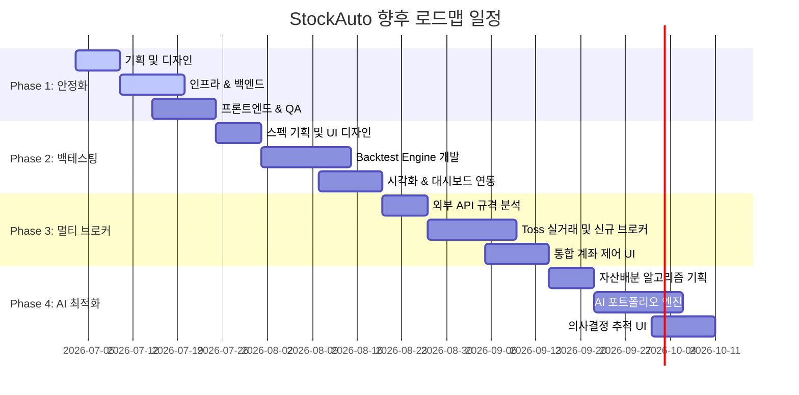

# 👑 StockAuto 프로젝트 개발 로드맵 (Project Roadmap)

본 문서는 StockAuto 자동매매 시스템이 MVP(최소 기능 제품) 단계를 넘어, 실제 프로덕션 수준의 안정성과 확장성을 갖춘 자율형 트레이딩 플랫폼으로 진화하기 위한 **전체 개발 마일스톤 및 로드맵 기획서**입니다.

가상 PM(Project Manager)의 관점에서 기획(Product), 디자인(UI/UX), 인프라(TA), 백엔드(Core/Data), 프론트엔드(Frontend) 각 영역의 유기적 협동과 릴리즈 우선순위, 그리고 알고리즘 거래 안전성에 직결되는 리스크 관리 계획을 구체적으로 정의합니다.

---

## 🧭 1. 개요 및 현재 MVP 상태 분석

### 1.1 현재 MVP 구현 현황
현재 StockAuto는 서비스의 가능성을 검증하기 위한 핵심적인 뼈대가 구축 완료된 상태입니다.
*   **3-Mode 트레이딩 엔진 (`scheduler.py`):** 가상 시뮬레이터(Simulated), 한투 모의투자(KIS MOCK), 한투 실전투자(KIS LIVE)를 지원하는 추상화된 브로커 인터페이스 기반 엔진.
*   **Next.js 대시보드 (`frontend/`):** React 19와 Vanilla CSS, HSL 프리미엄 다크 테마를 채택한 실시간 모니터링 화면 (계좌, 잔고, 자동완성 관심종목, 봇 시그널 및 매매로그).
*   **텔레그램 브릿지 (`telegram.py`):** 단일 데몬 스레드로 다중 사용자의 봇 구동 제어 및 자산 현황 조회를 지원하는 비동기 양방향 챗봇 브릿지.
*   **AI 뉴스 감성 판독 엔진 (`news_analyzer.py`):** Google Gemini 1.5 Flash API와 인터넷 차단/한도 초과 상황에 대응하는 로컬 사전식 룰 엔진(Lexicon Fallback)의 하이브리드 아키텍처.

### 1.2 프로덕션 릴리즈를 위한 기술적 극복 과제
1.  **서버리스 영속성 한계:** Google Cloud Run의 무상태(Stateless) 컨테이너 특성으로 인해 로컬 SQLite DB의 영속성이 차단됨.
2.  **멀티테넌시 보안 및 쿠키 정책:** 크로스 사이트 API 호출 환경에서 JWT 및 Refresh Cookie의 SameSite 정책 안정화 필요.
3.  **거래 예외 처리 부족:** KIS/TOSS OpenAPI의 슬리피지(Slippage), 부분 체결(Partial Fill), API 호출 제한(Rate Limit)에 대응하는 복구 시나리오 고도화 필요.
4.  **백테스팅 검증 부재:** 실전에 전략을 투입하기 전, 과거 데이터를 통해 전략의 수익률과 MDD(최대 낙폭)를 시뮬레이션할 수 있는 샌드박스 환경 부재.

---

## 📅 2. 전체 마일스톤 로드맵 (Milestone Overview)

전체 개발 단계는 4개의 핵심 마일스톤(Phase)으로 나뉘며, 각 단계는 기획-디자인-인프라-개발이 병렬적이면서도 유기적인 의존성을 가지고 연계됩니다.

---

## 🛠️ 3. 직군별 세부 마일스톤 및 연계 작업 계획

### 🚀 Phase 1: 프로덕션 안정화 및 보안 강화 (Stabilization & Security)
*   **목적:** MVP 코드를 실제 프로덕션 서버에 안착시키고, 무상태 인프라 환경에서 완벽한 데이터 영속성과 암호화 보안을 확보합니다.
*   **직군별 연계 태스크:**
    *   **기획 (Product):** 개인정보 처리 방침 수립 및 다중 계좌(멀티테넌시) 연동 시 암호화 키 관리 보안 정책 정의.
    *   **디자인 (UI/UX):** 모바일 브라우저 대응 반응형 대시보드 시안 제작, 금융 자산 정보 노출/숨김 기능 및 세밀한 에러 토스트 피드백 설계.
    *   **인프라 (TA):** Google Cloud Run 컨테이너 재생성 시 데이터 유실 방지를 위한 Google Cloud Storage FUSE 볼륨 마운트 실적용, 혹은 Google Cloud SQL (PostgreSQL) 다중 노드 전환 인프라 파이프라인 구성. Redis Production 클러스터 기동 및 가용성 체크.
    *   **백엔드 (Core):** SQLite에서 PostgreSQL로의 ORM 마이그레이션 호환성 보장 (`app/core/migrator.py` 확장), 텔레그램 일일 리포트 P2 경로의 DB 세션 중첩 해제, 토스증권 MOCK/REAL 실행 제한을 해제하기 위한 주문 모듈의 예외 처리 완성.
    *   **프론트엔드 (Frontend):** SameSite 쿠키 세팅 보완 및 JWT Token Refresh 로직의 안정성 강화, React Hydration 에러 차단을 위한 렌더링 최적화, UI 오작동 방지를 위한 Form 입력 벨리데이션 보강.

### 🧪 Phase 2: 지능형 스캐닝 및 백테스팅 엔진 도입 (Backtest Arena)
*   **목적:** 사용자가 직접 과거 시세 데이터를 바탕으로 투자 전략의 유효성을 검증하고, AI 감성 분석 점수의 영향력을 수치로 증명할 수 있는 백테스팅 엔진을 탑재합니다.
*   **직군별 연계 태스크:**
    *   **기획 (Product):** 백테스팅 시뮬레이션에 필요한 평가지표(Sharpe Ratio, MDD, 승률, profit factor) 계산 공식 정의, 대량 연산 시 CPU 스케줄링 정책 수립.
    *   **디자인 (UI/UX):** 백테스팅 조건 설정 폼 디자인, 전략 성과 분석 차트(누적 수익률 vs 벤치마크 지수 대비 그래프) 및 결과 리포트 대시보드 설계.
    *   **인프라 (TA):** 장시간 소요되는 백테스팅 연산이 백엔드 API 서버를 블로킹하지 않도록 Celery 및 Redis Queue 기반의 비동기 분산 워커(Worker) 아키텍처 구축.
    *   **백엔드 (Data & Core):** 과거 분봉/일봉 데이터를 벌크 다운로드하고 캐싱하는 데이터 파이프라인 구축. 백테스팅 코어 엔진 개발 (`Backtest Arena`), AI 뉴스 감성 분석 시 다국어(영어/한국어) 번역 속도 개선을 위한 LLM 프롬프트 고도화 및 캐시 히트율 향상.
    *   **프론트엔드 (Frontend):** 비동기 백테스팅 진행 상태 프로그레스 바 구현, TradingView 차트 라이브러리 또는 Recharts 기반의 백테스팅 성과 데이터 다이내믹 시각화.

### 🔌 Phase 3: 멀티 브로커 및 분산 주문 고도화 (Multi-Broker & Scaled Ordering)
*   **목적:** 한투, 토스 외 국내외 주요 증권사 OpenAPI 연동을 확장하고, 동시다발적으로 수십 명의 사용자가 매매 주문을 날려도 체결 안정성을 보장하는 고성능 브로커 관리 레이어를 구축합니다.
*   **직군별 연계 태스크:**
    *   **기획 (Product):** 키움증권, 미래에셋증권 등 신규 지원 브로커의 OpenAPI 스펙 분석 및 수수료/세금 정산 공식 표준화.
    *   **디자인 (UI/UX):** 여러 개의 증권사 계좌를 하나의 대시보드에서 통합 관리하고 전환할 수 있는 '멀티 계좌 카드' 및 계좌별 실시간 자산 배정 제어 패널 디자인.
    *   **인프라 (TA):** 외부 증권사 API 호출 시 발생하는 IP 제한 및 초당 호출 제한(Rate Limit)을 자동 우회하기 위한 아웃바운드 프록시 로테이터 및 트래픽 쓰로틀링 분산 큐 구축.
    *   **백엔드 (Core):** `BaseBroker` 인터페이스를 상속받는 신규 브로커 클래스 확장 및 Registry 패턴 자동 등록 연동, 락 획득 실패나 네트워크 타임아웃 발생 시 주문의 부분 체결 상태를 추적하여 복구하는 자율 복구 엔진(Order Reconciler) 고도화.
    *   **프론트엔드 (Frontend):** Zustand / React Query 기반의 글로벌 멀티 브로커 상태 트리 구축, 다중 계좌 주문 현황의 실시간 동기화 상태 애니메이션 컴포넌트 구현.

### 🧠 Phase 4: AI 모델 고도화 및 자율 자산 배분 (AI & Asset Allocation)
*   **목적:** 단순 감성 분석 점수 반영을 넘어, 거시 경제 지표 및 포트폴리오 최적화 알고리즘에 기반해 자율적으로 자산을 배분하고 리스크를 조절하는 AI 펀드 매니저급 모델로 고도화합니다.
*   **직군별 연계 태스크:**
    *   **기획 (Product):** 포트폴리오 최적화 수학 모델(Markowitz Mean-Variance, Black-Litterman 모델) 및 거시 경제 촉매제 정의.
    *   **디자인 (UI/UX):** AI가 제안하는 포트폴리오 비중 비교 원형 차트, AI의 의사결정 경로를 한눈에 트래킹할 수 있는 타임라인(Timeline) 뷰 설계.
    *   **인프라 (TA):** 금융 데이터 미세조정(Fine-Tuning) 및 대용량 배치 학습 파이프라인 가동을 위한 GPU 기반 클라우드 인프라(AI Platform) 연동.
    *   **백엔드 (Data & AI):** 뉴스 외 소셜 미디어(X, Reddit) 및 주요 거시 경제 지표(금리, CPI, 환율) 수집 파이프라인 확장, 자산 배분 알고리즘 엔진 탑재 및 포트폴리오 재조정(Rebalancing) 스케줄러 개발.
    *   **프론트엔드 (Frontend):** AI 포트폴리오 자동 리밸런싱 승인/거부 인터랙티브 토글 스위치 구현, 포트폴리오 자산 배분 비중의 실시간 변경에 따른 다이내믹 컴포넌트 렌더링.

---

## 📊 4. 우선순위 및 의존성 매트릭스 (Priority & Dependency Matrix)

각 마일스톤의 세부 작업은 **우선순위(P0~P2)**와 **기술적 의존성(Dependencies)**에 따라 단계적으로 진행되어야 병목 현상을 예방할 수 있습니다.

| 작업 코드 | 작업명 | 우선순위 | 의존성 (선행 작업) | 담당 영역 | 설명 |
| :--- | :--- | :---: | :--- | :---: | :--- |
| **P1-1** | GCS FUSE / PostgreSQL 전환 | **P0** | 없음 | TA / 백엔드 | Cloud Run 무상태 해결 및 DB 안정화 |
| **P1-2** | 텔레그램 리포트 DB 세션 수정 | **P0** | 없음 | 백엔드 | 커넥션 고갈 원천 차단 리팩터링 |
| **P1-3** | JWT / SameSite 쿠키 세팅 보완 | **P1** | 없음 | 프론트 / 백엔드 | 크로스 도메인 인증 보안 통과 |
| **P2-1** | Celery & Redis 비동기 인프라 | **P0** | P1-1 | TA / 백엔드 | 백테스팅 및 대용량 분석용 연산 분리 |
| **P2-2** | Backtest Arena 코어 개발 | **P1** | P2-1 | 백엔드 (Data) | 과거 시세 기반 전략 시뮬레이터 구축 |
| **P2-3** | 백테스트 분석 시각화 차트 | **P2** | P2-2 | 프론트엔드 | 누적 수익률 비교 분석 화면 구현 |
| **P3-1** | Rate Limit 우회용 트래픽 큐 | **P0** | 없음 | TA / 백엔드 | 외부 API 호출 제한 돌파 아키텍처 |
| **P3-2** | 토스 실거래 및 신규 브로커 지원 | **P1** | P3-1 | 백엔드 (Core) | Registry 패턴 활용 타 브로커 추가 |
| **P3-3** | 통합 멀티 계좌 스위처 UI | **P2** | P3-2 | 프론트엔드 | 여러 증권사 계좌 제어 화면 구현 |
| **P4-1** | AI 자산 배분 알고리즘 탑재 | **P1** | P2-2, P3-2 | 백엔드 (AI) | 블랙-리터먼 모델 기반 자동 리밸런싱 |
| **P4-2** | AI 의사결정 추적 타임라인 | **P2** | P4-1 | 프론트 / 백엔드 | AI 매매 판단 과정의 시각화 피드백 |

---

## ⚡ 5. 리스크 관리 계획 (Risk Management Plan)

자동매매 봇의 특성상 사소한 버그나 인프라 에러가 실제 금전적 손실(금융 사고)로 직결되므로, 철저한 장애 방어 안전망(Safety Net)이 사전에 계획되어야 합니다.

### 5.1 금융/거래 리스크 방어 계획 (Financial Risk Safety Net)
*   **슬리피지(Slippage) 제어 및 한도 설정:** 
    *   *리스크:* 거래량 부족이나 급격한 시세 변동 시 주문 가격과 체결 가격 간의 격차가 벌어짐.
    *   *대응책:* 스케줄러가 주문 전송 시 허용 슬리피지 한도(예: 현재가 대비 최대 0.5%)를 지정하고, 이를 초과할 경우 시장가 주문을 즉각 취소(Fail-Closed)하고 사용자에게 경보를 알립니다.
*   **부분 체결 및 주문 복구 시나리오 고도화:**
    *   *리스크:* 매수/매도 주문이 일부 수량만 체결되고 미체결 상태로 남아 포트폴리오의 비중이 꼬이는 현상.
    *   *대응책:* `order_reconciler.py`가 주기적으로 미체결 주문 목록을 스캔하여, 지정가 주문 발송 후 30초 내 미체결 시 해당 주문을 취소하고 당시 호가 상황에 맞춰 정정 주문을 재제출하는 하이브리드 폴링 루프를 운영합니다.

### 5.2 인프라 및 인스턴스 리스크 방어 계획 (Infrastructure Resiliency)
*   **SQLite 데이터 유실 방어:**
    *   *리스크:* Google Cloud Run의 인스턴스가 롤링 업데이트 등으로 인해 재생성되거나 스케일 아웃될 때, 컨테이너 내부의 SQLite DB 파일이 완전 삭제되는 현상.
    *   *대응책:* 프로덕션 배포 시 SQLite 파일 경로를 Cloud Storage FUSE 마운트 폴더(`/app/db`)로 강제 지정하고, 영구 보존용 DB 이중화를 위해 1일 1회 스냅샷 백업을 자동 수행합니다. 최종적으로는 Cloud SQL (Managed PostgreSQL) 도입을 적극 추진합니다.
*   **Redis 분산 락 경합 및 데드락 방어:**
    *   *리스크:* 동일 사용자의 자동 매매 루프와 수동 청산 API가 락 획득을 위해 무한 대기 상태에 빠지는 현상.
    *   *대응책:* Redis Lock에 반드시 명시적인 만료 시간(Lease Time: 최대 30초)을 설정하여 소유권 강제 상실(Lost Ownership) 시에도 락이 자동 해제되게 설계하고, 락 획득 실패 시 기계적으로 `fail-safe` 상태를 반환하도록 예외 경로를 고정합니다.

### 5.3 AI API 및 외부 요인 리스크 방어 계획 (API & Dependency Safety)
*   **Gemini API 크레딧 소진 및 장애:**
    *   *리스크:* AI 뉴스 감성 판독 엔진 호출 횟수 폭증으로 인한 한도 초과(Rate Limit Exceeded) 또는 API 장애.
    *   *대응책:* 현재 구현된 로컬 룰 기반 감성 사전(Lexicon Fallback Engine)이 Gemini API 호출 실패를 감지하는 즉시 0ms 만에 2선 방어선으로 교체 동작하도록 상시 모니터링 데몬을 구동합니다.
*   **증권사 API 연결 두절 및 망 혼잡:**
    *   *리스크:* 장 시작 직후(09:00, 22:30) 주문 폭주로 인한 증권사 서버 타임아웃.
    *   *대응책:* 지수 백오프(Exponential Backoff)를 적용한 재시도 로직을 탑재하고, 3회 이상 연결 실패 시 트레이딩 모드를 즉시 안전 모드(`SIMULATED` 또는 주문 일시 중지)로 다운그레이드하여 불완전한 주문이 시장에 중복 전달되지 않도록 제어합니다.

### 5.4 아키텍처 결함 방어 계획 (API Drift & Anti-Complacency)
*   **프론트-백엔드 스키마 불일치 (API Drift):**
    *   *리스크:* 백엔드 데이터 모델(`models.py`)이나 Pydantic 스키마 변경이 프론트엔드 API 호출 규격(`lib/api.ts`)에 반영되지 않아 발생하는 런타임 에러.
    *   *대응책:* 빌드 단계에서 `npx tsc --noEmit` 검증을 강제하고, CI/CD 파이프라인 내에서 백엔드 Pydantic 정의를 기반으로 프론트엔드 TypeScript 타입을 자동 생성하는 코드 제너레이터를 연동해 스키마 정합성을 100% 보장합니다.

---

## 📢 6. 결론 및 향후 릴리즈 방향성

StockAuto는 검증된 **마이크로-세션 패턴(Micro-Session Pattern)**과 **느슨한 결합의 멀티 브로커 아키텍처**를 계승하여, 안정적이고 실패 없는 금융 시스템으로 나아가야 합니다. 

이번에 정의된 향후 마일스톤에 따라 각 직군별 테스크를 우선순위에 맞춰 성실히 이행하며, 무엇보다 **리스크 관리 계획의 장애 안전망(Safety Net)**을 매 배포 시점마다 자동화 테스트 코드로 철저히 보충함으로써, 신뢰성 높은 자율 자동매매 플랫폼의 가치를 극대화할 것입니다.
