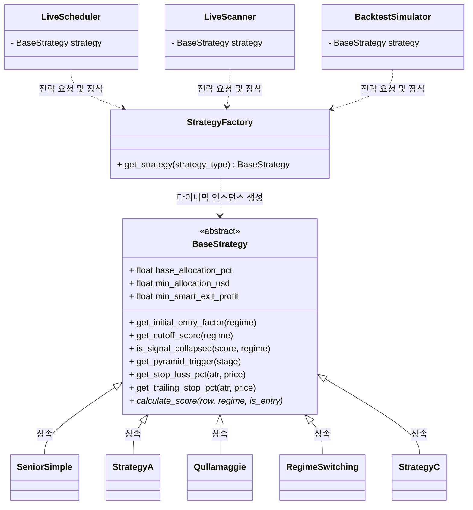

# 🏆 StockAuto 객체 지향 전략 패턴 (Strategy Pattern) 아키텍처 명세서

본 문서는 StockAuto 시스템에 도입된 **전략 패턴 (Strategy Pattern)** 아키텍처의 설계 사양, 클래스 관계도, 각 핵심 컴포넌트의 역할, 그리고 새로운 전략 카드(Lego Block)를 시스템에 유연하게 추가하는 방법(개발자 가이드)을 명시한 공식 아키텍처 설계서입니다.

---

## 📊 1. 클래스 관계도 (UML Class Diagram)

아래 다이어그램은 실시간 트레이딩 스케줄러, 실시간 스캐너, 백테스트 엔진이 공통 전략 인터페이스를 장착하여 완전히 결합도를 낮추고 모듈화된 관계를 보여줍니다.



---

## ⚙️ 2. 핵심 컴포넌트 상세 명세

### ① 추상 베이스 클래스 (`BaseStrategy`)
*   **파일 위치**: `backend/app/strategies/base_strategy.py`
*   **역할**: 모든 트레이딩 전략 카드의 기본 인터페이스 규격을 선언하는 헌법 클래스입니다.
*   **핵심 속성**:
    *   `base_allocation_pct`: 기본 분할 자본 비율 (예: 0.40 ➔ 총자산의 40% 기본 할당)
    *   `min_allocation_usd`: 최소 보장 달러 자산 (예: 2000.0 ➔ 최소 $2,000 이상 투자 강제)
    *   `min_smart_exit_profit`: 스마트 익절 최소 진입 수익률 마진 (예: 2.5 ➔ 2.5% 이상일 때만 조기익절 작동)
*   **핵심 메서드**:
    *   `get_stop_loss_pct(atr, price)`: ATR 변동성 대비 동적 손절 폭(%)을 산출합니다.
    *   `get_trailing_stop_pct(atr, price)`: ATR 변동성 대비 동적 트레일링 스탑 폭(%)을 산출합니다.
    *   `get_pyramid_trigger(stage)`: 피라미딩 불타기 추가 매수 진입을 위한 수익률 허들을 산출합니다.
    *   `get_initial_entry_factor(regime)`: 신규 진입 시 정찰병 비중 배분 비율을 리턴합니다.
    *   `is_signal_collapsed(score, regime)`: 보유 중 세력 지지선 붕괴 등에 따른 즉시 청산 여부를 리턴합니다.
    *   `calculate_score(row, regime, is_entry)*`: **[추상 메서드]** 각 전략별 11대 지표 가감점 총합을 계산합니다.

### ② 동적 팩토리 클래스 (`StrategyFactory`)
*   **파일 위치**: `backend/app/strategies/strategy_factory.py`
*   **역할**: 설정 파일(`settings.STRATEGY_TYPE`)에 기입된 문자열 상수를 인식하여, 런타임에 해당하는 Concrete 전략 인스턴스를 즉각 동적으로 생성 및 반환하는 조립기 역할을 담당합니다.
*   **특징**: 클래스 로딩을 실제 기동되는 시점까지 미루는 **지연 임포트(Lazy Import)** 설계 기법을 도입하여, 모듈 간 순환 임포트(Circular Import) 에러를 시스템 수준에서 철저하게 방지하였습니다.

---

## 🛠️ 3. 개발자 가이드: 2분 만에 새로운 전략 카드 추가하기

새로운 트레이딩 전략(예: `MyNewStrategy`)을 설계하고 시스템에 장착하려면 다음의 3단계를 수행하면 됩니다.

### [1단계] 전략 파일 생성
`backend/app/strategies/` 디렉터리에 새로운 파이썬 파일 `my_new_strategy.py`를 생성하고, `BaseStrategy`를 상속받아 구현합니다.

```python
# backend/app/strategies/my_new_strategy.py
from app.strategies.base_strategy import BaseStrategy

class MyNewStrategy(BaseStrategy):
    def __init__(self, name: str = "🎯 나의 단타 전략"):
        super().__init__(name=name)
        # 나만의 파라미터 세팅 (Lego 조절)
        self.base_allocation_pct = 0.20   # 총자산의 20% 투자
        self.min_allocation_usd = 1000.0  # 최소 $1,000 보장
        self.min_smart_exit_profit = 1.5  # 1.5% 이상부터 스마트 조기 청산 활성
        
    def calculate_score(self, row, regime: str, is_entry: bool = True, score_card: list = None) -> float:
        # 💡 pandas.Series(백테스트) 및 dict(실시간 스캐너) 둘 다 안전하게 읽을 수 있도록 _safe_get 사용 필수!
        close = self._safe_get(row, 'Close')
        rsi = self._safe_get(row, 'RSI')
        
        # 진입 시 예외 관문 필터 예시
        if is_entry and rsi > 70.0:
            return 0.0 # 과매수권 진입 금지
            
        score = 50.0 # 기본점수
        # 상승/하락장 레짐 스위칭 연동 채점 논리
        if rsi < 30.0:
            score += 30.0
            if score_card is not None:
                score_card.append({"factor": "RSI 과매도 반등 가점", "score": 30, "passed": True})
                
        return max(0.0, min(score, 100.0))
```

### [2단계] 전략 팩토리에 등록
`backend/app/strategies/strategy_factory.py` 파일의 매핑 딕셔너리에 신설 전략 클래스를 등록합니다.

```python
# backend/app/strategies/strategy_factory.py 에서
STRATEGY_MAP = {
    # ... 기존 전략 매핑들
    "my_new_strategy": ("app.strategies.my_new_strategy", "MyNewStrategy")
}
```

### [3단계] 환경 설정 활성화
`backend/.env.local` 또는 `backend/app/core/config.py`의 전략 설정을 원하는 토큰명으로 변경하면 즉시 백테스트 및 실거래에 반영됩니다!
```ini
# backend/.env.local 에서
STRATEGY_TYPE=my_new_strategy
```

---

## 🧪 4. 검증 및 무퇴보(No Regression) 정책

새로운 전략 카드를 장착하였거나 코어 엔진을 수정했을 때는 항상 아래의 검증 커맨드를 실행하여 시스템 무결성을 입증해야 합니다.

1.  **컴파일 무결성 검증**:
    ```bash
    python -m py_compile app/strategies/*.py app/bot/backtest_engine.py app/scanner/scanner.py app/bot/scheduler.py
    ```
2.  **역사적 12대 토너먼트 PnL 검증**:
    ```bash
    python run_tournament.py
    ```
    *   기존 탑재된 `regime_switching` 전략 등이 이전 배틀 성적표(예: Q2 상승장 `+18.44%` / 32회 거래)와 오차 없이 똑같이 재현되는지 확인하여 아키텍처 개편에 따른 무퇴보를 완벽히 유지하십시오.
